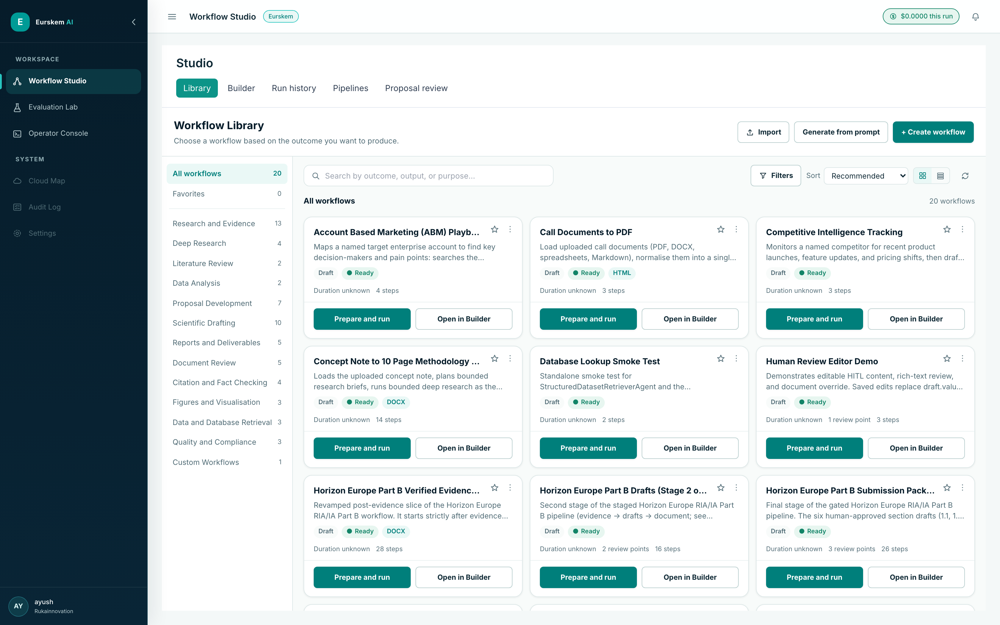
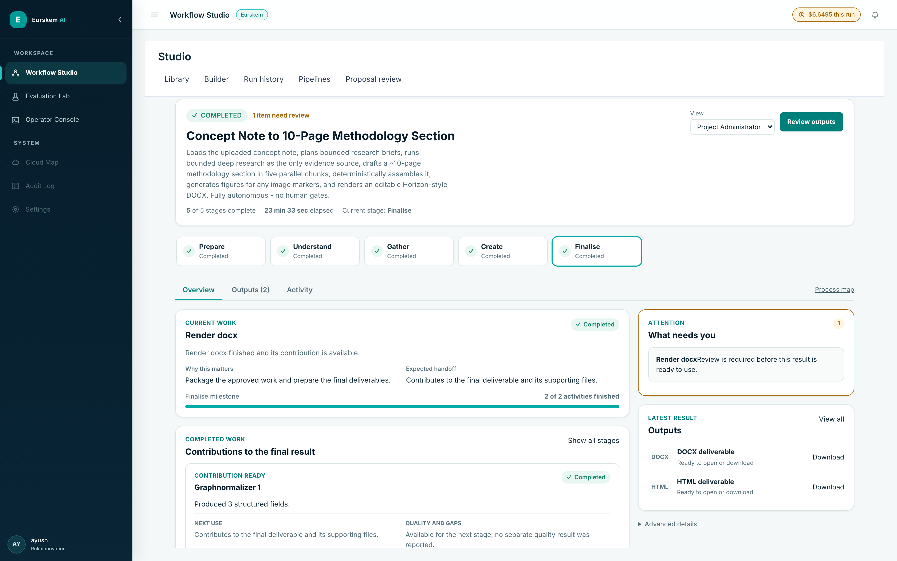
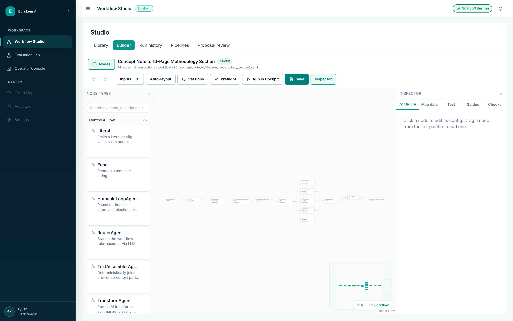
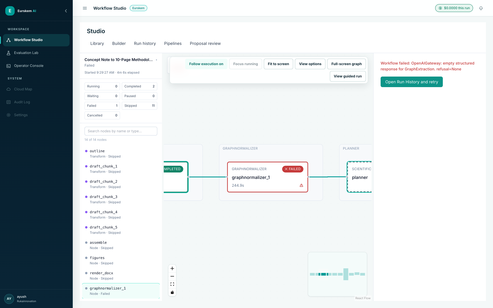
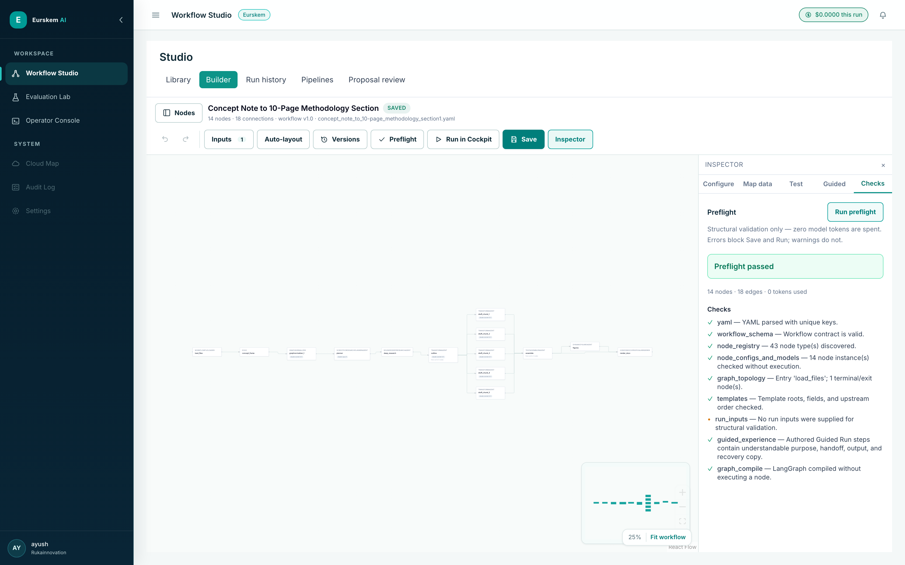
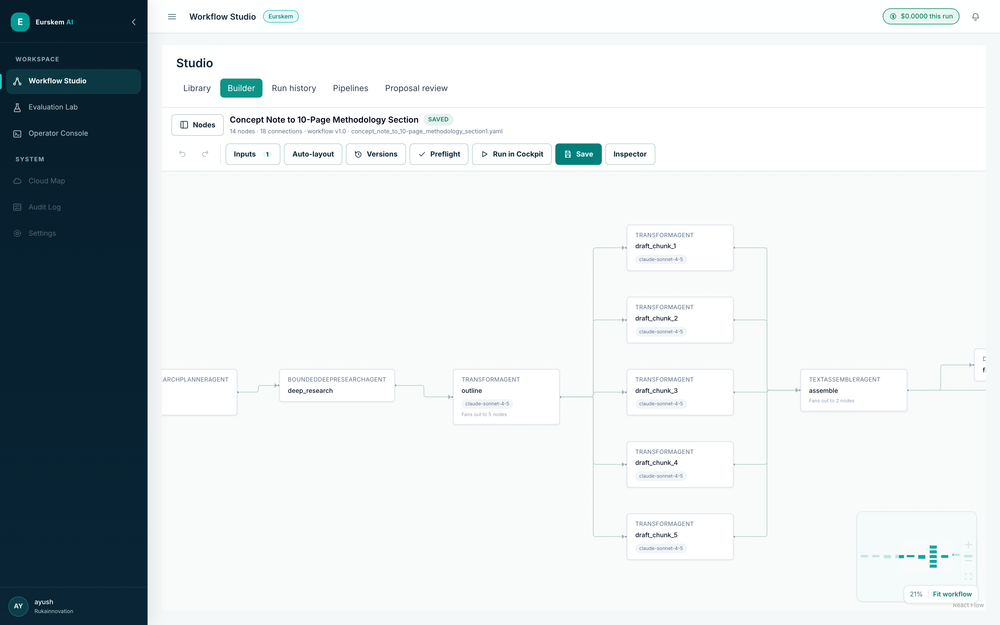

<h1 align="center">Eurskem AI</h1>

<p align="center">
  <strong>An agentic workflow platform for high-stakes work.</strong><br>
  Typed workflows compiled to LangGraph, a zero-token preflight, a strict evidence lifecycle,
  and three product surfaces over one run.
</p>

<p align="center">
  
  
  
  
  
  
</p>

---

Most "AI agent" systems hide the parts that matter. A single prompt conceals which sources were
chosen, where the reasoning turned, what failed, what it cost, and who is accountable. Eurskem AI is
built for the middle ground between an opaque prompt and a fully manual process: **visible automation
with typed steps, explicit evidence, bounded provider use, and human control at material decisions.**

A validated YAML contract compiles to a LangGraph state graph. Every node — all 43 types — passes
through one runtime boundary that binds cost context, publishes lifecycle events, writes audit
records, checks for cooperative pause, resolves configuration templates, validates output against a
schema, and checkpoints for recovery.

Proposal generation is the flagship use case. It is not the platform.

<p align="center">
  
  <br><em>Workflows are presented by outcome, not by graph shape.</em>
</p>

---

## Contents

- [Three surfaces, one run](#three-surfaces-one-run)
- [What makes it different](#what-makes-it-different)
- [Quick start](#quick-start)
- [How a workflow works](#how-a-workflow-works)
- [Architecture](#architecture)
- [Evidence integrity](#evidence-integrity)
- [Cost and model routing](#cost-and-model-routing)
- [Testing and verification](#testing-and-verification)

---

## Three surfaces, one run

The interface changes by audience. The workflow identity, run ID, node outputs, approvals and durable
history do not — there is no second, simplified engine behind the business view.

### Guided Run — for project administrators and domain experts

Nodes become business stages. Plain-language explanation of what is happening and why it matters, one
consolidated attention queue, and the deliverables. No node IDs, prompts, payloads or stack traces in
the primary reading path.

<p align="center"></p>

### Builder — for workflow authors

A stable four-area layout: action bar, registry-driven node library, canvas, persistent inspector.
Typed configuration forms, visual data mapping, node/branch tests, autosave drafts, and immutable
versions.

<p align="center"></p>

### Cockpit — for technical review

Live graph and node lifecycle, events, failure diagnosis, audit and output inspection. Below: a real
run that failed at `graphnormalizer_1` after 244.9 s — upstream work preserved as completed,
downstream explicitly skipped, provider-level cause attached, retry route beside it.

<p align="center"></p>

---

## What makes it different

### Preflight spends zero tokens — and says so

Nine deterministic checks run before any provider call: YAML key uniqueness, the Pydantic workflow
contract, registry discovery, per-node config and model compatibility, graph topology, template roots
and upstream ordering, Guided Run copy quality, and a real LangGraph compile. Every issue carries a
code, severity, path, node ID and suggestion, so the Builder can navigate straight to the problem.

The token counter is a product surface, not an implementation detail.

<p align="center"></p>

Checks were added from real mid-run failures and closed at the cheapest layer that could see them.
`TEMPLATE_NULLABLE_NESTED_ACCESS` is the last of that family — it fires when a template traverses into
a field whose declared type permits `None`, the one shape neither graph ordering nor default
materialisation can catch.

### One node boundary, not forty-three

Every node is added to the graph through `_make_runtime_fn` ([`app/runtime/compiler.py:63`](app/runtime/compiler.py)).
Three behaviours are only correct *because* they live in one place:

| Concern | Why it must be central |
|---|---|
| **Retry reuse** | Returns before a provider gateway is bound, so a replayed node consumes zero new tokens. |
| **Cost attribution** | `with_context()` returns a shallow clone, so parallel branches attribute correctly without locking. |
| **Cooperative pause** | Checked at the node boundary, because nothing can interrupt an in-flight provider call. |

Implemented per node type, these would drift silently as the library grew.

### Candidates are not evidence

Search results, snippets, abstracts, model summaries and Deep Research dossiers may guide
acquisition. They never become verified evidence by repetition. `EvidencePolicy`
([`app/evidence/models.py:46`](app/evidence/models.py)) defaults every permissive flag to `False`,
every threshold to its stricter value, and uses `extra="forbid"` so a misspelt override fails loudly
rather than silently leaving the default in place.

### Human control is a first-class node

`HumanInLoopAgent` pauses execution for approval, rejection with a reason, or an edited response.
The decision, its author and its reason land in the audit record.

---

## Quick start

**Requirements** — Python 3.11+, Node 20+, Docker.

```bash
# 1. Data services: MongoDB, Weaviate, MinIO, Redis
docker compose up -d

# 2. Backend
uv sync --frozen --all-extras --dev
.venv/bin/uvicorn app.main:app --reload --port 8000

# 3. UI
cd ui && npm ci && npm run dev        # http://localhost:5173
```

Docker Compose ships isolated development defaults, so a missing `.env` no longer causes
interpolation errors. Copy `.env.example` to `.env` only when you need custom local credentials or
provider keys — and never reuse development defaults in production.

Confirm the stack is up before doing anything else:

```bash
curl -s localhost:8000/health | jq '{status, ready}'
# { "status": "ok", "ready": true }
```

Sign in with the development bypass account (see `app/config.py`), then open **Library**, pick a
workflow, and press **Prepare and run**.

> **Note** — Guided Run and Cockpit attach a run through in-app navigation. Reaching them by pasting a
> URL will not carry the workflow YAML into navigation state; go via **Run history → select a run →
> Open in Guided / Open in Cockpit**.

---

## How a workflow works

A workflow is a YAML file in `workflows/`. This is the flagship one, abridged:

```yaml
name: Concept Note to 10-Page Methodology Section
inputs:
  files:
    type: file
nodes:
  - id: load_files
    type: WorkflowFileLoader
    config:
      files: '{{inputs.files}}'
  - id: planner
    type: ScientificResearchPlannerAgent
    config:
      concept_context: '{{concept_frame.text}}'
      model: claude-opus-5
      max_briefs: 5
  - id: deep_research
    type: BoundedDeepResearchAgent
    config:
      research_briefs: '{{planner.research_briefs}}'
      max_jobs: 5
      max_parallel_jobs: 3
      max_total_tool_calls: 60
      max_duration_seconds: 1800
  # → outline fans out to five parallel drafting chunks → deterministic assembly → DOCX
```

Bounds are declared numeric fields, not prose inside a prompt. The five drafting chunks run in
parallel and are joined by a `TextAssemblerAgent` — a deterministic join, not an LLM call — precisely
so the final document cannot be truncated by a `max_tokens` ceiling after five chunks were generated
correctly.

<p align="center">
  
  <br><em><code>outline</code> fans out to five drafting nodes, then a deterministic assembler joins them.</em>
</p>

### Node types

43 types across 7 capability families, discovered from the registry and surfaced to both the Builder
and the compiler:

| Family | Count | Examples |
|---|---|---|
| Control & Flow | 7 | `RouterAgent`, `HumanInLoopAgent`, `TransformAgent`, `TextAssemblerAgent`, `WorkflowFileLoader` |
| Research & Discovery | 5 | `BoundedDeepResearchAgent`, `ScholarlyCandidateDiscoveryAgent`, `ResearchSourceAcquirer` |
| Evidence & Retrieval | 9 | `ClaimEvidenceVerifier`, `CitationRegistryBuilder`, `InternalProjectEvidenceRetrieverAgent` |
| Proposal Engineering | 9 | Concept framing, coverage, consistency, blueprint |
| Multimodal | 4 | Vision and figure understanding |
| Document Rendering & Export | 7 | `HorizonDocxProposalRenderer`, PDF/HTML renderers |
| Integrations | 2 | MCP and external tools |

Add one by subclassing the node base with typed input, config and output schemas plus an async `run`
method — the registry, Builder forms, preflight and compiler pick it up without further wiring.

---

## Architecture

```
┌──────────────────────────────────────────────────────────────────────┐
│  React 19 application                                                │
│  Library · Guided Run · Builder · Cockpit · Run History · Evaluation │
└───────────────────────────────┬──────────────────────────────────────┘
                                │  authenticated actions + live events
┌───────────────────────────────▼──────────────────────────────────────┐
│  FastAPI control plane                                               │
│  JWT + RBAC · REST · WebSocket/SSE · run ownership · health/readiness│
└───────────┬──────────────────────────────────────┬───────────────────┘
            │                                      │
┌───────────▼─────────────────────┐  ┌─────────────▼────────────────────┐
│  Workflow runtime               │  │  Typed capability registry       │
│  YAML → preflight → LangGraph   │◄─┤  research · RAG · HITL · routing │
│  durable history · checkpoints  │  │  documents · evaluation          │
└───────────┬─────────────────────┘  └─────────────┬────────────────────┘
            │                                      │
┌───────────▼─────────────────────┐  ┌─────────────▼────────────────────┐
│  Platform data services         │  │  External capabilities           │
│  MongoDB · Weaviate             │  │  LLM endpoints · web search      │
│  MinIO · Redis                  │  │  scientific databases · vision   │
└─────────────────────────────────┘  └──────────────────────────────────┘
```

| Store | Holds |
|---|---|
| **MongoDB** | Workflows, runs, durable node history, audit, manifests, scorecards, cost ledger |
| **Weaviate** | Chunks, vectors, BM25 index, retrieval metadata |
| **MinIO** | Uploaded bytes, immutable source versions, generated artifacts |
| **Redis** | Events, cache, rate limits, workflow checkpoints |

Files live in object storage; graph state carries stable references, never bytes.

### Where the code is

| Topic | Path |
|---|---|
| Workflow contract | [`app/runtime/schema.py`](app/runtime/schema.py) |
| Zero-token preflight | [`app/runtime/preflight.py`](app/runtime/preflight.py) |
| Compilation and node boundary | [`app/runtime/compiler.py`](app/runtime/compiler.py), [`executor.py`](app/runtime/executor.py) |
| Builder durability | [`app/workflow/builder_store.py`](app/workflow/builder_store.py) |
| Bounded research | [`app/research/deep_research.py`](app/research/deep_research.py) |
| Evidence contracts | [`app/evidence/models.py`](app/evidence/models.py) |
| Hybrid retrieval | [`app/retrieval/hybrid_search.py`](app/retrieval/hybrid_search.py) |
| Model routing | [`app/llm/model_router.py`](app/llm/model_router.py), [`registry.py`](app/llm/registry.py) |
| Confidential entities | [`app/security/entity_tokenizer.py`](app/security/entity_tokenizer.py) |
| UI surfaces | [`ui/src/modes/studio/`](ui/src/modes/studio/) |

---

## Evidence integrity

```
Discover  →  Acquire  →  Verify  →  Truth graph  →  Draft
candidates   immutable    exact      approved       cited
             full text    passage    wording        sections
             + hash       + locator  + gaps
```

Retrieval scope is a **database filter**, not a prompt instruction — another session's chunks cannot
become candidates even if a model asks for them ([`hybrid_search.py:21`](app/retrieval/hybrid_search.py)).

### The gates hold when it costs something

A real evidence-stage run (`1f2c3a4d`, 14/14 nodes, 509.7 s) examined **19 critical claims and
verified zero**. Source acquisition resolved no canonical URLs into immutable full text, so
verification had nothing to quote against. The run recorded its own refusal:

```json
{
  "policy_version": "eurskem-evidence-v2.0",
  "claims_examined": 19,  "critical_claims": 19,
  "verified_claims": 0,   "unresolved_claims": 19,
  "full_text_evidence_rate": 0.0,
  "warnings": ["No proposal-grade citations passed all hard gates."]
}
```

> *"Acquired 0 immutable cited source version(s) directly from canonical URLs; rejected 0.
> **No search snippet or Deep Research prose was promoted to verified evidence.**"*
> — `acquire_research_sources.report`

A system optimised to look productive would have cited the dossier prose it already had. Nineteen
plausible sentences with plausible references are indistinguishable from good work until an evaluator
checks them. Nineteen blocking issues is the more useful failure — and it is the one this code
produces.

Read honestly in both directions: verification works; **source acquisition is the weak link.**

---

## Cost and model routing

Every call through the gateway is written to the cost ledger with run ID, node ID, tokens, and
**both** the intended and the actual model — because a fallback may execute on provider failure or
rate limit, and that substitution should be a recorded fact rather than an invisible one.

From a real run (`ed462b3e`, 14 nodes, 23 min 33 s):

| Node | Intended | Actual | Calls | USD |
|---|---|---|---:|---:|
| `deep_research` | gpt-5.6-sol | gpt-5.6-sol | 4 | 2.8461 |
| `draft_chunk_1…5` | claude-sonnet-4-5 | claude-sonnet-4-5 | 5 | 3.0246 |
| **`outline`** | **claude-sonnet-4-5** | **gpt-5.6-terra** ⚠️ | 1 | 0.3275 |
| `planner` | claude-opus-5 | claude-opus-5 | 1 | 0.2830 |
| `graphnormalizer_1` | claude-sonnet-4-5 | claude-sonnet-4-5 | 1 | 0.1683 |
| **Total** | | | **12** | **6.6495** |

A fallback happened. The workflow still completed and still produced the deliverable — and the
substitution is auditable. Discovery is 43% of spend; the five parallel drafting chunks are another
45% at near-identical input sizes, which is what a correct fan-out should look like.

The capability registry separates text generation, embeddings, images and research-only models, so an
endpoint-incompatible model cannot enter the generic text router.

> **Known gap** — per-node cost is recorded but not yet joined into the Cockpit node inspector, which
> says so in the UI. The run-level total is in the application header.

---

## Testing and verification

```bash
uv sync --frozen --all-extras --dev
.venv/bin/python -m pytest -q                                        # 91 test modules
.venv/bin/python scripts/preflight_workflows.py --warnings-as-errors # every workflow, 0 tokens
cd ui && npm ci && npm run lint -- --max-warnings=0 && npm run build
```

| Layer | Proves | Does not prove |
|---|---|---|
| Schema/preflight | Contracts, templates, topology, model prerequisites — before tokens | Provider behaviour or data quality |
| Unit | Node logic, routing, stores, UI state | Live service interfaces or deployment wiring |
| Service integration | Mongo, Weaviate, MinIO, Redis, checkpointer compatibility | External provider access and quality |
| Frontend | Rendering, interaction, lint, production build | Human comprehension without usability testing |
| Live provider | Real credentials, endpoints, rate limits, response contracts | Long-term reliability across all data |
| Production smoke/load | Deployment readiness, HTTPS path, no-LLM concurrency gate | Scientific or business outcome quality |

`scripts/preflight_workflows.py` validates every workflow in the repository without spending a single
token — the cheapest CI gate in the project and the one that catches the most.


> GDPR-oriented controls and auditability are **not** GDPR compliance. A real deployment still needs
> purpose limitation, lawful basis, data minimisation, processor agreements, DPIA where applicable,
> subject-rights processes, retention, and breach procedures.


<p align="center">
  <strong>Scientific &nbsp;·&nbsp; Trustworthy &nbsp;·&nbsp; Observable &nbsp;·&nbsp; Human-controlled</strong><br>
  <sub>Built by <a href="https://github.com/ayushak26">Ayush Khandelwal</a></sub>
</p>
