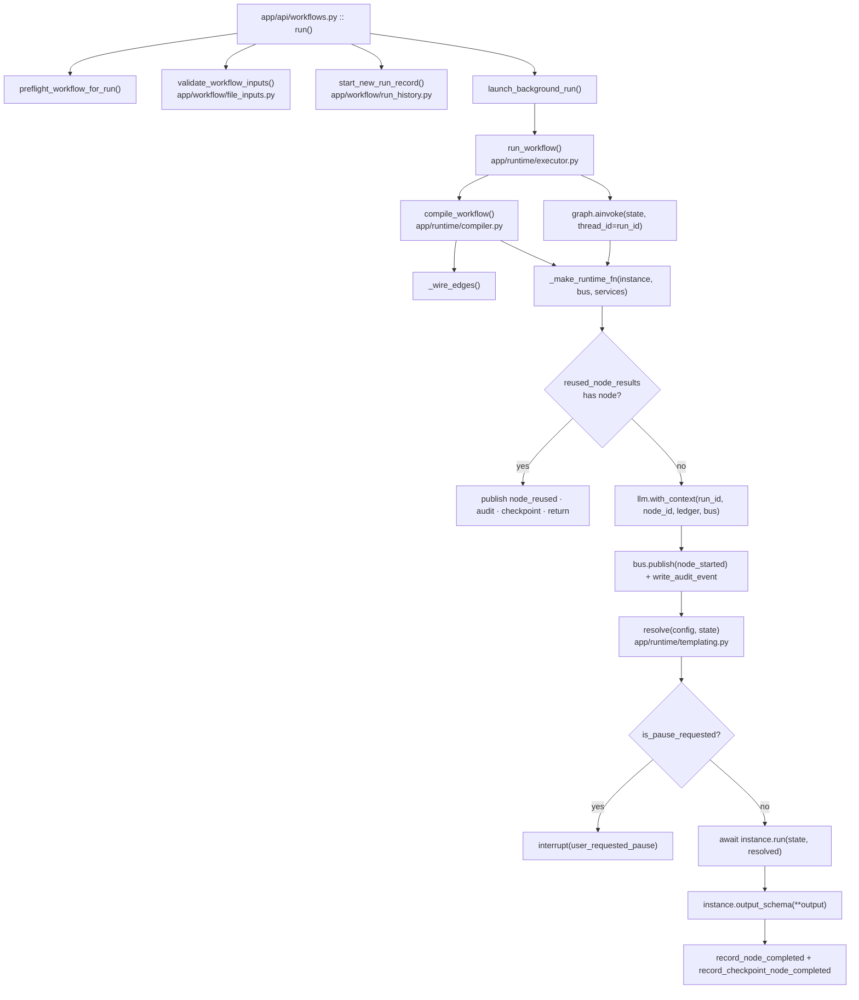
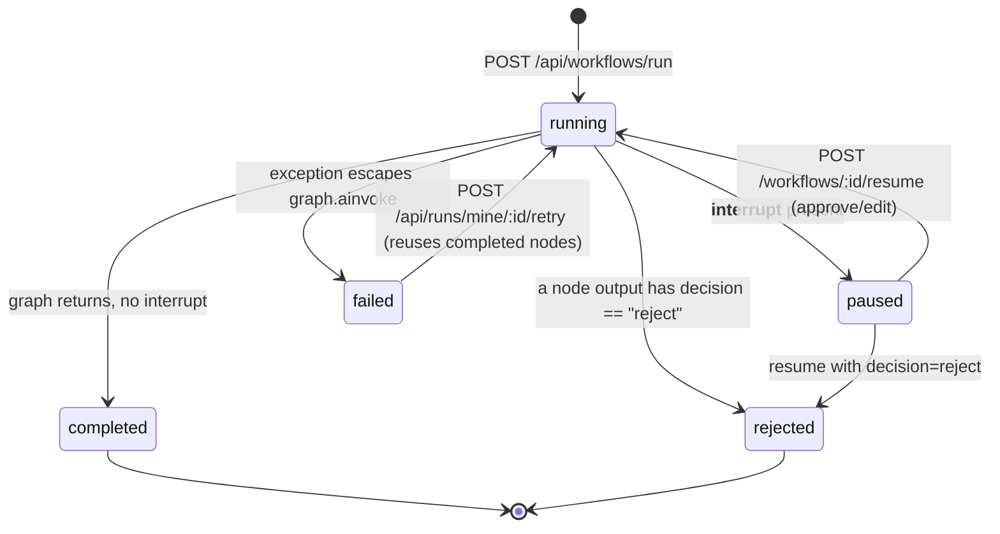
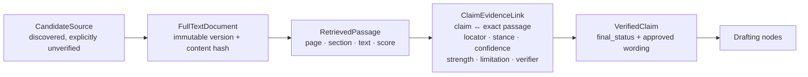
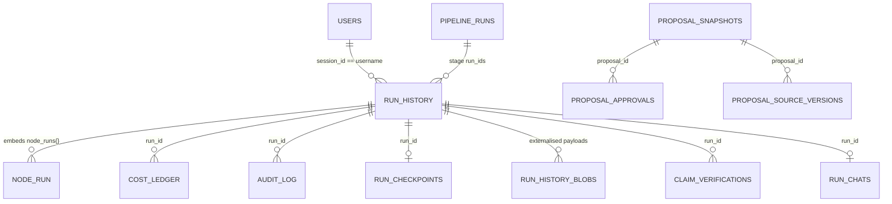
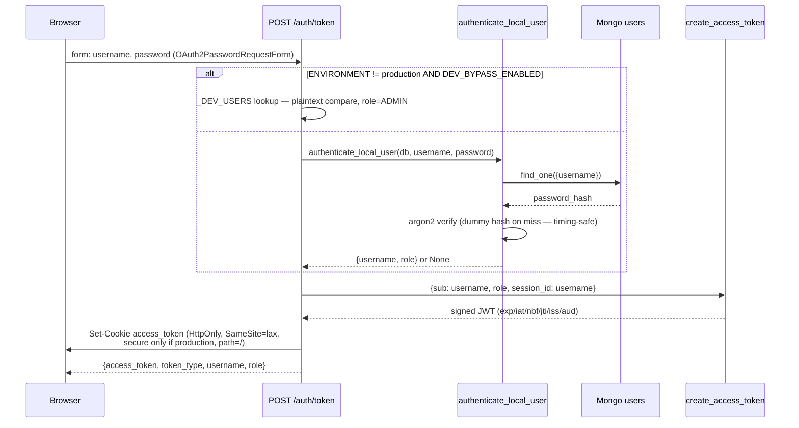
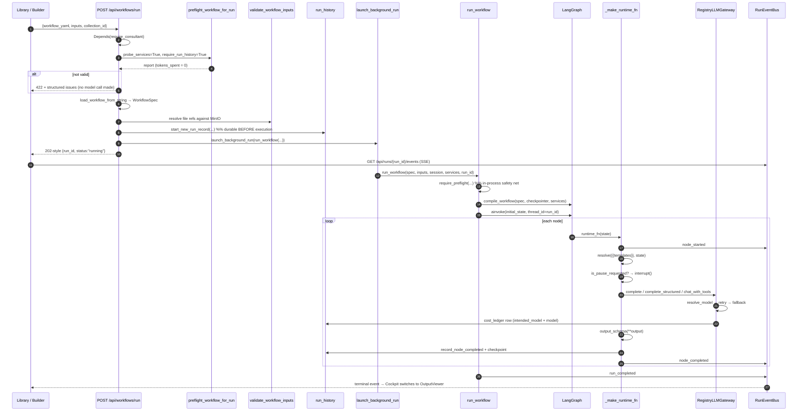
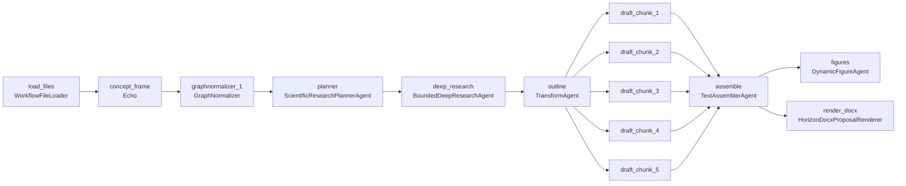
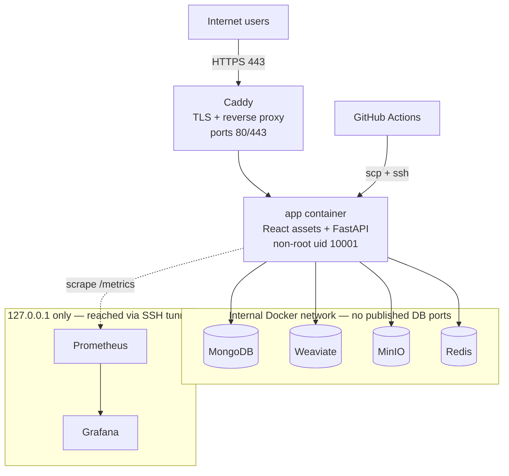

# Codebase Engineering Handbook

**Repository:** `agentic-workflow-platform` (Eurskem AI)
**Branch analysed:** `main` @ `7ca16b2` (3 August 2026)
**Analysis date:** 9 August 2026
**Scope:** ~62,000 lines across `app/` (Python backend, ~29k) and `ui/src/` (React frontend, ~21k), plus tests, infra and workflow definitions.

> **How to read this document.** Every architectural claim below is tagged implicitly by how it is sourced. Where a statement is backed by code I read, it cites the file and usually the line or symbol. Where I inferred intent from naming or structure, the text says **"likely intent"**. Where the repository did not give me enough evidence, the text says **"unclear"**. Nothing here is invented; if you find a claim without a citation, treat it as lower confidence.

---

## Table of contents

| # | Section | # | Section |
|---|---|---|---|
| 1 | [Executive Overview](#1-executive-overview) | 24 | [Build System](#24-build-system) |
| 2 | [The System in One Mental Model](#2-the-system-in-one-mental-model) | 25 | [Local Development](#25-local-development) |
| 3 | [Technology Stack](#3-technology-stack) | 26 | [CI/CD](#26-cicd) |
| 4 | [Repository Structure](#4-repository-structure) | 27 | [Deployment](#27-deployment) |
| 5 | [Application Startup](#5-application-startup) | 28 | [Important Abstractions](#28-important-abstractions) |
| 6 | [Architecture](#6-architecture) | 29 | [Design Patterns](#29-design-patterns) |
| 7 | [Architecture Diagram](#7-architecture-diagram) | 30 | [Coding Conventions](#30-coding-conventions) |
| 8 | [Core Domain Model](#8-core-domain-model) | 31 | [Feature-to-Code Map](#31-feature-to-code-map) |
| 9 | [Database and Persistence](#9-database-and-persistence) | 32 | [Data Flow Maps](#32-data-flow-maps) |
| 10 | [API Architecture](#10-api-architecture) | 33 | [Critical Files](#33-critical-files) |
| 11 | [Frontend Architecture](#11-frontend-architecture) | 34 | [Common Change Scenarios](#34-common-change-scenarios) |
| 12 | [Authentication](#12-authentication) | 35 | [Debugging Playbook](#35-debugging-playbook) |
| 13 | [Authorization](#13-authorization) | 36 | [Failure Modes](#36-failure-modes) |
| 14 | [Major Request Lifecycles](#14-major-request-lifecycles) | 37 | [Performance and Concurrency](#37-performance-and-concurrency) |
| 15 | [Major Business Workflows](#15-major-business-workflows) | 38 | [Technical Debt and Risks](#38-technical-debt-and-architectural-risks) |
| 16 | [Events and Background Processing](#16-events-and-background-processing) | 39 | [TODOs / Incomplete Areas](#39-todos-and-incomplete-areas) |
| 17 | [External Integrations](#17-external-integrations) | 40 | [Extension Points](#40-extension-points) |
| 18 | [State Management](#18-state-management) | 41 | [Change Impact Guide](#41-change-impact-guide) |
| 19 | [Configuration](#19-configuration) | 42 | [Glossary](#42-glossary) |
| 20 | [Error Handling](#20-error-handling) | 43 | [First-Day Reading Path](#43-first-day-reading-path) |
| 21 | [Security](#21-security) | 44 | [Repository Understanding Matrix](#44-repository-understanding-matrix) |
| 22 | [Logging and Observability](#22-logging-and-observability) | 45 | [Final Cheat Sheet](#45-final-cheat-sheet) |
| 23 | [Testing](#23-testing) | A | [Hidden Coupling](#appendix-a-hidden-coupling) |
| | | B | [Architecture Decisions](#appendix-b-architecture-decisions) |
| | | C | [Code Ownership by Responsibility](#appendix-c-code-ownership-by-responsibility) |

---

# 1. Executive Overview

## 1.1 Project purpose

**The problem.** Consulting, scientific research and grant-proposal work combine repetitive effort with high consequence. A single LLM prompt hides the parts that matter for that kind of work: which sources were selected, where reasoning transitioned, what failed, what it cost, and who is accountable. A fully manual process is slow and hard to audit.

**The response.** Eurskem AI is a **node-typed workflow platform**. A human-editable YAML file declares a graph of typed steps; the runtime validates it without spending model tokens, compiles it to a LangGraph `StateGraph`, and executes it so that every node passes through one boundary that records events, cost, audit and checkpoints.

**Positioning (stated in the repo's own README and portfolio docs).** The platform is the product. Proposal generation ("Project Alex" / Horizon Europe Part B) is the flagship *use case* built on it, not the platform itself. Confirmed by structure: nothing in `app/runtime/` is proposal-specific; proposal logic lives in `app/proposal_graph/`, `app/evidence/` and a subset of `app/nodes/`.

**Users** — derived from the three frontend "modes" in [`ui/src/App.tsx`](../ui/src/App.tsx) and the role model in [`app/security/rbac.py`](../app/security/rbac.py):

| User | Surface | What they need |
|---|---|---|
| Project administrator / domain expert | Guided Run (`/guided/:runId`) | Business stages, one attention queue, outputs, approve/reject/edit |
| Workflow author | Builder (`/builder/:name`) | Typed node config, data mapping, preflight, versions |
| Technical reviewer | Cockpit (`/cockpit/:runId`), Run History (`/history`) | Node lifecycle, failures, audit, retry |
| Operator | Operator Console mode, `/health`, `/ready`, `/metrics` | Readiness, cost, corpus inspection |
| Evaluator | Evaluation Lab mode, `/api/eval/*` | Scorecards, golden sets |

## 1.2 System summary

The backend is a **FastAPI application** ([`app/main.py`](../app/main.py)) whose `lifespan` context manager is the single composition root. At startup it builds one `services: dict` containing every shared client — Mongo, Weaviate, MinIO, Redis, the LangGraph checkpointer, the LLM gateway, the event bus, web search, image generation, vision, MCP, Deep Research, the scientific-skill catalog and the entity tokenizer. That dict is stashed on `app.state.services` and is the *only* dependency-injection mechanism in the system. Every route reaches it via `request.app.state.services`, and the workflow runtime receives it as a parameter.

Each external dependency is wrapped in its own `try/except` that logs a warning and continues. **The application boots with zero data services available.** What fails then is not startup but individual workflows, which is deliberate: `/ready` (in [`app/api/health.py`](../app/api/health.py)) reports per-service probes, and preflight refuses to run a workflow whose required services are missing.

A **workflow** is a YAML document in `workflows/` matching `WorkflowSpec` ([`app/runtime/schema.py:286`](../app/runtime/schema.py)). It declares typed `inputs`, `static_variables`, a list of `nodes` (each with a registry `type` and a `config`), `edges` (plain, fan-out list, or conditional with named `branches`), an `entry`, optional `exit`, an `output` projection, plus optional Guided-Run `experience` and `library` presentation metadata and a `data_protection_mode`.

Before anything executes, **preflight** ([`app/runtime/preflight.py`](../app/runtime/preflight.py), 1,934 lines) runs nine deterministic checks and can emit any of ~60 typed issue codes. It parses YAML for duplicate keys, validates the Pydantic contract, discovers the node registry, constructs every node to validate its config, checks model names against the catalog and (optionally) probes provider access, statically analyses every `{{...}}` template against upstream output schemas and graph ordering, validates router/fan-in topology, probes required services, and finally compiles the LangGraph graph without executing a node. Its report carries `tokens_spent: 0` as a first-class field — a product surface, not an implementation detail.

**Compilation** ([`app/runtime/compiler.py:563`](../app/runtime/compiler.py) `compile_workflow`) instantiates each node from `NodeRegistry`, wraps it in `_make_runtime_fn`, wires edges through `_wire_edges`, and compiles with a checkpointer. `_wire_edges` contains the subtlest logic in the repository: a target reached by more than one "arrival group" (a HITL dispatch, a router branch, or the combined plain-edge group) is redirected through synthetic pass-through **join-gate** nodes so that all predecessors can be passed to LangGraph in a single `add_edge([...], target)` call — the only form LangGraph treats as an AND-join rather than a race.

**Execution** ([`app/runtime/executor.py:60`](../app/runtime/executor.py) `run_workflow`) re-runs preflight as an in-process safety net, builds the initial `WorkflowState`, and invokes the graph with `thread_id = run_id`. It returns one of three statuses: `completed`, `paused` (a `__interrupt__` is present — a human gate or a cooperative pause), or `rejected` (a HITL node emitted `decision == "reject"`).

**The one node boundary.** Every node is added to the graph through `_make_runtime_fn` ([`app/runtime/compiler.py:63`](../app/runtime/compiler.py)). Inside it, in order: retry-reuse replay (returns before a gateway is bound, so replayed nodes cost zero tokens), per-node LLM context binding via `llm.with_context(...)`, `node_started` event + audit write, template resolution of the node's config against live state, a cooperative-pause check, `await instance.run(state, resolved)`, output validation against `output_schema`, durable node history and checkpoint writes. Centralising these is what keeps 43 node types operationally consistent.

**Persistence** is MongoDB-first. [`app/workflow/run_history.py`](../app/workflow/run_history.py) (1,379 lines) owns the durable run record — status, per-node runs, inputs, outputs, workflow YAML, checkpoints, pause requests — and transparently externalises oversized documents into GridFS (`run_history_blobs`) when a write exceeds the 16 MB BSON limit. Weaviate holds chunks and vectors, MinIO holds bytes and generated artifacts, Redis holds the LangGraph checkpointer and (in design) cache/rate-limit state.

**Live progress** reaches the browser over **Server-Sent Events** at `GET /api/runs/{run_id}/events`. `RunEventBus` ([`app/runtime/events.py`](../app/runtime/events.py)) is a Redis stream + pub/sub with bounded, TTL'd replay (falling back to in-process queues when Redis is absent), so a reconnecting client can pass `Last-Event-ID` and catch up — across workers, not just within the one that ran the workflow. The frontend does not use `EventSource` (which cannot send an `Authorization` header) — it reads the response body stream manually in `streamRunEvents` ([`ui/src/api/client.ts:710`](../ui/src/api/client.ts)).

**The frontend** is a React 19 SPA with three top-level modes selected by local state in `App.tsx`, not by URL: Workflow Studio, Evaluation Lab, Operator Console. Studio owns the router ([`ui/src/modes/studio/StudioRoot.tsx`](../ui/src/modes/studio/StudioRoot.tsx)) with routes for Library, Builder, Guided Run, Cockpit, Run History, Pipelines and Proposal Review. There is no Redux/Zustand/React-Query layer: server state is fetched in `useEffect` hooks and held in `useState`, with two large custom hooks (`useCockpitRun`, and the guided runtime model) doing the derivation work.

**Beyond single workflows**, the repository also implements **pipelines** ([`app/runtime/pipeline_executor.py`](../app/runtime/pipeline_executor.py), `pipeline_schema.py`) — multi-stage orchestration where each stage is a whole workflow and later stages consume earlier stages' outputs, with explicit human advance between stages.

**Evidence integrity** is the domain-specific heart of the system. `app/evidence/` declares fail-closed contracts (`EvidencePolicy` with every permissive flag defaulting to `False` and `extra="forbid"`), and a chain of node types moves material from *candidate* → *acquired immutable full text* → *exact-passage verification* → *VerifiedClaim* → drafting. The architectural rule, stated in code and comments throughout, is that search snippets and model summaries never become evidence by repetition.

## 1.3 Key capabilities

Only capabilities I confirmed in code are listed.

| Capability | Where |
|---|---|
| Typed workflow authoring + YAML contract | `app/runtime/schema.py`, `app/workflow/builder_store.py`, `ui/src/modes/studio/Builder.tsx` |
| Zero-token preflight validation | `app/runtime/preflight.py`, `scripts/preflight_workflows.py` |
| Graph compilation + execution | `app/runtime/compiler.py`, `executor.py` |
| Human-in-the-loop gates (approve/reject/edit) | `app/runtime/hitl.py`, `app/nodes/human_in_loop.py`, `ui/.../HITLPanel.tsx` |
| Cooperative pause / resume | `run_history.request_pause`, `compiler` pause check |
| Safe retry with completed-output reuse | `app/api/runs.py` `retry_failed_run`, `services["reused_node_results"]` |
| Durable run history + audit | `app/workflow/run_history.py`, `app/security/audit.py`, `app/api/audit.py` |
| Live run streaming (SSE) | `app/runtime/events.py`, `GET /api/runs/{run_id}/events` |
| Model routing, fallback, retries | `app/llm/registry.py`, `app/llm/model_router.py` |
| Cost ledger (intended vs actual model) | `app/observability/cost_ledger.py`, `app/api/cost.py` |
| Hybrid retrieval (BM25 + vector + rerank + compress) | `app/retrieval/` |
| Bounded Deep Research | `app/research/deep_research.py` |
| Evidence lifecycle + claim verification | `app/evidence/`, `app/nodes/claim_evidence_verifier.py` |
| Document rendering (DOCX/PDF/HTML/PPTX/XLSX) | `app/tools/`, `app/nodes/*renderer*.py` |
| Confidential entity tokenisation | `app/security/entity_tokenizer.py`, `entity_vault.py` |
| Multi-workflow pipelines | `app/runtime/pipeline_*.py`, `app/api/pipelines.py` |
| Evaluation / scorecards | `app/evaluation/`, `app/api/eval.py` |
| File upload + extraction | `app/workflow/file_inputs.py`, `app/api/workflow_files.py` |
| MCP tool integration | `app/mcp/`, `app/nodes/mcp_agent.py` |
| Workflow generation from a prompt | `app/api/workflow_generation.py` |
| Ask-AI over a run / node types | `app/api/run_chat.py`, `app/api/node_types_chat.py` |
| Autofix for preflight issues | `app/runtime/autofix.py`, `POST /api/workflows/autofix` |

**Not present** (checked and absent): billing/subscriptions, email/notification sending, multi-tenant org management beyond `session_id` scoping, Celery/APScheduler, Kubernetes manifests, Terraform/Pulumi, feature-flag service.

---

# 2. The System in One Mental Model

Imagine you are at a whiteboard.

> **One YAML file is the contract; one dict is the wiring; one function is the boundary; one Mongo document is the truth.**

Draw four boxes.

**Box 1 — The contract.** A workflow is a YAML file. It is not code and it is not a prompt. It declares typed inputs, a list of nodes each naming a registered type plus config, and edges between them. `WorkflowSpec` is that contract. Everything the Builder shows, everything preflight checks, and everything the compiler builds comes from this one document. Because it is a document, it can be versioned, diffed, autosaved as a draft, and restored — which is exactly what `app/workflow/builder_store.py` does.

**Box 2 — The wiring.** At startup, `app/main.py`'s `lifespan` builds a plain Python dict called `services`. Mongo, Weaviate, MinIO, Redis, the checkpointer, the LLM gateway, the event bus, MCP, web search — all of it, one key each. There is no DI container, no provider registry, no framework magic. If you want to know what a component can reach, look at which `services[...]` keys it reads. If a service failed to construct, its key is simply absent, and every consumer is written to handle that.

**Box 3 — The boundary.** Nodes never touch the graph directly. `compile_workflow` wraps every node instance in `_make_runtime_fn`, and *that* function is what LangGraph calls. It is where the run ID gets bound to the LLM gateway (so cost lands on the right node), where lifecycle events are published, where audit rows are written, where `{{templates}}` in the node's config are resolved against live state, where a pause request is honoured, and where the node's return value is validated against its declared `output_schema`. Forty-three node types, one operational contract. When you are debugging "why did this node behave like that", this function is where you start.

**Box 4 — The truth.** The durable record of a run is one MongoDB document in `run_history`, patched incrementally by the boundary as each node starts, completes, fails, is reused or pauses. Guided Run, Cockpit, Run History and the audit panel are four *renderings of that one document*, which is why you can move between them without starting a second run. When the document would exceed Mongo's 16 MB limit, `_externalize_if_large` transparently spills payloads to GridFS and stores a pointer.

**Now draw the arrows.**

A browser authenticates at `POST /auth/token` and receives a JWT in an HttpOnly cookie. It POSTs a workflow YAML plus inputs to `POST /api/workflows/run`. That route runs preflight with live service probes; a failure returns 422 with structured issues and **no model call has been made**. On success it validates and materialises file inputs into MinIO, reserves or generates a `run_id`, writes the durable run record *before* execution, and then **detaches** execution into a background task — because a run can take twenty minutes and holding the HTTP connection open invites proxy timeouts that would cancel an in-flight provider call. The response is immediately `{run_id, status: "running"}`.

The browser then opens an SSE stream at `GET /api/runs/{run_id}/events` and watches the graph light up. Meanwhile the background task walks the graph. Each node passes the boundary. LLM calls go through `RegistryLLMGateway`, which resolves the requested model, retries transient failures, falls back to a compatible model if the intended one is unavailable, and writes a `cost_ledger` row recording **both** what was asked for and what actually ran. If a `HumanInLoopAgent` is reached, LangGraph's `interrupt()` raises out through the graph; the executor detects `__interrupt__`, marks the run `paused`, and persists a checkpoint. A human later calls `POST /api/workflows/{run_id}/resume` with `{"decision": "approve"|"reject"|"edit"}`, and `resume_workflow_durable` rebuilds or reuses the graph and continues.

When the run finishes, an `output` projection is computed from the spec's `output` block, terminal events go out on the bus, and the durable document is final. Cockpit switches from graph view to output view; Run History can reopen the same record days later.

**The one thing to hold onto:** *the YAML declares, the services dict wires, the boundary enforces, and the Mongo document remembers.* Almost every question about this codebase resolves to one of those four.

---

# 3. Technology Stack

## 3.1 Languages and runtime

| Technology | Version | Role | Configured in |
|---|---|---|---|
| Python | `>=3.11` declared; 3.12 in CI and Docker | Backend language | [`pyproject.toml:8`](../pyproject.toml), `Dockerfile` (`python:3.12.11-slim-bookworm`), CI (`uv python install 3.12`) |
| TypeScript | `~6.0.2` | Frontend language | [`ui/package.json`](../ui/package.json) |
| Node.js | v22 observed locally; Vite 8 implies ≥20 | Frontend build/dev runtime | `ui/package.json` (no `engines` field — **unclear**, not pinned) |

## 3.2 Backend framework and server

| Technology | Role | Where |
|---|---|---|
| **FastAPI** | HTTP framework, DI via `Depends`, OpenAPI docs | [`app/main.py:377`](../app/main.py); 18 routers included at lines 414–431 |
| **Uvicorn** | ASGI server | `Dockerfile` CMD, local dev command |
| **Pydantic v2** | Every schema in the system: settings, workflow contract, node config/input/output, API request bodies | `app/config.py`, `app/runtime/schema.py`, `app/nodes/base.py` |
| **Starlette** | `BaseHTTPMiddleware` for the (unregistered — see §21) security middleware | `app/security/middleware.py:13` |

`pydantic` is not merely a validation library here — it is the **type system of the platform**. `NodeType` subclasses declare three Pydantic models (`input_schema`, `output_schema`, `config_schema`), and preflight introspects `output_schema.model_fields` to statically validate template references. Replacing Pydantic would require rewriting preflight.

## 3.3 Workflow engine

| Technology | Role | Where |
|---|---|---|
| **LangGraph** (v1.2.9 referenced in comments) | Graph construction and execution: `StateGraph`, `START`/`END`, `add_conditional_edges`, `interrupt()`, `Command(resume=...)` | [`app/runtime/compiler.py`](../app/runtime/compiler.py), [`app/runtime/hitl.py`](../app/runtime/hitl.py) |
| **`langgraph.checkpoint.redis.aio.AsyncRedisSaver`** | Durable graph checkpoints across process restarts; `thread_id = run_id` | [`app/main.py:199-206`](../app/main.py) |
| **`MemorySaver`** | Explicit offline/test fallback only | `app/runtime/compiler.py:612` |

The design comment at `compiler.py:610` is explicit: Redis is the production checkpointer and `MemorySaver` is a fallback, not the default intent.

## 3.4 Data stores

| Store | Client | Role | Where configured |
|---|---|---|---|
| **MongoDB 7.0.14** | `pymongo` (sync, for `CostLedger`) **and** `motor`/`AsyncIOMotorClient` (async, everything else) | Runs, durable node history, audit, manifests, scorecards, cost ledger, users, entity mappings, claim verifications, preflight stats, proposal snapshots; GridFS for oversized run payloads | `app/db/mongo.py` (`DB_NAME = "eurskem_ai"`), `app/main.py:80-98` |
| **Weaviate 1.27.0** | `weaviate` python client (`connect_to_local`, gRPC on 50051) | Chunk storage, BM25 + vector hybrid search, metadata filters | `app/retrieval/weaviate_client.py`, `app/main.py:157` |
| **MinIO** (S3-compatible) | **boto3** (per the docstring in `app/storage/minio_client.py`, despite the module name) | Uploaded bytes, immutable source versions, generated artifacts | `app/storage/minio_client.py`, `app/main.py:173` |
| **Redis** (`redis-stack-server`) | `redis.asyncio` | LangGraph checkpoints; designed for cache + rate limits | `app/main.py:184` |

**Note the dual Mongo clients.** `services["mongo"]` is the async motor wrapper; `services["audit_db"]` is the raw motor `Database`; `services["db"]` is a *separate synchronous pymongo* `Database` used only because `CostLedger` is synchronous ([`app/main.py:86-138`](../app/main.py)). This is a deliberate, commented decision, not an accident.

## 3.5 LLM and AI providers

| Technology | Role | Where |
|---|---|---|
| **Anthropic SDK** | Claude models (`claude-opus-5`, `claude-sonnet-4-5`, `claude-haiku-4-5`, …) | `app/llm/anthropic_gw.py`, `anthropic_batch.py` |
| **OpenAI SDK** | GPT models, embeddings, image generation, web search | `app/llm/openai_gw.py`, `openai_registry.py`, `openai_batch.py` |
| **OpenAI-compatible local endpoints** | Self-hosted Kimi K3 / GLM-5 over `/v1` | `app/llm/local_openai_gw.py`, settings `LOCAL_KIMI_*` / `LOCAL_GLM_*` |
| **Tavily** | Web search backend option | `app/tools/web_io.py`, `TAVILY_API_KEY` |
| **MCP (Model Context Protocol)** | stdio subprocess tool servers, incl. `paper_search_mcp` | `app/mcp/client.py`, `app/mcp/server.py`, `app/mcp/paper_search_server.py` |
| **spaCy** | NER for unclaimed spans in entity detection | `app/security/entity_ner.py` |
| **K-Dense scientific-agent-skills** | Catalog of scientific skills cloned at image-build time (`v2.59.0`) | `Dockerfile` stage 1, `app/research/skills.py` |

## 3.6 Frontend

| Technology | Version | Role |
|---|---|---|
| **React** | 19.2.6 | UI |
| **react-router-dom** | 7.16.0 | Studio routing (`BrowserRouter` in `ui/src/main.tsx`) |
| **reactflow** | 11.11.4 | The Builder canvas and Cockpit graph |
| **dagre** | 0.8.5 | Automatic graph layout (`ui/src/modes/studio/flow-layout.ts`) |
| **js-yaml** | 4.1.1 | Client-side YAML ⇄ graph bridge (`yaml-bridge.ts`) |
| **Tailwind CSS** | 3.4.19 | Styling, plus hand-written CSS variables in `ui/src/styles/globals.css` |
| **Vite** | 8.0.12 | Dev server and production bundler |
| **Vitest** | 4.1.10 | Frontend unit tests (12 test files) |
| **ESLint 10 / typescript-eslint** | — | Linting, CI runs with `--max-warnings=0` |

There is **no** state-management library, **no** data-fetching library (React Query/SWR), and **no** component library. State is `useState`/`useEffect`; the API layer is a hand-written `fetch` wrapper in `ui/src/api/client.ts`.

## 3.7 Observability, build and tooling

| Technology | Role | Where |
|---|---|---|
| **structlog** | Structured JSON logging | `app/observability/logging.py` |
| **prometheus_client** | Metrics, mounted as an ASGI app at `/metrics` | `app/main.py:409-411`, `app/observability/metrics.py` |
| **OpenTelemetry** | Tracing scaffold, disabled by default (`OTEL_ENABLED=false`) | `app/observability/tracing.py` |
| **Grafana 12.1.0 / Prometheus 3.5.0** | Dashboards, bound to loopback | `docker-compose.yml`, `observability/` |
| **uv** | Python dependency resolution and locking (`uv.lock`, 1 MB) | `pyproject.toml`, CI, `Dockerfile` |
| **pytest** | Backend tests (91 modules) | `tests/`, `pyproject.toml` |
| **WeasyPrint** | HTML→PDF rendering (hence `libpango`/`libcairo` in the Dockerfile) | `app/tools/`, `Dockerfile:24-31` |
| **python-docx / python-pptx / openpyxl** | Document generation | `app/tools/docx_proposal_rendering.py`, `powerpoint_tool`, `excel_tool` |
| **Caddy** | TLS termination / reverse proxy in production | `deploy/ionos/`, `docker-compose.production.yml` |

---
# 4. Repository Structure

```text
agentic-workflow-platform/
├── app/                          # Python backend (~29k LOC)
│   ├── main.py                   # ★ Composition root: lifespan builds `services`, mounts 18 routers
│   ├── config.py                 # ★ Pydantic Settings + production security gate
│   ├── api/                      # HTTP layer — 20 route modules, one per feature area
│   ├── runtime/                  # ★ Workflow engine: schema, preflight, compiler, executor, HITL, events, coordination
│   ├── nodes/                    # 43 node types + registry + category map
│   ├── llm/                      # Provider gateways, model registry, router, semantic cache, batch
│   ├── workflow/                 # Durable stores: run history, builder store, file inputs, pipelines history
│   ├── evidence/                 # Evidence contracts, claim verification, identifiers, retrieval
│   ├── proposal_graph/           # Proposal-domain graph: concepts, coverage, Horizon evaluation
│   ├── research/                 # Bounded Deep Research + scientific skill catalog
│   ├── retrieval/                # Hybrid search, reranker, compressor, Weaviate client
│   ├── ingestion/                # Extractor, chunker, embedder, collections registry
│   ├── security/                 # JWT, RBAC, users, guardrails, middleware, entity protection
│   ├── observability/            # structlog, Prometheus metrics, cost ledger, OTel tracing
│   ├── storage/                  # Object store wrapper (MinIO/S3)
│   ├── db/                       # Mongo client wrapper, DB_NAME, versioned migration runner
│   ├── mcp/                      # MCP stdio client + two servers
│   ├── evaluation/               # Golden sets, LLM judge, scorecard runner
│   └── tools/                    # Document/IO tools: DOCX, PDF, XLSX, PPTX, web, image, vision
├── ui/                           # React 19 SPA (~21k LOC)
│   └── src/
│       ├── App.tsx               # Mode switcher (studio | eval | operator) + auth gate
│       ├── main.tsx              # BrowserRouter bootstrap
│       ├── api/                  # client.ts (all HTTP + SSE) and types.ts
│       ├── components/           # auth/, layout/, studio/, ui/ — small shared set
│       ├── hooks/                # useRunEvents, useRunSocket
│       ├── modes/
│       │   ├── studio/           # ★ Library, Builder, Cockpit, GuidedRun, RunHistory, Pipelines
│       │   ├── eval/             # Evaluation Lab
│       │   └── operator/         # Operator Console, corpus inspector
│       └── styles/globals.css    # Brand tokens (navy #092536, teal #007f7b)
├── workflows/                    # ★ The workflow contract instances — 20 executable YAML files
│   ├── pipelines/                # Multi-stage pipeline definitions
│   ├── collections/              # Corpus/collection definitions (default, proposal)
│   ├── test_fixtures/            # Small workflows used by tests
│   └── .builder/                 # (runtime) autosaved drafts — not executable, gitignored
├── tests/                        # 91 pytest modules + conftest.py + fake_mongo.py
├── scripts/                      # 25 operational scripts (preflight, smoke, seed, load test…)
├── docs/                         # Architecture, security, evaluation, ADRs, deployment guides
├── deploy/ionos/                 # Caddyfile, deploy_release.sh, setup_host.sh, backup.sh, MinIO policy
├── observability/                # Prometheus + Grafana provisioning
├── portfolio/                    # Portfolio PDFs, screenshots and their HTML sources
├── eval/, exports/, output/, samples/   # Golden sets, generated artifacts, sample inputs
├── docker-compose.yml            # Local dev stack (all ports bound to 127.0.0.1)
├── docker-compose.production.yml # Production stack
├── Dockerfile                    # Multi-stage: scientific skills → python:3.12-slim, non-root uid 10001
├── pyproject.toml / uv.lock      # Backend dependencies
└── .github/workflows/            # ci.yml, deploy-ionos.yml, live-llm-tests.yml
```

## 4.1 "Where do I look for…?"

| I need to change… | Go to |
|---|---|
| An HTTP endpoint | `app/api/<feature>.py` — the file names map to feature areas |
| What a workflow is allowed to declare | `app/runtime/schema.py` |
| A validation rule that should block a run | `app/runtime/preflight.py` |
| How a node executes / what wraps it | `app/runtime/compiler.py` → `_make_runtime_fn` |
| Graph wiring, fan-out, routers, join gates | `app/runtime/compiler.py` → `_wire_edges` |
| Run status semantics | `app/runtime/executor.py` → `run_workflow` |
| A new capability a workflow can call | `app/nodes/` (add a `NodeType` subclass) |
| Which model actually gets called | `app/llm/registry.py` → `RegistryLLMGateway`, `app/llm/model_router.py` |
| What is stored about a run | `app/workflow/run_history.py` |
| Draft/version/save behaviour of workflows | `app/workflow/builder_store.py` |
| Retrieval scope and filters | `app/retrieval/hybrid_search.py` |
| Evidence rules | `app/evidence/models.py` |
| Any setting or env var | `app/config.py` |
| Anything the browser calls | `ui/src/api/client.ts` |
| Builder canvas behaviour | `ui/src/modes/studio/Builder.tsx`, `builder-graph.ts`, `yaml-bridge.ts` |
| Cockpit live behaviour | `ui/src/modes/studio/cockpit/useCockpitRun.ts` |
| Guided-Run stage derivation | `ui/src/modes/studio/guided/runtime-model.ts` |

## 4.2 Notable structural observations

- **`app/api/` has no sub-layering.** Route modules contain routing, validation, orchestration and sometimes business logic in one file. `app/api/workflows.py` (924 lines) and `app/api/proposals.py` (542 lines) are the two largest and are where this is most visible.
- **There is no `services/` or `usecases/` directory.** Application logic lives either in route modules or inside node types. This is a real architectural characteristic, not an omission — see §6.4.
- **`app/nodes/` is the largest package (9,937 lines, 45 files).** It is where the *domain* lives. `proposal_evidence_factory.py` alone is 1,138 lines.
- **`workflows/` is source, not data.** These YAML files are validated in CI (`scripts/preflight_workflows.py --warnings-as-errors`), so a change to a node's schema that breaks a shipped workflow fails the build.

---

# 5. Application Startup

## 5.1 Backend entry point

**File:** [`app/main.py`](../app/main.py)
**Symbol:** `lifespan(app)` (async context manager) → `app = FastAPI(..., lifespan=lifespan)`
**Command:** `uvicorn app.main:app --host 0.0.0.0 --port 8000` (Dockerfile CMD)

### Startup sequence (confirmed, in source order)

```text
Process starts
   ↓
configure_logging(settings.environment)                     app/main.py:66  (structlog)
   ↓
Settings validated                                          app/config.py — @model_validator
   │  └─ validate_production_security() raises ValueError and ABORTS BOOT
   │     if ENVIRONMENT=production with dev secrets/CORS/hosts/flags
   ↓
FastAPI object constructed                                  app/main.py:377
   │  └─ docs_url/redoc_url/openapi_url = None if API_DOCS_ENABLED=false
   ↓
TrustedHostMiddleware  → CORSMiddleware                     app/main.py:390-406
   ↓
/metrics mounted (if METRICS_ENABLED)                       app/main.py:409-411
   ↓
18 routers included                                         app/main.py:414-431
   ↓
── lifespan begins (on first request / server start) ──
   ↓
MongoDB           sync ping (3s timeout) → async motor wrapper
   │  ├─ CollectionRegistry, audit_db
   │  ├─ run_migrations(audit_db)  ← app/db/migrations.py; MigrationError is the
   │  │                              one Mongo failure that ABORTS boot (below)
   │  ├─ ensure_indexes × 6 (run history, pipelines, claim verifications,
   │  │                      run chat, preflight stats, proposal workspace)
   │  ├─ EntityTokenizerService + index creation
   │  ├─ eager _load_kek() warning if entity protection ≠ public
   │  └─ CostLedger(db)  ← raw *sync* pymongo Database
   ↓
Weaviate          connect_to_local(host, port, grpc_port, api_key)
   ↓
Object store      get_object_store()  (MinIO/S3 via boto3)
   ↓
Redis             aioredis.from_url(...).ping()
   ↓
LangGraph checkpointer   AsyncRedisSaver.from_conn_string(REDIS_URL).asetup()
   │                     (only attempted if Redis connected)
   ↓
LLM gateway       get_llm_gateway()  → RegistryLLMGateway singleton
   │               + configured_local_model_probes()
   ↓
Tool services     web_search, database_lookup, image_generator, kimi_vision
   │               (always construct; raise only when called)
   ↓
Scientific skills (if SCIENTIFIC_SKILLS_ENABLED) → catalog.refresh()
   ↓
Deep Research     (if DEEP_RESEARCH_ENABLED) → get_deep_research_service(llm, web_search)
   ↓
MCP client        launch_mcp_session() — spawns stdio subprocess, holds session
   ↓
Retriever         (if Weaviate up) embedder + retrieve() closure + evidence_indexer
   ↓
Event bus         RunEventBus(redis, max_events_per_run, max_run_histories,
   │                            replay_ttl_seconds)   ← Redis-backed if Redis is up
   │               + BackgroundRunManager(redis, lease_seconds)
   ↓
Stale-run cleanup asyncio background task loop (interval = RUN_AUTO_CLEANUP_INTERVAL_SECONDS,
                  leader-elected per tick via RedisLease — see §16.4)
   ↓
app.state.services = services      ← THE dependency container
   ↓
yield  →  APPLICATION READY
```

### The degradation contract

Every block from MongoDB onward is wrapped in `try/except Exception` that logs a **warning** and continues. Consequences you must understand:

- The app **almost always boots**. Three things abort startup instead of degrading: a production config violation (a `ValueError` from settings validation, before FastAPI is even constructed), a `MigrationError` (deliberately re-raised — serving traffic against a half-migrated database is worse than not serving), and any plain bug in the lifespan body itself. The last one is easy to miss: the lifespan reads `settings.*` outside the `try` blocks, so a setting referenced in code but absent from `Settings` raises `AttributeError` and kills boot. Uvicorn then unwinds the already-started MCP stdio session from a different task, and anyio's `Attempted to exit cancel scope in a different task than it was entered in` floods the log — **that traceback is a symptom of a failed startup, not its cause.** Scroll up to the last successful `*.ready` log line; the real error is immediately after it.
- Absence is signalled by a **missing dict key**, not by a null object. Consumers use `services.get("x")` and branch.
- `CostLedger(None)` is constructed on Mongo failure ([`app/main.py:145`](../app/main.py)) so cost recording degrades to a no-op rather than crashing nodes.
- Readiness, not liveness, is the gate: `GET /ready` probes each service in `READINESS_REQUIRED_SERVICES` and is what the deployment script waits on.

### Shutdown

Reverse order, after `yield`: cancel the cleanup task, close `background_run_manager` (which drains in-flight detached runs) and `event_bus`, then `database_lookup`, `mongo`, `weaviate_client`, `redis`, stop the MCP subprocess, exit the checkpointer context. Ordering matters here — `redis` is closed *after* the two Redis-backed managers, so their teardown still has a working client.

## 5.2 Other entry points

| Entry point | File / command | Notes |
|---|---|---|
| **Frontend bootstrap** | `ui/src/main.tsx` → `<BrowserRouter><App/></BrowserRouter>` | `App.tsx` calls `rehydrate()` first to recover an HttpOnly-cookie session before deciding to show `LoginPage` |
| **Preflight CLI** | `scripts/preflight_workflows.py [paths] [--json] [--warnings-as-errors]` | Zero-token validation of every workflow; run in CI |
| **MCP servers** | `app/mcp/server.py`, `app/mcp/paper_search_server.py` | Launched as stdio subprocesses by `MCPClient.start()` |
| **Ingestion CLI** | `app/ingestion/cli.py` | Corpus ingestion |
| **Test bootstrap** | `tests/conftest.py` | Provides `StubLLM` and fixtures; `tests/fake_mongo.py` provides an in-memory Mongo double |
| **Operational scripts** | `scripts/*.py` (25) | `smoke_production.py`, `load_test.py`, `seed_collections.py`, `manage_user.py`, `generate_production_env.py`, `render_sample_proposal*.py`, … |

**Schema evolution has two halves.** Indexes are handled by idempotent `ensure_indexes()` calls at startup (§9.5). *Document shape* is handled by a versioned migration runner, `run_migrations()` in [`app/db/migrations.py`](../app/db/migrations.py) — index creation is not a data-migration strategy, because old documents keep their old shape. Each `Migration` is recorded in the `schema_migrations` collection once applied, so it runs at most once; a Mongo lease (`__migration_lock__`, 300 s, renewed while working) stops concurrent Uvicorn workers from backfilling the same population simultaneously. `CURRENT_RUN_SCHEMA_VERSION` is `1`, whose migration backfills the explicit v1 shape onto legacy run and checkpoint documents. Failure raises `MigrationError`, which is the one Mongo problem that aborts boot rather than degrading.

---

# 6. Architecture

## 6.1 What kind of architecture is this?

It is a **modular monolith with a domain-specific execution engine at its centre**, and it does *not* cleanly match layered/clean/hexagonal architecture. Being precise about this matters more than picking a label:

| Pattern | Does it fit? | Evidence |
|---|---|---|
| Monolith | **Yes** | One FastAPI process, one deployable, one Docker image |
| Modular monolith | **Yes** | `app/` packages have clear responsibilities and mostly import downward |
| Plugin architecture | **Yes, for nodes** | `NodeRegistry` + `discover_nodes()` auto-import; adding a file adds a capability |
| Event-driven | **Partially** | `RunEventBus` is real, but it is *in-process, fan-out-to-UI only*. No broker, no consumers that change state |
| Layered / Clean / Hexagonal | **No** | There is no application-service layer and no port/adapter inversion. Routes call the runtime directly; nodes reach infrastructure through the `services` dict |
| Microservices | **No** | Single process; MCP subprocesses are tool servers, not services |
| CQRS / Serverless | **No** | No evidence |

The honest one-line description: **a FastAPI control plane wrapped around a plugin-based workflow interpreter, with infrastructure supplied by a hand-built service dictionary.**

## 6.2 Architectural layers and dependency direction

```text
┌─────────────────────────────────────────────────────────────┐
│  ui/src            React SPA — talks only to app/api        │
└─────────────────────────────┬───────────────────────────────┘
                              │ HTTP + SSE
┌─────────────────────────────▼───────────────────────────────┐
│  app/api           Routing, authz dependency, request       │
│                    validation, orchestration                │
└──────┬──────────────────────────────────────┬───────────────┘
       │                                      │
┌──────▼───────────────────┐        ┌─────────▼───────────────┐
│  app/runtime             │        │  app/workflow           │
│  schema · preflight ·    │◄───────┤  run_history ·          │
│  compiler · executor ·   │        │  builder_store ·        │
│  hitl · events           │        │  file_inputs            │
└──────┬───────────────────┘        └─────────┬───────────────┘
       │ NodeRegistry.get()                   │
┌──────▼──────────────────────────────────────▼───────────────┐
│  app/nodes         43 node types = the domain capabilities  │
└──────┬──────────────────────────────────────────────────────┘
       │ self.services[...]
┌──────▼──────────────────────────────────────────────────────┐
│  Infrastructure & domain services                           │
│  app/llm · app/retrieval · app/evidence · app/research ·    │
│  app/tools · app/storage · app/db · app/mcp · app/security  │
└─────────────────────────────────────────────────────────────┘
```

**Dependency rules that actually hold (confirmed by import inspection):**

- `ui/` → `app/api` only, and only over HTTP.
- `app/api` → `app/runtime`, `app/workflow`, `app/security`, and domain packages directly.
- `app/runtime` → `app/nodes` (via registry), `app/workflow/run_history`, `app/observability`, `app/security` (entity protection mode).
- `app/nodes` → everything infrastructural, but **only through `self.services`**, never by importing `app.main`.
- Infrastructure packages do **not** import `app/api` or `app/runtime`. This is the cleanest boundary in the codebase.

**Inconsistencies worth knowing:**

1. **`app/runtime/compiler.py` imports `app/workflow/run_history`** (`record_node_started`, `is_pause_requested`, …). The execution engine therefore depends on a persistence module. It works because those functions take `db` as a parameter, but the direction is downward-to-sideways rather than through an interface.
2. **`app/observability/cost_ledger.py` imports `app/llm/openai_registry`** for pricing. The comment at the top explains this is deliberate — a second hand-maintained price table had already drifted — but it couples observability to the LLM package.
3. **`app/security/entity_tokenizer.py` imports `_PII_PATTERNS` from `app/security/guardrails.py`** — a private symbol crossing module boundaries within the package.

## 6.3 Module boundaries

| Module | Responsibility | Public surface | Depends on | Consumed by | Owns |
|---|---|---|---|---|---|
| `app/runtime` | Validate, compile, execute workflows | `WorkflowSpec`, `preflight_workflow_spec`, `compile_workflow`, `run_workflow`, `resume_workflow`, `RunEventBus` | nodes, workflow, observability | api, scripts, tests | Graph semantics, run status |
| `app/nodes` | Capability units | `NodeType`, `NodeRegistry` | services dict | runtime, api (`/node-types`) | Node contracts |
| `app/workflow` | Durable stores for runs/drafts/files | `upsert_run`, `record_node_*`, `save_workflow`, `validate_workflow_inputs` | db, storage | api, runtime | The run document, the draft/version files |
| `app/llm` | Model access | `get_llm_gateway()`, `RegistryLLMGateway`, `ModelRouter` | provider SDKs, cost ledger | runtime boundary, nodes | Model resolution, retry, fallback |
| `app/evidence` | Evidence contracts + verification | `EvidencePolicy`, `ClaimEvidenceLink`, `VerifiedClaim` | retrieval, llm | nodes, proposal_graph | Evidence rules |
| `app/retrieval` | Read path | `retrieve()`, `hybrid_search()` | Weaviate, embedder, llm | services dict | Scope filter (security boundary) |
| `app/security` | Identity + confidentiality | `require_consultant`, `Role`, `EntityTokenizerService` | db | api, llm gateway | AuthN/AuthZ, tokenisation |
| `app/observability` | Logs, metrics, cost | `get_logger`, `metrics.*`, `CostLedger` | llm registry (pricing) | everywhere | Cost records |

## 6.4 The missing application-service layer

There is **no** `UserService`/`OrderService`-style layer. Business orchestration lives in exactly two places:

1. **Route handlers** — e.g. `POST /api/workflows/run` in [`app/api/workflows.py:382`](../app/api/workflows.py) performs preflight, YAML load, input validation, run-ID reservation, durable record creation and background launch inline.
2. **Node `run()` methods** — e.g. `BoundedDeepResearchAgent` owns the research loop; `ClaimEvidenceVerifier` owns verification.

**Why this is defensible:** the *workflow YAML itself* is the application layer. Sequencing, branching and orchestration are declared in data, not code, so a code-level service layer would duplicate what the graph already expresses.

**Where it costs you:** logic that is *not* workflow-shaped — proposal approvals, source-version registration, Horizon evaluation in `app/api/proposals.py` — has nowhere to live except the route module, which is why that file is 542 lines and hard to unit-test without a TestClient.

---

# 7. Architecture Diagram

## 7.1 System components

```mermaid
flowchart TB
    subgraph Client["Browser — React 19 SPA"]
        Lib["Workflow Library"]
        Bld["Builder (reactflow)"]
        Gui["Guided Run"]
        Cok["Cockpit"]
        Hist["Run History"]
    end

    subgraph API["FastAPI control plane — app/main.py"]
        MW["TrustedHost + CORS"]
        Auth["/auth/token · JWT in HttpOnly cookie"]
        R1["/api/workflows/*"]
        R2["/api/runs/*"]
        R3["/api/proposals/* · /api/eval/* · /api/pipelines/*"]
        SSE["GET /api/runs/:id/events (SSE)"]
        Health["/health · /ready · /metrics"]
    end

    subgraph Runtime["Workflow runtime — app/runtime"]
        PF["preflight.py — 0 tokens"]
        CMP["compiler.py — StateGraph + _make_runtime_fn"]
        EXE["executor.py — run_workflow"]
        HITL["hitl.py — interrupt / resume"]
        BUS["events.py — RunEventBus"]
    end

    subgraph Nodes["app/nodes — 43 typed capabilities"]
        NR["NodeRegistry"]
    end

    subgraph Infra["Data services"]
        Mongo[("MongoDB<br/>runs · audit · cost · users<br/>+ GridFS blobs")]
        Weav[("Weaviate<br/>chunks · vectors · BM25")]
        Minio[("MinIO<br/>uploads · artifacts")]
        Redis[("Redis<br/>LangGraph checkpoints")]
    end

    subgraph Ext["External capabilities"]
        Anth["Anthropic"]
        OAI["OpenAI"]
        Local["Local Kimi / GLM (OpenAI-compatible)"]
        Search["Tavily / OpenAI / Kimi web search"]
        MCP["MCP stdio servers<br/>eurskem · paper-search"]
    end

    Client -->|"fetch + Authorization / cookie"| API
    Cok -.->|"EventSource-style stream"| SSE
    Gui -.-> SSE

    R1 --> PF --> CMP --> EXE
    EXE --> HITL
    EXE --> BUS --> SSE
    CMP --> NR
    NR --> Nodes

    R1 --> Mongo
    R2 --> Mongo
    EXE --> Redis
    Nodes --> Mongo
    Nodes --> Weav
    Nodes --> Minio
    Nodes --> Ext

    subgraph Gateway["app/llm — RegistryLLMGateway"]
        GW["resolve · retry · fallback · cost"]
    end
    Nodes --> GW --> Anth & OAI & Local
    GW --> Mongo
    Nodes --> MCP
    Nodes --> Search
```



## 7.2 Runtime call graph (the hot path)



---
# 8. Core Domain Model

This system has **two domain layers**. The *platform domain* (workflow, node, run, event, cost) is use-case neutral and lives in `app/runtime` + `app/workflow`. The *proposal domain* (claim, source, evidence link, verified claim, approval) lives in `app/evidence` + `app/proposal_graph`. Keep them separate in your head — that separation is the product thesis.

## 8.1 Platform domain

### `WorkflowSpec` — the contract
**File:** [`app/runtime/schema.py:286`](../app/runtime/schema.py)

| Field | Type | Purpose |
|---|---|---|
| `name` | `str` | Identity; also the `workflow_id` in run state |
| `description`, `use_case`, `version` | `str` | Presentation and grouping |
| `inputs` | `dict[str, WorkflowInputSpec]` | Typed inputs: `file` \| `text` \| `json`, with `required`, `multiple`, `accept`, `max_files` |
| `static_variables` | `list[StaticVariable]` | Workflow-owned constants — deliberately separate from user inputs so a caller cannot override a policy |
| `nodes` | `list[NodeSpec]` | The capabilities |
| `edges` | `list[EdgeSpec]` | Topology |
| `entry` / `exit` | `str` / `str \| list[str]` | Graph endpoints; exit defaults to all non-source nodes |
| `output` | `WorkflowOutputSpec` | Which node outputs to project into the run result |
| `experience` | `WorkflowExperienceSpec` | Guided Run stages — **presentation only, never graph semantics** |
| `library` | `LibraryMetadataSpec` | Library card copy, duration range, review count, evidence policy claims |
| `data_protection_mode` | `str \| None` | Per-workflow override of entity-protection mode |

A `@model_validator(mode="after")` named `validate_graph_references` enforces cross-field integrity (unknown node references, invalid `data_protection_mode`) at parse time.

### `NodeSpec`
**File:** [`app/runtime/schema.py:189`](../app/runtime/schema.py)

`id`, `type` (registry key), `config` (free dict, validated later against the node's `config_schema`), `allowed_models`, `selected_model`, `model_routing` (a `ModelRoutingPolicy` with `accuracy_priority`, `max_estimated_cost_usd`, `prefer_low_latency`, `quality_scores`), `experience` (a rich `NodeExperienceSpec` used to write Guided-Run copy), and `data_protection_mode`.

`NodeSpec.effective_config()` is what the compiler passes to the node constructor — **likely intent:** it merges `selected_model` into config so the Builder's model picker and the node's own `model` field stay in sync.

### `EdgeSpec`
**File:** [`app/runtime/schema.py:275`](../app/runtime/schema.py)

```python
from_: str = Field(alias="from")     # YAML uses `from`, Python cannot
to: str | list[str] | None = None    # single target OR fan-out list
condition: str | None = None         # presence of BOTH condition and
branches: dict[str, str] | None = None  # branches makes this a router edge
```

Three edge shapes, and the distinction drives `_wire_edges`:
1. **Plain** (`to` is a string) — sequential.
2. **Fan-out** (`to` is a list) — parallel branches.
3. **Router** (`condition` + `branches`) — the source node's output `route` field selects the branch.

### `WorkflowState` — the graph's shared memory
**File:** [`app/runtime/state.py`](../app/runtime/state.py)

A `TypedDict` whose **reducers are the load-bearing part**. Without them, concurrent writes from parallel branches raise LangGraph's `InvalidUpdateError`.

| Field | Reducer | Why |
|---|---|---|
| `node_outputs` | `merge_node_outputs` (dict union) | Five parallel drafters each write `{node_id: output}`; union is correct and side-effect free |
| `audit_log` | `operator.add` | Append-only list concatenation |
| `model_selections` | `operator.add` | Provider-neutral model choices; contains no prompts or content, so it is safe for operator UI |
| `domain_state` | `merge_domain_state` | Namespace for use-case packs (`domain_state["eu_proposal"]`); runtime owns the boundary, the pack owns the reducer |
| `inputs`, `variables`, `session_id`, `collection_id`, `workflow_id`, `workflow_name` | none (last-write-wins) | Set once at invocation |

`session_id` and `collection_id` are the **isolation keys** — retrieval, cache and Weaviate all filter on them.

### `NodeType` — the plugin contract
**File:** [`app/nodes/base.py`](../app/nodes/base.py)

An ABC with three class-level Pydantic schemas plus one abstract async method:

```python
type_name: ClassVar[str]              # registry key
input_schema / output_schema / config_schema: ClassVar[Type[BaseModel]]
description: ClassVar[str]            # shown in the Builder palette
async def run(self, state, resolved_config) -> dict
```

Plus three **optional preflight extension points** — `required_services(config)`, `preflight_output_fields(config)`, `preflight_static_output_values(config)` — which let a new node type get bespoke preflight coverage *without editing `preflight.py`*. `tests/test_node_preflight_coverage.py` forces every newly registered type to be reviewed against them.

### Run lifecycle states



Confirmed in [`app/runtime/executor.py:157-219`](../app/runtime/executor.py). Note **`paused` is explicitly not terminal** — the code comments that no `WORKFLOW_RUNS` metric is incremented for it.

Per-node states, from `run_history` and the Cockpit UI: `running`, `completed`, `failed`, `paused`, `skipped`, `reused`, `cancelled`.

## 8.2 Proposal / evidence domain

### The promotion chain



**File:** [`app/evidence/models.py`](../app/evidence/models.py). The rule enforced throughout the code and comments: *a candidate never becomes evidence by being repeated*. `app/nodes/` contains a node type for each arrow.

### `EvidencePolicy` — fail-closed by construction
**File:** [`app/evidence/models.py:46`](../app/evidence/models.py)

```python
model_config = ConfigDict(extra="forbid")
policy_version = "eurskem-evidence-v2.0"
minimum_independent_sources_for_critical_claim = 2
minimum_full_text_sources_for_state_of_art_claim = 1
minimum_support_confidence = 0.72
allow_abstract_only_support = False
allow_preprint_as_sole_support = False
allow_search_snippet_as_evidence = False
require_exact_locator = True
```

Three design properties worth naming: every permissive flag defaults `False` and every threshold to its stricter value (an unconfigured policy is the safe one); `extra="forbid"` makes a misspelt override fail loudly instead of silently leaving the default; `policy_version` travels with the decision so an approval can be replayed against the rules in force.

### Other proposal entities

| Entity | File | Role |
|---|---|---|
| `ProposalWorkspace` | `app/proposal_graph/workspace_store.py` | Mongo-backed workspace, has `ensure_indexes()` |
| Concept / concept alternatives | `app/proposal_graph/concepts.py`, `app/nodes/concept_alternatives.py`, `concept_freeze.py` | Concept selection and freezing |
| Coverage | `app/proposal_graph/coverage.py` | Call-requirement coverage analysis |
| Horizon evaluation | `app/proposal_graph/horizon_evaluator.py` | Scoring against Horizon criteria |
| Approvals | `app/api/proposals.py` + `proposal_approvals` collection | Request/decide/list approval workflow |
| Source versions | `proposal_source_versions` collection | Immutable acquired source registry |

### Entity relationships (as stored)



**Note the identity shortcut:** the JWT is minted with `session_id = username` ([`app/api/auth.py:88`](../app/api/auth.py)), so *user*, *session* and *tenant scope* are the same string. See §21 for why that matters.

---

# 9. Database and Persistence

## 9.1 Technology and connection

MongoDB is the system of record. `DB_NAME = "eurskem_ai"` is hard-coded in [`app/db/mongo.py:27`](../app/db/mongo.py) (the `MONGO_DB` setting exists but the async wrapper uses the constant — a small inconsistency).

Three handles coexist, deliberately:

| Key | Type | Used by |
|---|---|---|
| `services["mongo"]` | `app.db.mongo.MongoClient` (motor wrapper with typed CRUD: `manifests`, `scorecards`, `collections`) | evaluation, ingestion |
| `services["audit_db"]` | raw motor `Database` | run history, audit, entity vault, pipelines — the bulk of writes |
| `services["db"]` | **sync** `pymongo.Database` | `CostLedger` only, because it is synchronous |

## 9.2 Collections

Confirmed by inspecting a live instance and by the `ensure_indexes` calls in `app/main.py`:

| Collection | Owner module | Contents |
|---|---|---|
| `run_history` | `app/workflow/run_history.py` | One document per run: status, `node_runs`, `node_types`, `inputs`, `outputs`, `variables`, `workflow_yaml`, timings, `owner_pid`, `completed_nodes`, `reused_nodes`, `failed_node`, `error` |
| `run_history_blobs.files` / `.chunks` | same | GridFS spill for payloads over the 16 MB BSON limit |
| `run_checkpoints` | same | Retry/resume checkpoints, paused node, approvals |
| `audit_log` | `app/security/audit.py`, `app/api/audit.py` | Node start/end/error/reuse + HITL decisions with actor |
| `cost_ledger` | `app/observability/cost_ledger.py` | `run_id, session_id, node_id, model, intended_model, input/output tokens, cache tokens, cost_usd, ts` |
| `users` | `app/security/users.py` | `username` (unique), `password_hash`, `role`, `active` |
| `entity_mappings`, `entity_placeholder_counters` | `app/security/entity_vault.py` | Encrypted real-value ↔ placeholder map, scoped |
| `claim_verifications` | `app/workflow/claim_verifications.py` | Per-record verification results |
| `proposal_snapshots`, `proposal_approvals`, `proposal_source_versions` | `app/proposal_graph/`, `app/api/proposals.py` | Proposal workspace state |
| `pipeline_runs` | `app/workflow/pipeline_history.py` | Multi-stage pipeline state |
| `run_chats` | `app/workflow/run_chat_store.py` | Ask-AI conversation per run |
| `preflight_stats` | `app/workflow/preflight_stats.py` | Aggregated preflight coverage stats |
| `manifests`, `scorecards`, `horizon_evaluations` | `app/db/mongo.py`, `app/evaluation/` | Ingestion manifests and evaluation results |
| `workflow_input_files` | `app/workflow/file_inputs.py` | Uploaded-file metadata (bytes live in MinIO) |

## 9.3 The oversized-document mechanism (important)

**File:** [`app/workflow/run_history.py:43-140`](../app/workflow/run_history.py)

```text
upsert_run / record_node_completed
   → attempt Mongo write
   → _is_document_size_error(exc)?        # BSON 16 MB limit
        → _externalize_if_large(...)      # write payload to GridFS
        → store {"_externalized": True, "blob_id": ..., "size_bytes": ..., "preview": ...}
   → reads go through _inflate_value / _inflate_run_document
```

If you query `run_history` directly and see `{"_externalized": true, "blob_id": ...}` instead of your outputs, that is this mechanism. To read it you must `gridfs.GridFS(db, collection="run_history_blobs").get(ObjectId(blob_id))` — the API does this for you via `_inflate_run_document`.

## 9.4 Data access pattern

**Module-level async functions taking `db` as the first argument.** There is no repository class, no ORM, no query builder, no active record. Example signature set from `run_history.py`:

```python
async def upsert_run(db, *, run_id, session_id, ...)
async def record_node_started(db, *, run_id, session_id, node_id, ...)
async def get_run(db, session_id, run_id)
async def list_runs(db, session_id, ...)
async def delete_run(db, *, run_id, session_id)
```

**Consequences:** every call site must pass `db`, and `session_id` is a *keyword argument on almost every function* — that is how tenant scoping is enforced (`_require_session()` raises if it is missing). There is no place where a query can accidentally omit the scope, because the helper demands it.

## 9.5 Migrations

No Alembic — the runner is hand-rolled in [`app/db/migrations.py`](../app/db/migrations.py). Schema evolution has three layers:

1. **Idempotent index creation** at startup — six `ensure_indexes()` calls in `app/main.py`, each doing `create_index(...)`.
2. **Versioned data migrations** — `run_migrations(audit_db)` runs in the lifespan *before* the API serves traffic. Each `Migration` (a frozen dataclass of `migration_id`, `description`, `apply`) is recorded in the `schema_migrations` collection once applied, so it executes at most once per database. A Mongo lease (`__migration_lock__`, 300 s, renewed while working) keeps concurrent Uvicorn workers from backfilling the same population simultaneously. `CURRENT_RUN_SCHEMA_VERSION` is `1`; its migration stamps the explicit v1 shape (`active_nodes`, `completed_nodes`, `node_runs`, `outputs`, counters, `attempt`, `error`, `schema_version`) onto legacy run and checkpoint documents via `$exists: false` updates, so it is safe to re-run.
3. **MongoDB's schemaless documents** — new fields simply appear; readers still use `.get()` with defaults.

**Residual risk (see §38.3):** a migration failure raises `MigrationError` and **aborts boot** — deliberate, since serving traffic against a half-migrated database is the worse outcome. Documents are backfilled rather than re-validated, so defensive reads remain the second line of defence for anything written before v1.

## 9.6 Transactions

**No multi-document transactions anywhere.** No `start_session()` / `with_transaction()` in the codebase. Consistency is achieved by:

- **Single-document atomicity** — the run document is patched with `update_one`/`$set` per node, and Mongo guarantees per-document atomicity.
- **Ordering** — the durable run record is created *before* execution starts ([`app/api/workflows.py:426`](../app/api/workflows.py)), so a crash leaves a visible `running` record rather than nothing.
- **Reconciliation** — `_reconcile_if_stale()` (`run_history.py:1043`) checks `owner_pid` with `_process_is_alive()` and marks orphaned runs failed after `STALE_RUN_AFTER_SECONDS`.

## 9.7 Weaviate, MinIO, Redis

- **Weaviate** — schema/collection handling in `app/retrieval/weaviate_client.py`; the read filter is `_build_where_filter` in `hybrid_search.py:21`, which always pins `session_id` and `collection_id` and is commented *"this is a security boundary"*.
- **MinIO** — `app/storage/minio_client.py` exposes `put_file`, `put_bytes`, `get_bytes`, `object_exists`, `list_objects`, `presigned_url`, `ensure_bucket`, plus `content_hash()` and `key_for_path()` helpers. Keys observed in practice: `workflow-inputs/<scope>/<sha256><ext>` and `workflows/<run_id>/<artifact>`.
- **Redis** — LangGraph checkpointer (`AsyncRedisSaver`, `thread_id = run_id`). The semantic cache (`app/llm/semantic_cache.py`) and rate limiting are designed for Redis; the cache is **off by default** (`SEMANTIC_CACHE_ENABLED=false`) and the rate-limit middleware is **not mounted** (§21).

## 9.8 Seed and test data

| Purpose | Where |
|---|---|
| Corpus seeding | `scripts/seed_collections.py`, `scripts/ingest_samples.py`, `workflows/collections/*.yaml` |
| Golden sets | `eval/`, `app/evaluation/golden_set.py` |
| Test fixtures | `workflows/test_fixtures/*.yaml` (hello, parallel_demo, file_input_demo, proposal_generation, agro_thrive_partb) |
| Fake Mongo | `tests/fake_mongo.py` — in-memory double |
| Scripted LLM | `tests/conftest.py` → `StubLLM` |
| User creation | `scripts/manage_user.py upsert` |

---

# 10. API Architecture

## 10.1 Style and conventions

**REST-ish JSON over HTTP, plus one SSE stream.** No GraphQL, no gRPC. WebSocket helpers exist in the frontend (`wsUrl()`, `useRunSocket.ts`) but the live path in use is SSE — **likely intent:** WebSocket was an earlier iteration; `useRunEvents.ts` + `streamRunEvents` is the current one.

**No API versioning.** Everything is under `/api` with no `/v1`. The contract is coupled to the frontend in the same repository.

**Routing** is FastAPI routers, one module per feature area, each declaring its own prefix and included in `app/main.py:414-431`.

| Router | Prefix | File |
|---|---|---|
| health | *(none)* | `app/api/health.py` |
| auth | `/auth` | `app/api/auth.py` |
| workflows | `/api` | `app/api/workflows.py` |
| runs | `/api/runs` | `app/api/runs.py` |
| run chat | `/api/runs` | `app/api/run_chat.py` |
| cost | `/api/cost` | `app/api/cost.py` |
| audit | `/api/audit` | `app/api/audit.py` |
| eval | `/api/eval` | `app/api/eval.py` |
| inspect | `/api/inspect` | `app/api/inspect.py` |
| proposals | `/api/proposals` | `app/api/proposals.py` |
| research | `/api/research` | `app/api/research.py` |
| pipelines | `/api/pipelines` | `app/api/pipelines.py` |
| candidates | `/api/candidates` | `app/api/candidates.py` |
| llm providers | `/api/llm` | `app/api/llm_providers.py` |
| workflow files | `/api/workflow-input-files` | `app/api/workflow_files.py` |
| workflow generation | `/api/workflows` | `app/api/workflow_generation.py` |
| node types chat | `/api/node-types` | `app/api/node_types_chat.py` |
| entity registry | `/api/entity-registry` | `app/api/entity_registry.py` |

## 10.2 Validation, serialization, errors

- **Input validation** — Pydantic request models declared inline in each route module (`RunRequest`, `ResumeRequest`, `SaveWorkflowRequest`, …). FastAPI returns `422` with Pydantic's error array automatically.
- **Domain validation** — preflight for workflows; `validate_workflow_inputs()` for file inputs; guardrails (`check_workflow_inputs`) **only on `/api/inspect` and `/api/eval`**.
- **Responses** — plain dicts, mostly. `response_model=` is used sparingly (`Token`, `Identity`, `ChunksResponse`, `RetrieveResponse`).
- **Errors** — `raise HTTPException(status_code, detail)`. **There is no global exception handler** (no `@app.exception_handler` anywhere), so an unhandled exception becomes a bare 500 from Starlette with a stack trace in the logs. See §20.

## 10.3 Key endpoints by feature

### Workflow execution

```text
POST /api/workflows/run
  Purpose:      Start a workflow run
  Auth:         require_consultant  (permission workflow:run)
  Request:      { workflow_yaml, inputs, session_id?, collection_id, run_id? }
  Validation:   preflight_workflow_for_run(probe_services=True, require_run_history=True)
                → 422 with structured issues if invalid, before any model call
                load_workflow_from_string → 400 on YAML error
                validate_workflow_inputs → 422 WorkflowFileInputError
  Business:     _reserve_run_id (idempotent per tenant) OR uuid4
                start_new_run_record  ← durable record written BEFORE execution
                launch_background_run(run_workflow(...))  ← detached
  DB:           run_history insert; MinIO reads for file inputs
  Response:     { run_id, status: "running" }   (immediate — does NOT await the run)
  Errors:       422 preflight/inputs · 400 YAML · 409 run-id conflict (via _reserve_run_id)
  Impl:         app/api/workflows.py:382
```

```text
POST /api/workflows/{run_id}/resume
  Purpose:      Resume a paused run with a human decision
  Auth:         require_consultant   (was UNAUTHENTICATED before "Phase 11A" — see the comment at line 471)
  Request:      { decision: {"decision": "approve"|"reject"|"edit", ...}, session_id? }
  Business:     resume_workflow_durable → validate against the paused node's allowed_actions
  Impl:         app/api/workflows.py:466 → app/runtime/hitl.py:76
```

```text
GET /api/runs/{run_id}/events            (Server-Sent Events)
  Purpose:      Live node lifecycle stream
  Auth:         cookie or Authorization header (get_current_user_cookie_or_header)
  Headers:      Last-Event-ID → bounded replay from RunEventBus
  Emits:        node_started · node_completed · node_failed · node_paused · node_reused
                run_completed · run_rejected · run_failed · heartbeat
  Impl:         app/api/workflows.py:835
```

### Workflow authoring

| Endpoint | Purpose |
|---|---|
| `GET /api/workflows`, `/api/workflows/by-name/{name}`, `/{name}/detail`, `/{name}/stats` | Library and Builder load |
| `POST /api/workflows/validate` | Preflight on demand (structural, no services) |
| `POST /api/workflows/autofix` | Apply automatic fixes to preflight issues (`app/runtime/autofix.py`) |
| `POST /api/workflows/save` · `DELETE /api/workflows/{name}` | Strict save (writes YAML + records a version) / delete |
| `PUT/GET/DELETE /api/workflows/{name}/draft` | Autosave draft lifecycle |
| `GET /api/workflows/{name}/versions[/{id}]` · `POST .../restore` | Immutable version history |
| `POST /api/workflows/generate` | Generate a workflow from a natural-language prompt |
| `GET /api/node-types`, `/api/node-types/{type}/models` | Builder palette (admin-only for the full manifest) |

### Run management

| Endpoint | Purpose |
|---|---|
| `GET /api/runs/mine`, `/mine/{run_id}` | Run History list/detail, tenant-scoped |
| `GET /api/runs/mine/{run_id}/pending-gate` | The HITL gate awaiting decision |
| `POST /api/runs/mine/{id}/retry` | Retry reusing completed node outputs |
| `POST /api/runs/mine/{id}/pause` / `/resume` | Cooperative pause |
| `POST /api/runs/mine/{id}/restart` | Fresh run from the same definition |
| `DELETE /api/runs/mine/{id}` | Delete run + GridFS blobs |
| `GET/POST /api/runs/mine/{id}/chat` | Ask-AI over a run |

### Files, cost, audit, evaluation

| Endpoint | Purpose |
|---|---|
| `POST /api/workflow-input-files` · `/extract` · `GET /content` · `/capabilities` | Upload → MinIO, text extraction, download, supported types |
| `GET /api/files?key=...&download=` | Generic artifact fetch |
| `GET /api/cost/run/{run_id}` · `/session/{session_id}` | Cost aggregation |
| `GET /api/audit/session/{session_id}` | Audit trail |
| `POST /api/eval/score-output` · `/run` · `GET /golden-set` · `/history` | Evaluation |
| `GET /api/inspect/chunks` · `POST /api/inspect/retrieve` | Corpus inspection (Operator Console) |
| `GET /health` · `/ready` · `/metrics` | Liveness, readiness, Prometheus |

---

# 11. Frontend Architecture

## 11.1 Bootstrap and mode switching

```text
ui/src/main.tsx
  └─ <BrowserRouter> → <App/>
       ├─ isAuthed()? no → rehydrate()   ← recovers session from HttpOnly cookie
       │     └─ while in flight: "Preparing your workspace…" splash (prevents login flash)
       ├─ not logged in → <LoginPage/>
       └─ logged in →
            <Sidebar mode onModeChange/>  <Topbar runCostUsd/>
            <RunCostContext.Provider>
              mode === 'studio'   → <StudioRoot/>   ← owns react-router Routes
              mode === 'eval'     → <EvalRoot/>
              mode === 'operator' → <OperatorRoot/>
```

**Important quirk:** the three modes are **local `useState` in `App.tsx`, not routes.** Only Studio uses the URL. So a Cockpit deep link works, but "Operator Console" cannot be linked to — switching modes is invisible to the router and to browser history.

## 11.2 Studio routes

**File:** [`ui/src/modes/studio/StudioRoot.tsx`](../ui/src/modes/studio/StudioRoot.tsx)

| Route | Component |
|---|---|
| `/library` (index redirect) | `Library.tsx` |
| `/builder` · `/builder/:name` | `Builder.tsx` (994 lines — the largest UI file) |
| `/guided/:runId` | `GuidedRun.tsx` |
| `/cockpit/:runId` | `Cockpit.tsx` |
| `/history` · `/history/:runId` | `RunHistory.tsx` |
| `/candidates/:runId` | `RunCandidates.tsx` |
| `/pipelines` · `/pipelines/runs[/:id]` | `Pipelines.tsx` |
| `/proposal-review[/:runId]` | `ProposalReview.tsx` |

## 11.3 State management — there is no library

| Kind of state | How it is held |
|---|---|
| Server state | `useState` + `useEffect` fetch. No cache, no dedupe, no retry layer |
| Auth identity | Module-level `let _token` / `let _username` in `ui/src/api/client.ts` — **in-memory, lost on refresh**; the HttpOnly cookie is the durable part and `rehydrate()` restores identity |
| Cross-component | Exactly one React context: `RunCostContext` (`ui/src/RunCostContext.tsx`), used only to push the run cost into the Topbar |
| Persisted client state | `localStorage` for `eurskem.sidebar.collapsed`; **navigation state** (`location.state`) carries the workflow YAML into Cockpit/Guided |
| Derived view state | Two big pure-ish modules: `cockpit-state.ts` and `guided/runtime-model.ts`, both unit-tested |

**The navigation-state coupling is the single most surprising frontend behaviour.** `useCockpitRun` reads `location.state` as `CockpitNavState` (`ui/src/modes/studio/cockpit/useCockpitRun.ts:100-104`). If you navigate to `/cockpit/:runId` by pasting a URL, `navState.workflowYaml` is undefined and Cockpit renders *"No workflow YAML in navigation state… Direct navigation isn't supported yet (Phase 11 will add a snapshot endpoint)"*. You must enter through Library → Run, or Run History → **Open in Cockpit**.

A second behaviour to know: `Cockpit.tsx:370` short-circuits to `<OutputViewer>` when `finished?.status === 'completed'`. A completed run therefore **never shows the graph** — the graph is only visible while running, paused or failed.

## 11.4 API layer

**File:** [`ui/src/api/client.ts`](../ui/src/api/client.ts) (782 lines) — every backend call in the application lives here, exported as one `api` object plus a few standalone functions.

- Base URL: `import.meta.env.VITE_API_URL ?? 'http://localhost:8000'`.
- `afetch()` wraps `fetch` with `credentials: 'include'` (for the cookie) and adds `Authorization: Bearer` when an in-memory token exists — belt and braces.
- `login()` posts form-encoded creds to `/auth/token`, stores `_token` + `_username`; the server also sets the HttpOnly cookie.
- `streamRunEvents()` (line 710) is a **hand-written SSE parser**: it reads `response.body.getReader()`, decodes chunks, splits on `\n\n`, parses `event:` / `id:` / `data:` lines, tracks `lastEventId`, and stops on a terminal event. `EventSource` was not usable because it cannot send an `Authorization` header.
- Types live in `ui/src/api/types.ts` (577 lines) and are **hand-maintained**, not generated from the OpenAPI schema — so backend/frontend drift is possible and is not caught by CI.

## 11.5 Component structure

Shared components are deliberately few: `components/auth/LoginPage.tsx`, `components/layout/{Sidebar,Topbar}.tsx`, `components/studio/WorkflowCanvas.tsx`, `components/ui/{BrandMark,Icon}.tsx`. Everything else is feature-local under `modes/studio/`, with sub-folders for `cockpit/`, `guided/`, `library/`, `run-history/` (each with a `tabs/` directory).

**Styling** is Tailwind utility classes plus a hand-written design-token layer in `ui/src/styles/globals.css` (`--brand-navy-950: #061c2a` … `--brand-teal-700: #007f7b`). There is no component library.

**Forms** are controlled components with local state. The Builder's node configuration form is *generated* from the node's JSON-schema-ish manifest by `SchemaForm.tsx` — this is why adding a config field to a node type automatically produces a Builder input with no frontend change.

## 11.6 Frontend↔backend bridge for workflows

`ui/src/modes/studio/yaml-bridge.ts` + `builder-graph.ts` convert between the YAML text and the reactflow node/edge graph, and `flow-layout.ts` applies dagre auto-layout. The Builder holds the YAML as the source of truth and re-derives the canvas — which is why "Auto-layout" is an explicit button rather than continuous.

---
# 12. Authentication

## 12.1 Mechanism

Stateless **JWT**, delivered two ways at once: an `HttpOnly` cookie (for the browser) and a `Bearer` header (for API clients and the in-memory SPA session).

**Files:** [`app/api/auth.py`](../app/api/auth.py), [`app/security/jwt_handler.py`](../app/security/jwt_handler.py), [`app/security/dependencies.py`](../app/security/dependencies.py), [`app/security/users.py`](../app/security/users.py), [`app/security/passwords.py`](../app/security/passwords.py).

## 12.2 Login flow



**Token claims** (`jwt_handler.create_access_token`): `sub`, `role`, `session_id`, plus `exp`, `iat`, `nbf`, `jti`, `iss` (`eurskem-ai`), `aud` (`eurskem-ai-ui`). Default lifetime 120 minutes (`ACCESS_TOKEN_EXPIRE_MINUTES`).

**Verification** (`decode_token`) is strict — it *requires* `exp`, `iat`, `nbf`, `iss`, `aud` and `sub` via python-jose `options`. A token missing any of them is rejected. Algorithm is HS256 with `SECRET_KEY` as the shared secret.

## 12.3 Subsequent requests

```text
FastAPI dependency get_current_user_cookie_or_header
   → OAuth2PasswordBearer(auto_error=False)  → Authorization: Bearer <jwt>
   → Cookie(default=None)                    → access_token cookie
   → _user_from_token(token or access_token)
   → decode_token → CurrentUser(username, Role, session_id)
```

Header wins over cookie. The docstring names the reason: browser `EventSource` cannot set headers, so the cookie is what makes the SSE stream authenticable.

## 12.4 Password handling

**Argon2** via `argon2-cffi` (`app/security/passwords.py`). Two details worth noting: a minimum length of **12 characters** is enforced at hash time, and `verify_password` verifies against a module-level `_DUMMY_HASH` when no stored hash exists, which keeps the timing profile of "unknown user" similar to "wrong password".

## 12.5 The development bypass

```python
# app/api/auth.py:13
_DEV_USERS = {settings.dev_bypass_username: {"password": settings.dev_bypass_password,
                                             "role": Role.ADMIN}}
```

Active only when `environment != "production"` **and** `DEV_BYPASS_ENABLED` (default `True`). Default credentials are `ayush` / `dev123` (`app/config.py:250-252`). The production settings gate refuses to boot if `DEV_BYPASS_ENABLED` is true in production — that is the control that makes this safe.

## 12.6 What does not exist

Confirmed absent: registration endpoint, password reset, refresh tokens, token revocation/blacklist (`jti` is minted but never checked), MFA, real OAuth/OIDC (`app/security/sso_stub.py` is a 26-line stub), session store. Users are created out-of-band with `scripts/manage_user.py upsert`.

**Logout** (`POST /auth/logout`) clears the cookie. Because the JWT is stateless and there is no blacklist, a leaked bearer token remains valid until `exp`.

---

# 13. Authorization

## 13.1 The model

**File:** [`app/security/rbac.py`](../app/security/rbac.py) — the entire authorization model is 15 lines.

| Role | Permissions |
|---|---|
| `admin` | `workflow:run`, `workflow:write`, `workflow:read`, `eval:run`, `user:manage` |
| `consultant` | `workflow:run`, `workflow:write`, `workflow:read`, `eval:run` |
| `viewer` | `workflow:read` |

Two dependency factories are exported from `app/security/dependencies.py`:

```python
require_consultant = require_permission("workflow:run")
require_admin      = require_permission("user:manage")
```

**Only these two are actually used.** `workflow:write`, `workflow:read` and `eval:run` are declared but never enforced by any route — grep confirms no `require_permission("workflow:read")` call sites. Practically the system has **two tiers**: "can run things" and "is an admin".

## 13.2 Resource-level access control

Ownership is enforced by **tenant scoping on the data access path**, not by a policy layer:

```python
# app/api/workflows.py
session = _scope(user, req.session_id)        # derives the tenant scope from the JWT
```

and every `run_history` function takes `session_id` as a required keyword, with `_require_session()` raising if it is empty. `GET /api/runs/mine/...` therefore cannot return another tenant's run, because the query is built with the caller's scope.

The same principle protects retrieval: `_build_where_filter` pins `session_id` and `collection_id` into the Weaviate filter, so a model asking for another scope's chunks gets nothing.

## 13.3 Gaps and inconsistencies

| Observation | Evidence | Why it matters |
|---|---|---|
| `viewer` role can be minted but almost nothing checks `workflow:read` | `rbac.py` vs grep for `require_permission` | A viewer hitting a run route is blocked by `require_consultant`, so viewers effectively have no functional access — the role is aspirational |
| `session_id` is client-supplied in several request bodies (`RunRequest.session_id`, `ResumeRequest.session_id`) | `app/api/workflows.py:404`, `:463` | Mitigated by `_scope(user, req.session_id)`, which reconciles it against the token — **read that function before trusting any route that accepts a session_id** |
| Identity, session and tenant are the same string | `session_id: username` in `create_access_token` | One user cannot have two isolated workspaces, and two users cannot share one. Fine for the current model; a blocker for real multi-tenancy |
| `GET /api/node-types` is admin-only while `POST /api/workflows/run` is consultant | `app/api/workflows.py` | A consultant can run any workflow but cannot enumerate node types — likely intent: the manifest exposes internal schema detail |

---

# 14. Major Request Lifecycles

## 14.1 Read — `GET /api/runs/mine/{run_id}` (Run History detail)

```text
Browser (RunHistory.tsx → api.runDetail)
  → fetch with credentials + Authorization
  → CORSMiddleware → TrustedHostMiddleware
  → FastAPI route  app/api/runs.py :: my_run_detail
  → Depends(require_consultant) → get_current_user_cookie_or_header
        → decode_token → CurrentUser(username, role, session_id)
        → has_permission(role, "workflow:run") else 403
  → session = _scope(user, ...)
  → run_history.get_run(db, session_id=session, run_id=run_id)
        → _require_session(session_id)         # raises if empty
        → db.run_history.find_one({run_id, session_id})
        → _reconcile_if_stale(db, doc)         # marks orphaned runs failed
        → _inflate_run_document(db, doc)       # pulls GridFS blobs back in
  → dict returned → FastAPI JSON encodes
  → RunHistory.tsx sets state → tabs render
```

Two behaviours to remember: **the read path can mutate** (stale reconciliation writes), and **the document you get may have been reassembled from GridFS**.

## 14.2 Write — `POST /api/workflows/run` (the central flow)



**The single most important design decision on this path** is step 6: execution is detached with `asyncio.create_task` inside `launch_background_run` ([`app/workflow/orchestration.py:212`](../app/workflow/orchestration.py)). The docstring explains it was a bug fix — holding the request open for minutes meant any upstream idle timeout cancelled the request task and, with it, the in-flight OpenAI call, surfacing as a raw `asyncio.CancelledError` deep in the client library. Tasks are kept in a module-level `_BACKGROUND_RUN_TASKS` set so they are not garbage-collected mid-flight.

**Consequence:** the HTTP response tells you a run *started*, never whether it succeeded. All outcome observation is via SSE or Run History.

## 14.3 Authentication request

See §12.2. The one thing to add here: `_set_auth_cookie` sets `secure=True` **only** when `environment == "production"` (`app/api/auth.py:34-51`), because dev runs on plain `http://localhost`.

## 14.4 Human-in-the-loop resume

```text
Cockpit HITLPanel → api.resumeRun(runId, decision)
  → POST /api/workflows/{run_id}/resume   [require_consultant]
  → resume_workflow → resume_workflow_durable          app/runtime/hitl.py:76
       → get_resume_checkpoint(db, run_id)
       → _validate_saved_decision(checkpoint, decision)
            · pause_kind == "user_requested" → any payload continues
            · otherwise → decision must be in the paused node's allowed_actions
       → in-process fast path: _PAUSED_GRAPHS[run_id].ainvoke(Command(resume=decision))
       → durable fallback: recompile from checkpoint["workflow_yaml"], inject
         services["hitl_resume_decisions"] so the paused node is skipped on replay
  → clear_pause_request / record_checkpoint_approval
  → API handler writes the hitl_approve/reject/edit audit event
    (deliberately NOT in hitl.py — the actor identity only exists at the route)
```

The `hitl_resume_decisions` mechanism is subtle and worth internalising: on a restart-safe resume with no persistent checkpointer, the graph is **replayed from scratch**, so LangGraph's own interrupt-matching does not apply. The decision map is what lets the previously paused node return its decision instead of pausing again. `_make_runtime_fn` honours the same map for cooperative pauses (`compiler.py:216-225`).

---

# 15. Major Business Workflows

## 15.1 Concept note → 10-page methodology (the flagship)

**Definition:** `workflows/concept_note_to_10-page_methodology_section1.yaml` (352 lines, 14 nodes, 18 edges).



Three design choices in this one file explain much of the platform:

1. **Bounds are typed config, not prose.** `deep_research` declares `max_jobs: 5`, `max_parallel_jobs: 3`, `max_total_tool_calls: 60`, `max_tool_calls_per_job: 16`, `max_duration_seconds: 1800`, `max_iterations: 8`. The agent cannot exceed them because the loop checks them, not because a prompt asks nicely.
2. **The five-way fan-out is the reason `merge_node_outputs` exists.** Five `TransformAgent`s write to `node_outputs` concurrently.
3. **Assembly is deterministic.** `TextAssemblerAgent` is a string join, not an LLM call — its palette description says exactly why: *"so the result is never truncated by a max_tokens ceiling."*

## 15.2 Evidence lifecycle (Horizon Part B, stage 1)

**Definition:** `workflows/horizon_partb_evidence.yaml` (34 nodes).

```text
load_concept · load_documents          → inputs
call_intelligence · partb_metadata     → understand the call
understand_supporting_image            → multimodal
normalise_source_graph                 → canonicalise identifiers
research_plan → deep_research          → CANDIDATES
acquire_research_sources               → immutable full text + hash
verify_evidence                        → ClaimEvidenceLink + VerifiedClaim
   ├─ verified_claims, claim_evidence_links, citation_registry
   ├─ rejected_candidates, evidence_gaps, blocking_issues
   └─ qa_report (policy_version, rates, warnings)
call_coverage · truth_graph · proposal_blueprint · research_documentation
```

**Observed behaviour on real data:** in run `1f2c3a4d` the acquisition node resolved 0 canonical URLs, so `verify_evidence` returned `verified_claims: 0` against 19 critical claims, 19 `evidence_gaps` and 19 `blocking_issues`, with `warnings: ["No proposal-grade citations passed all hard gates."]`. This is the fail-closed rule working — the pipeline completed successfully and promoted nothing.

## 15.3 Pipelines — multi-workflow orchestration

**Files:** `app/runtime/pipeline_schema.py`, `pipeline_executor.py`, `pipeline_preflight.py`, `app/api/pipelines.py`, `workflows/pipelines/horizon_partb.pipeline.yaml`.

```text
PipelineSpec { stages: [PipelineStageSpec] }
   each stage names a workflow + input sources
run_pipeline(spec)      → runs stage 1, records PipelineRunState
   ↓ human reviews the stage output
advance_pipeline(id)    → materialize_stage_inputs() maps prior outputs
                          into the next stage's typed inputs, then runs it
```

`resolve_input_source` + `_coerce_for_target` handle mapping a previous stage's output field into the next workflow's declared input type. Stages are **not** automatically chained — `POST /api/pipelines/{id}/advance` is an explicit human action, which is the whole point of splitting a 34-node workflow into stages.

## 15.4 Builder authoring loop

```text
Edit on canvas → yaml-bridge serialises → PUT /workflows/{name}/draft   (autosave, .builder/)
Run preflight  → POST /workflows/validate → issues carry node_id → canvas navigates to node
Autofix        → POST /workflows/autofix  → app/runtime/autofix.py rewrites the YAML
Save           → POST /workflows/save     → builder_store.save_workflow()
                    ├─ record_version(previous content)   ← keeps what is replaced
                    ├─ _atomic_write(tmp → replace)       ← no partial writes
                    ├─ record_version(new content)
                    └─ delete_draft(name)
```

---

# 16. Events and Background Processing

## 16.1 What exists — and what does not

**There is no message broker, no queue, and no external worker process.** No Celery, RQ, Arq, Dramatiq, Kafka, RabbitMQ or SQS. Grep confirms it. Every unit of work is an in-process `asyncio` construct — but the ones below are now *coordinated* across processes through Redis, which is a different claim from being in-process.

| Mechanism | Implementation | Purpose |
|---|---|---|
| **Run event bus** | `app/runtime/events.py` — `RunEventBus`: Redis stream (replay, `maxlen`+TTL) + pub/sub channel (live), with in-process queues as the no-Redis fallback | Feed the SSE stream |
| **Background run tasks** | `app/workflow/orchestration.py` — `BackgroundRunManager`: `asyncio.create_task` per run, tracked locally for graceful shutdown, guarded by an `awp:run-owner:<run_id>` Redis lease | Detach workflow execution from the HTTP request; make a duplicate launch a no-op |
| **Stale-run cleanup loop** | `app/main.py` — `while True: await asyncio.sleep(interval)`, gated on the `awp:leader:stale-run-cleanup` lease | Sweep abandoned runs, once per cluster per tick |
| **Distributed leases** | `app/runtime/coordination.py` — `RedisLease`: `SET NX EX`, Lua compare-and-renew, Lua compare-and-release, `keep_alive()` heartbeat | The primitive under the two rows above |
| **MCP subprocess** | `app/mcp/client.py` — stdio child process held for app lifetime | Tool servers |

## 16.2 The event bus

```python
# app/runtime/events.py
@dataclass class RunEvent:  type, run_id, session_id, node_id, error, output_preview, ...
    def terminal(self) -> bool          # run_completed / run_rejected / run_failed
class RunEventBus:
    async def publish(evt)              # fan out to subscribers + append to bounded history
    async def subscribe(run_id, session_id, last_event_id=None)
    async def unsubscribe(...)
```

Keyed by `(run_id, session_id)` — the tuple, so a subscriber cannot listen to another tenant's run. Bounded by `SSE_REPLAY_EVENTS_PER_RUN` (1000) and `SSE_REPLAY_RUN_LIMIT` (1000).

**Two backends, chosen at construction.** If Redis is up, `publish`/`subscribe` route to Redis (`_publish_redis`/`_subscribe_redis`); the in-process queues and ring buffer are the development-only fallback for when it is not. The Redis path is what makes live streaming survive a multi-worker deployment:

- A **stream** (`XADD`, `maxlen ≈ SSE_REPLAY_EVENTS_PER_RUN`) holds the replay history, and a **pub/sub channel** delivers live to whichever worker the client is connected to — so a run executing in worker A reaches a subscriber on worker B.
- `event_id` is an `INCR` on a shared sequence key, not a per-process counter, so `Last-Event-ID` is meaningful across workers.
- Both stream and sequence keys carry an `EXPIRE` of `SSE_REPLAY_TTL_SECONDS` (default `86400`), refreshed on every publish — replay for a run outlives its last event by that long, then the keys reclaim themselves.
- Key names are `awp:run-events:<sha256(session_id\0run_id)>:{stream,sequence,channel}` — the digest keeps tenant and run identifiers out of Redis keyspace, which is visible to anything that can run `KEYS`.

```text
Producer:  _make_runtime_fn (node_*), run_workflow (run_*), RegistryLLMGateway (model selection)
   ↓
Bus:       Redis stream + pub/sub  (fallback: in-process asyncio queues + ring buffer)
   ↓
Consumer:  GET /api/runs/{run_id}/events  →  SSE  →  streamRunEvents() in the browser
   ↓
Effect:    UI state only — no server-side side effects are triggered by events
```

**This is the critical property:** the event bus is *observational*. Nothing in the backend reacts to an event. If the bus is lost, the run still completes and the durable record is still correct — you just lose live updates.

## 16.3 Failure, retry and idempotency

| Concern | Behaviour |
|---|---|
| **Event delivery** | Best-effort. Redis stream + pub/sub when Redis is up, so a multi-process deployment streams correctly — worker A's run reaches a client on worker B. **Without Redis the bus falls back to in-process queues, and that fallback does break live streaming across workers.** Recovery is client-side either way: `Last-Event-ID` replay (bounded by `SSE_REPLAY_TTL_SECONDS`) and polling Run History |
| **Background task failure** | `run_and_finalize` wraps the coroutine and writes the terminal status to Mongo; `_on_done` discards the task from the tracking set |
| **Retry of a whole run** | `POST /api/runs/mine/{id}/retry` collects completed node outputs into `services["reused_node_results"]`; `_make_runtime_fn` replays them **before binding a gateway**, so reused LLM nodes cost zero tokens |
| **Idempotency** | Client-supplied `run_id` is reserved per tenant (`_reserve_run_id`), so a repeated POST is safe. Node-level idempotency is **not** provided — a retried node re-executes its side effects unless it is in the reuse map |
| **Dead letters** | None. A failed run is a Mongo document with `status: "failed"` and a `failed_node`; there is no retry queue |
| **Ordering** | Guaranteed only within a node's own event sequence. Parallel branches interleave |

## 16.4 The stale-run sweeper

```python
# app/main.py — inline, no scheduler library (the comment says this is deliberate:
# "No external scheduler in this deployment ... an in-process periodic task matches
#  how everything else in this lifespan is already wired.")
while True:
    await asyncio.sleep(settings.run_auto_cleanup_interval_seconds)   # default 3600
    lease = RedisLease(redis, "awp:leader:stale-run-cleanup",
                       ttl_seconds=settings.distributed_lease_seconds)
    if not await lease.acquire():          # another worker is the leader this tick
        continue
    heartbeat = asyncio.create_task(lease.keep_alive())
    ...                                    # sweep, racing the heartbeat
    await lease.release()
```

**Every worker runs the timer, but only the lease holder sweeps.** The lease (`app/runtime/coordination.py`) is a `SET NX EX` claim with a compare-and-release, so leadership moves to another worker within `DISTRIBUTED_LEASE_SECONDS` after the holder exits, rather than being pinned to one process. Two properties are worth knowing:

- The sweep races its own heartbeat via `asyncio.wait(..., FIRST_COMPLETED)`. If `keep_alive` returns first the lease was **lost** mid-sweep, so the sweep is cancelled and `run_history.auto_cleanup_lease_lost` is logged — a sweep never continues deleting under a lease it no longer holds.
- With no Redis, a **production** environment logs `auto_cleanup_skipped` and does nothing (an unsynchronised multi-worker sweep is worse than none); other environments sweep unguarded, which is correct for a single-process dev box.

Combined with `_reconcile_if_stale` on the read path (which checks `owner_pid` liveness), this is how the system recovers from a process that died mid-run.

The same lease type also guards run launches: `BackgroundRunManager` (`app/workflow/orchestration.py`) takes `awp:run-owner:<run_id>` before executing, so a repeated launch of the same `run_id` is a no-op on every worker rather than a duplicated run. If Redis is reachable but the claim errors, the run is failed closed with "Distributed run ownership is unavailable" instead of running unguarded.

---

# 17. External Integrations

## 17.1 LLM providers

**Wrapper:** `RegistryLLMGateway` in [`app/llm/registry.py:516`](../app/llm/registry.py) — a singleton created once at startup and shared by every node. It is the only component that talks to model providers.

| Aspect | Implementation |
|---|---|
| **Provider selection** | `_gateway_class_for(model_name)` → `AnthropicGateway` / `OpenAIGateway` / `LocalOpenAIGateway` |
| **Context binding** | `with_context(run_id, session_id, node_id, ledger, event_bus, node_type, allowed_models, routing_policy, entity_tokenizer, collection_id, processing_mode)` returns a **shallow clone**, so parallel branches get isolated attribution without a lock |
| **Model resolution** | `resolve_model(intended)`, `_promote_tier_peers()`, `_is_model_available()`, `_cached_model_access()` with TTL (`LLM_MODEL_ACCESS_CACHE_TTL_SECONDS`) |
| **Auto routing** | `ModelRouter.select()` (`app/llm/model_router.py:155`) scores profiles by `accuracy_priority`, cost ceiling, latency preference and `quality_scores`; `infer_task_kind` / `infer_complexity` derive the request shape |
| **Retry** | `_call_resilient` with `RetryPolicy` — `LLM_RETRY_ATTEMPTS=3`, exponential base 1 s, max 8 s, ±20 % jitter; `_is_retryable_error`, `_retry_after_seconds` honours provider `Retry-After` |
| **Fallback** | `_models_for_call()` produces an ordered candidate list; on `_is_model_unavailable_error` the next compatible model runs and **`intended_model` ≠ `model` is recorded** |
| **Timeouts** | `LLM_REQUEST_TIMEOUT_SECONDS=200`, local `LOCAL_LLM_TIMEOUT_SECONDS=600`, access probe 
`LLM_MODEL_ACCESS_PROBE_TIMEOUT_SECONDS` |
| **Cost** | `_record_cost` → `CostLedger.calculate()` → Mongo `cost_ledger`, including Anthropic cache-write (×2.0) / cache-read (×0.1) and OpenAI cache-read (×0.5) multipliers |
| **Confidentiality** | `_tokenize_messages` / `_detokenize_value` run entity protection around the call when `processing_mode != "public"` |
| **Caching** | `app/llm/semantic_cache.py` — similarity ≥ 0.97, TTL 3600 s, per-scope cap 200. **Disabled by default** |
| **Batch** | `openai_batch.py`, `anthropic_batch.py` — batch APIs, used by evaluation paths |
| **Testing** | `StubLLM` in `tests/conftest.py`; live provider tests are a separate manual workflow (`live-llm-tests.yml`) |

## 17.2 Web search

**File:** `app/tools/web_io.py`. Backends: `auto` | `tavily` | `openai` | `kimi` | `stub` (`WEB_SEARCH_BACKEND`). Bounded by `WEB_SEARCH_MAX_TOOL_ROUNDS` (1–10, default 4). The service constructs unconditionally at startup and raises only when called without credentials — missing credentials therefore surface as a **preflight issue**, not a boot failure. Consumed by `WebSearchAgent` and by `BoundedDeepResearchAgent`'s tool loop.

## 17.3 MCP (Model Context Protocol)

**File:** [`app/mcp/client.py`](../app/mcp/client.py).

```text
launch_mcp_session()
  → build_server_specs(settings)      # "eurskem" (app/mcp/server.py) + optional "paper-search"
  → MCPClient.start()                 # spawn stdio subprocess per server, open a session
  → held on services["mcp_client"] for the app lifetime
  → list_tools() / call_tool(name, args) / probe()
```

Timeouts: `MCP_STARTUP_TIMEOUT_SECONDS=30`, `MCP_TOOL_TIMEOUT_SECONDS=90`. Preflight has dedicated issue codes (`MCP_SERVER_UNAVAILABLE`, `MCP_TOOL_MISSING`, `MCP_SERVER_PROBE_FAILED`) and `mcp:eurskem` appears in `READINESS_REQUIRED_SERVICES`. The paper-search server takes its own credentials (`PAPER_SEARCH_MCP_OPENALEX_API_KEY`, `_UNPAYWALL_EMAIL`, `_CORE_API_KEY`, `_SEMANTIC_SCHOLAR_API_KEY`).

## 17.4 Other integrations

| Provider | Purpose | File | Notes |
|---|---|---|---|
| OpenAI Images | Figure generation | `app/tools/image_io.py` | `IMAGE_GENERATION_BACKEND`, `OPENAI_IMAGE_MODEL` |
| Kimi K3 vision | Image understanding | `app/tools/vision_io.py` | Shares `LOCAL_KIMI_API_KEY` via the `moonshot_api_key` property — one credential, deliberately not a second setting |
| Structured database lookup | External dataset queries | `app/tools/database_lookup.py` | Has an explicit `close()` called at shutdown |
| K-Dense scientific skills | Research skill catalog | `app/research/skills.py` | Cloned at **image build time** (`SCIENTIFIC_SKILLS_REF=v2.59.0`) into `/opt/scientific-agent-skills`; allowlisted by `SCIENTIFIC_SKILLS_ALLOWLIST` |
| Weaviate / MinIO / Redis / Mongo | Data services | see §9 | Internal Docker network in production |

**Webhooks:** none. The system makes outbound calls only; nothing calls in except the browser.

---

# 18. State Management

| # | State | Lives in | Authoritative for | Lifetime |
|---|---|---|---|---|
| 1 | **Workflow definition** | `workflows/*.yaml` on disk + version files under `.builder/` | What a workflow *is* | Permanent, versioned |
| 2 | **Draft (unsaved edit)** | `workflows/.builder/<name>.json` | In-progress authoring only | Until save or discard |
| 3 | **Durable run record** | Mongo `run_history` (+ GridFS) | **What happened in a run** — the system of record | Until deleted or swept |
| 4 | **Graph checkpoint** | Redis via `AsyncRedisSaver`, `thread_id = run_id` | LangGraph's own resume position | Redis retention |
| 5 | **In-flight graph state** | Python memory inside the background task; `_PAUSED_GRAPHS[run_id]` for paused runs | The live execution | Process lifetime — **lost on restart**, recovered from #4/#3 |
| 6 | **Run events** | `RunEventBus` ring buffer (in-process) | Live UI updates only | Bounded, in-process |
| 7 | **Cost** | Mongo `cost_ledger` | Spend attribution | Permanent |
| 8 | **Audit** | Mongo `audit_log` | Who did what | Permanent |
| 9 | **Corpus** | Weaviate (chunks/vectors) + MinIO (bytes) | Retrievable knowledge | Permanent |
| 10 | **Artifacts** | MinIO `workflows/<run_id>/...` | Generated documents | Permanent |
| 11 | **Entity vault** | Mongo `entity_mappings` (encrypted) | Placeholder ↔ real value | `ENTITY_MAPPING_TTL_SECONDS` (30 d) |
| 12 | **Semantic cache** | Redis | Response reuse | TTL 3600 s, **off by default** |
| 13 | **Auth identity** | JWT in HttpOnly cookie (durable) + `_token`/`_username` module vars in JS (ephemeral) | Who the caller is | Token `exp` (120 min) |
| 14 | **Frontend view state** | `useState` per component | Nothing — always derived | Component lifetime |
| 15 | **Navigation state** | `location.state` (react-router) | Carries `workflowYaml` into Cockpit/Guided | Single navigation |
| 16 | **Browser prefs** | `localStorage` (`eurskem.sidebar.collapsed`) | UI preference | Until cleared |

### The state rules worth memorising

1. **Mongo `run_history` is the truth.** Redis checkpoints and the in-memory graph are *accelerators*; if they disappear, the run record still describes what happened.
2. **Anything in-process does not survive a restart or a second worker** — `_PAUSED_GRAPHS`, `RunEventBus`, `_BACKGROUND_RUN_TASKS`. The durable fallbacks in `resume_workflow_durable` and `_reconcile_if_stale` exist precisely because of this.
3. **Large payloads are not where you expect them.** Outputs above the BSON limit are in GridFS behind a pointer; file bytes are always in MinIO with only a reference in graph state.
4. **The frontend holds no server state authoritatively.** Refreshing any page re-fetches; the only thing that would be lost is `location.state`, which is exactly the Cockpit deep-link limitation.

---
# 19. Configuration

## 19.1 Mechanism

A single `Settings` class ([`app/config.py`](../app/config.py), 466 lines) built on **pydantic-settings**. Field names map to `UPPER_SNAKE_CASE` environment variables. There is **one global instance** (`settings`) imported directly by ~40 modules — configuration is a module-level singleton, not injected.

Precedence: environment variable → `.env` file → field default. All `.env*` files are gitignored except `.env.example`, which is the only one tracked (`git ls-files` confirms).

## 19.2 Environment variables

Grouped by concern. Defaults shown are the code defaults; "required" means *required in production* (enforced by the settings gate) unless stated otherwise.

### Core / security
| Variable | Purpose | Required | Default | Used by |
|---|---|---|---|---|
| `ENVIRONMENT` | Switches logging renderer, cookie `secure`, dev bypass, production gate | no | `development` | `main.py`, `auth.py`, `logging.py` |
| `SECRET_KEY` | JWT HS256 signing key | **prod: ≥32 bytes, non-placeholder** | insecure dev value | `jwt_handler.py` |
| `ALGORITHM` | JWT algorithm | no | `HS256` | `jwt_handler.py` |
| `ACCESS_TOKEN_EXPIRE_MINUTES` | Token lifetime | no | `120` | `auth.py` |
| `JWT_ISSUER` / `JWT_AUDIENCE` | Required JWT claims | no | `eurskem-ai` / `eurskem-ai-ui` | `jwt_handler.py` |
| `DEV_BYPASS_ENABLED` / `_USERNAME` / `_PASSWORD` | Local login without a Mongo user | **prod: must be false** | `true` / `ayush` / `dev123` | `auth.py` |
| `API_DOCS_ENABLED` | `/docs`, `/redoc`, `/openapi.json` | **prod: must be false** | `true` | `main.py` |
| `CORS_ALLOWED_ORIGINS` | CSV | **prod: HTTPS only, no `*`/localhost** | localhost dev origins | `main.py` |
| `TRUSTED_HOSTS` | CSV | **prod: explicit hosts, no `*`/testserver** | `localhost,127.0.0.1,testserver` | `main.py` |

### Data services
| Variable | Purpose | Default |
|---|---|---|
| `MONGO_URI` | Connection string | dev creds — **prod: must not contain `eurschempass`** |
| `MONGO_DB` | Database name | `eurskem_ai` (note: `app/db/mongo.py` hard-codes `DB_NAME`) |
| `WEAVIATE_HOST` / `_PORT` / `_GRPC_PORT` / `_API_KEY` | Vector store | `weaviate` / `8080` / `50051` / `""` — **prod: key required** |
| `MINIO_ENDPOINT` / `_ACCESS_KEY` / `_SECRET_KEY` / `_BUCKET` | Object store | `localhost:9000` / dev creds — **prod: secret must not be `eurskempassword`** |
| `REDIS_URL` | Checkpointer, cache, rate limits | `redis://localhost:6379/0` — **prod: must include auth** |
| `READINESS_REQUIRED_SERVICES` | CSV of probes `/ready` must pass | mongo,weaviate,minio,redis,checkpointer,mcp:eurskem |
| `HEALTH_PROBE_TIMEOUT_SECONDS` | Per-probe timeout | `2.0` |

### LLM and models
| Variable | Purpose | Default |
|---|---|---|
| `ANTHROPIC_API_KEY`, `OPENAI_API_KEY` | Provider credentials | `""` |
| `ANTHROPIC_PROMPT_CACHE_TTL` | `5m` \| `1h` | `1h` (cost multipliers assume this) |
| `LLM_REQUEST_TIMEOUT_SECONDS` | Per-call timeout | `200` |
| `LLM_RETRY_ATTEMPTS` / `_BASE_DELAY` / `_MAX_DELAY` / `_JITTER_RATIO` | Retry policy | `3` / `1.0` / `8.0` / `0.2` |
| `LLM_MODEL_ACCESS_CACHE_TTL_SECONDS`, `_PROBE_TIMEOUT_SECONDS` | Access-probe caching | — |
| `LOCAL_KIMI_*` / `LOCAL_GLM_*` (`ENABLED`, `BASE_URL`, `API_KEY`, `SERVED_MODEL`, `REASONING_EFFORT`) | Self-hosted OpenAI-compatible endpoints | disabled |
| `LOCAL_LLM_TIMEOUT_SECONDS`, `_VERIFY_SERVED_MODEL`, `_READINESS_REQUIRED` | Local endpoint behaviour | `600` / `true` / `false` |
| `EMBEDDING_BASE_URL` / `_API_KEY` / `_MODEL` / `_DIMENSIONS` | Embeddings | `text-embedding-3-small` / `1536` |
| `SEMANTIC_CACHE_ENABLED` + threshold/TTL/cap | Response cache | `false` — **prod: must be true** |

### Features and tools
| Variable | Purpose | Default |
|---|---|---|
| `DEEP_RESEARCH_ENABLED` | Construct the Deep Research service | `false` |
| `SCIENTIFIC_SKILLS_ENABLED` / `_PATH` / `_ALLOWLIST` / `_MAX_PROMPT_CHARS` | Skill catalog | `false` / `/opt/…` / allowlist / `30000` |
| `PAPER_SEARCH_MCP_ENABLED` + path/command/module + 4 provider keys | Scholarly MCP server | `false` |
| `MCP_STARTUP_TIMEOUT_SECONDS` / `MCP_TOOL_TIMEOUT_SECONDS` | MCP bounds | `30` / `90` |
| `WEB_SEARCH_BACKEND`, `TAVILY_API_KEY`, `OPENAI_WEB_SEARCH_MODEL`, `WEB_SEARCH_MAX_TOOL_ROUNDS`, `KIMI_WEB_SEARCH_MODEL` | Search | `auto` / … / `4` |
| `IMAGE_GENERATION_BACKEND`, `OPENAI_IMAGE_MODEL` | Figures | `openai` |
| `KIMI_VISION_MODEL`, `KIMI_VISION_MAX_IMAGE_BYTES` | Vision | — |

### Safety, limits, lifecycle, observability
| Variable | Purpose | Default |
|---|---|---|
| `GUARDRAILS_ENABLED`, `GUARDRAIL_PII_MODE` (`audit`\|`redact`\|`block`), `GUARDRAIL_MAX_TEXT_CHARS` | Input guardrails | `true` / `audit` / 2 M — **prod: enabled must be true** |
| `ENTITY_PROTECTION_DEFAULT_MODE`, `ENTITY_MAPPING_TTL_SECONDS`, `ENTITY_VAULT_MASTER_KEY` | Confidential entities | see §21 |
| `RATE_LIMIT_ENABLED`, `_REQUESTS_PER_MINUTE`, `_AUTH_REQUESTS_PER_MINUTE` | Rate limiting | `true` / `60` / `10` — **prod: must be true, but see §21.6** |
| `WORKFLOW_FILE_MAX_MB` / `_MAX_FILES` / `_MAX_TOTAL_MB`, `MAX_REQUEST_BODY_MB` | Upload limits | `50` / `20` / `200` / `220` |
| `STALE_RUN_AFTER_SECONDS`, `RUN_AUTO_CLEANUP_AFTER_SECONDS`, `_INTERVAL_SECONDS`, `RUN_DELETE_MIN_RUNNING_AGE_SECONDS` | Run lifecycle | `900` / `86400` / `3600` / `86400` |
| `SSE_HEARTBEAT_SECONDS`, `SSE_REPLAY_EVENTS_PER_RUN`, `SSE_REPLAY_RUN_LIMIT`, `SSE_REPLAY_TTL_SECONDS` | Live streaming | `15` / `1000` / `1000` / `86400` |
| `DISTRIBUTED_LEASE_SECONDS` | TTL of the Redis leases that make cross-worker ownership exclusive — cleanup leader and per-run launch (§16.4) | `120` (min `30`) |
| `METRICS_ENABLED`, `OTEL_ENABLED`, `OTEL_SERVICE_NAME`, `OTEL_EXPORTER_OTLP_ENDPOINT` | Observability | `true` / `false` |
| `EXTERNAL_REQUEST_TIMEOUT_SECONDS` | Generic outbound timeout | `30` |

### Frontend
`VITE_API_URL` — backend base URL, read in `ui/src/api/client.ts:34`, default `http://localhost:8000`.

## 19.3 The production gate

`Settings.validate_production_security()` ([`app/config.py:255`](../app/config.py)) is a `@model_validator` that **raises `ValueError` and prevents boot**. It has two parts:

1. **Always** — validates local-model URLs, served-model names, timeout and embedding dimensions, regardless of environment.
2. **Only when `ENVIRONMENT == "production"`** — refuses insecure `SECRET_KEY`, `DEV_BYPASS_ENABLED`, `API_DOCS_ENABLED`, missing `WEAVIATE_API_KEY`, committed dev passwords in `MONGO_URI`/`MINIO_SECRET_KEY`, a `REDIS_URL` without auth, disabled semantic cache / rate limits / guardrails, non-HTTPS or wildcard CORS origins, and wildcard/`testserver` trusted hosts.

This is the strongest configuration control in the codebase, and it runs before FastAPI exists. `scripts/production_preflight.py` runs the same validation as a pre-deploy gate.

## 19.4 Feature flags

There is **no feature-flag service**. Flags are boolean settings evaluated once at startup (`DEEP_RESEARCH_ENABLED`, `SCIENTIFIC_SKILLS_ENABLED`, `SEMANTIC_CACHE_ENABLED`, `METRICS_ENABLED`, `PAPER_SEARCH_MCP_ENABLED`, …). Changing one requires a restart. Per-workflow behaviour is instead expressed in the YAML (`data_protection_mode`, `model_routing`, node config).

---

# 20. Error Handling

## 20.1 The exception taxonomy

There is no single base exception. Errors are grouped by module:

| Exception | Module | Meaning |
|---|---|---|
| `NodeRegistryError(KeyError)` | `app/nodes/registry.py` | Unknown node type |
| `HITLResumeError(KeyError)` | `app/runtime/hitl.py` | Resume without a valid paused checkpoint |
| `PipelineExecutionError(RuntimeError)` | `app/runtime/pipeline_executor.py` | Stage orchestration failure |
| `ModelRoutingError(RuntimeError)` | `app/llm/model_router.py` | No compatible model |
| `GuardrailViolation` | `app/security/guardrails.py` | Input tripped a guardrail |
| `WorkflowFileInputError` | `app/workflow/file_inputs.py` | Bad/missing/oversized file input |
| `VaultKeyMisconfiguredError` | `app/security/entity_protection_errors.py` | Entity vault KEK invalid |
| `KeyError` (unwrapped) | `app/runtime/templating.py` | *"Template path not resolvable"* — the most common runtime failure |
| Provider SDK exceptions | `app/llm/errors.py` classifiers | Classified by `_is_retryable_error`, `_is_model_unavailable_error`, `_status_code`, `_anthropic_error_type` |

## 20.2 How an exception travels

```text
Node raises inside instance.run()
   ↓  caught by _make_runtime_fn (app/runtime/compiler.py)
   ├─ metrics: node run marked failed
   ├─ bus.publish(RunEvent(type="node_failed", node_id, error))
   ├─ write_audit_event(..., NODE_ERROR)
   ├─ record_node_failed(db, run_id, node_id, error)   ← durable, attributed
   └─ re-raise
   ↓
graph.ainvoke propagates
   ↓  caught by run_workflow (app/runtime/executor.py:134)
   ├─ metrics.WORKFLOW_RUNS(status="error")
   ├─ bus.publish(RunEvent(type="run_failed", error=str(e)[:240]))
   └─ re-raise
   ↓
run_and_finalize (app/workflow/orchestration.py)
   └─ marks the run document failed
```

**The run is already detached from the HTTP request at this point**, so the failure never becomes an HTTP status. The client learns about it from the SSE `run_failed` event or from Run History.

## 20.3 The templating error is the one you will meet

`app/runtime/templating.py:_lookup` deliberately builds a self-diagnosing message:

```text
Template path not resolvable: outputs.deep_research.dossiers —
failed at segment 'dossiers' under 'node_outputs.deep_research';
available at that level: ['brief_ids', 'failures', 'jobs_failed', ...]
```

It names the failing segment, the path walked so far, and the keys that *were* present. Preflight exists largely to catch these before runtime — `TEMPLATE_UNKNOWN_NODE`, `TEMPLATE_UNKNOWN_OUTPUT_FIELD`, `TEMPLATE_NOT_UPSTREAM`, `TEMPLATE_CONDITIONAL_UPSTREAM`, `TEMPLATE_NULLABLE_NESTED_ACCESS`, `TEMPLATE_STATICALLY_EMPTY_FIELD`.

## 20.4 Retryable vs terminal

| Class | Handling |
|---|---|
| Transient provider error (429, 5xx, timeout) | `_call_resilient` retries with jittered exponential backoff, honouring `Retry-After` |
| Model unavailable / no access | Fallback to the next compatible model; `intended_model` ≠ `model` recorded |
| No compatible model at all | `ModelRoutingError` → node fails → run fails |
| Node logic error | Terminal for the run; recoverable by `POST /api/runs/mine/{id}/retry` which reuses completed nodes |
| Missing service at startup | Not an error — a missing `services` key; preflight blocks dependent runs (`REQUIRED_SERVICE_MISSING`) |
| Mongo document too large | Not an error — transparently externalised to GridFS |
| Process death mid-run | `_reconcile_if_stale` + `cleanup_stale_runs` mark it failed later |

## 20.5 What is missing

- **No global exception handler.** There is no `@app.exception_handler(Exception)` anywhere. An unhandled error in a route returns Starlette's default 500 and prints a traceback. There is therefore **no request correlation ID in error responses**, which makes production triage harder than it needs to be (§38).
- **No error codes in API responses.** `HTTPException(detail=...)` carries free text (except preflight, which returns structured issue objects via `_preflight_http_detail`).
- **Frontend error handling is per-call** — `try/catch` around `afetch`, with the message rendered locally. There is no error boundary component.

---

# 21. Security

> Read this section as *what the code implements*, not as an assurance. Several controls exist as code but are not wired into the running application; those are called out explicitly.

## 21.1 Authentication / authorization
See §12 and §13. Strong points: strict JWT claim requirements, Argon2 with a 12-character minimum and dummy-hash timing defence, HttpOnly cookies with `secure` in production, and tenant scoping enforced at the data-access helper rather than per-route.

## 21.2 Transport and headers
- **TLS** terminated by Caddy in production (`deploy/ionos/Caddyfile`), not by the app.
- **CORS** — explicit origins, `allow_credentials=True`, restricted methods and headers (`Authorization`, `Content-Type`, `Accept`, `Cache-Control`, `Last-Event-ID`). Production gate forbids `*` and non-HTTPS.
- **TrustedHostMiddleware** — explicit host allowlist.
- **CSRF** — the mitigation is `SameSite=lax` on the auth cookie plus same-origin serving via the Vite proxy; the code comment at `app/api/auth.py:34-41` states this explicitly and calls it *"the CSRF mitigation for the POC"*. **There are no CSRF tokens.** Because `allow_credentials=True` and state-changing routes accept the cookie, this is a control worth reviewing before any cross-site embedding.

## 21.3 Injection and data-boundary protections
- **NoSQL injection** — queries are built from typed parameters (`find_one({"run_id": run_id, "session_id": session_id})`), never from string concatenation. There is no SQL.
- **Retrieval scope** — `_build_where_filter` (`app/retrieval/hybrid_search.py:21`) pins `session_id` and `collection_id` into the Weaviate filter and is annotated *"this is a security boundary."* A model cannot widen its own scope.
- **XSS** — React escapes by default. `grep` for `dangerouslySetInnerHTML` should be part of any review of `RichTextEditor.tsx` and `OutputViewer.tsx`, which render generated content.
- **Output validation** — every node's return value is validated against its `output_schema` before it enters shared state.

## 21.4 Confidential entity protection
**Files:** `app/security/entity_tokenizer.py`, `entity_vault.py`, `entity_registry.py`, `entity_ner.py`.

```text
Detection order (highest precedence first):
  1. scoped registry — longest known value first, so a curated entity
     always beats an overlapping NER/regex guess
  2. regex safety nets (_PII_PATTERNS, imported from guardrails.py)
  3. spaCy NER over spans not yet claimed
Replacement:
  spans sorted by start DESC → splice right-to-left so earlier offsets stay valid
  placeholders are STABLE per (session, collection, entity_type, value) via the vault
Restoration:
  _detokenize_value on the response inside RegistryLLMGateway
```

Keys: `ENTITY_VAULT_MASTER_KEY` (KEK) must be ≥32 bytes and **distinct from `SECRET_KEY`**. It is validated *lazily* on first real tokenisation, with an eager warning at startup (`app/main.py:121-135`) so a deployment notices before its first run fails. Modes: `public` (passthrough) / pseudonymised / `restricted_local`. **`restricted_local` is not implemented** and, per the comment at `app/config.py:172`, falls back to pseudonymisation rather than silently sending plaintext — a fail-toward-safe default.

## 21.5 Secrets management
Secrets come from environment variables only. `.env*` is gitignored (only `.env.example` is tracked). Production secrets live in `/opt/eurskem/shared/.env.production` with mode `0600`, enforced by `deploy_release.sh` (`chmod 600` and a hard failure if the file is absent). CI uses obviously-labelled throwaway values (`ci-mongo-only-not-a-production-secret`). GitHub Actions pins third-party actions by commit SHA (`actions/checkout@9c091bb…`), which is a supply-chain control. `tests/test_ci_security.py` exists to assert CI security properties.

Health probes deliberately return only `type(exc).__name__`, never connection strings — see the comment at `app/api/health.py:53`.

## 21.6 ⚠ Controls that exist in code but are **not active**

This is the most important security finding in the repository, and it is stated plainly because a reader would otherwise assume these are on.

**`app/security/middleware.py` defines three middlewares:**

| Class | Purpose |
|---|---|
| `RequestContextMiddleware` | Correlation/request ID binding for structured logs |
| `RequestSizeLimitMiddleware` | Enforces `MAX_REQUEST_BODY_MB` |
| `RedisRateLimitMiddleware` | Enforces `RATE_LIMIT_REQUESTS_PER_MINUTE` / `_AUTH_REQUESTS_PER_MINUTE` |

**None of them is registered in `app/main.py`.** The only middlewares mounted are `TrustedHostMiddleware` and `CORSMiddleware` (lines 390–406). A repository-wide grep finds these classes referenced in exactly two places: their own module, and `tests/test_production_controls.py`, which builds *throwaway FastAPI apps* to test them in isolation (`app.add_middleware(...)` at lines 269, 270, 298).

Consequences, as the code stands:

1. **No rate limiting is enforced** on any endpoint, including `POST /auth/token` — despite the production gate *requiring* `RATE_LIMIT_ENABLED=true`. The setting is read only by the unmounted middleware. The `awp_rate_limit_rejections_total` metric will always be zero.
2. **No request body size limit** is enforced at the HTTP layer. `WORKFLOW_FILE_MAX_MB` is still enforced inside `app/workflow/file_inputs.py`, so uploads are bounded; arbitrary large bodies to other routes are not.
3. **No request/correlation ID** is bound into the log context, which is why §22 notes that cross-cutting request tracing is weak.

**A second, related gap:** guardrails (`check_workflow_inputs`) are applied in `app/api/inspect.py` and `app/api/eval.py` **but not in `app/api/workflows.py`** — the route that actually runs workflows. Grep for `check_workflow_inputs` in `workflows.py` returns nothing. So `GUARDRAIL_PII_MODE` does not affect the primary execution path.

*Interpretation:* likely intent is that these were built for the production hardening effort and the mounting step was missed, since the tests pass without them being mounted. Fixing it is a small change in `app/main.py` — but it must be done with `REDIS_URL` verified, because `RedisRateLimitMiddleware` depends on Redis.

## 21.7 Other observations

| Item | Status |
|---|---|
| JWT revocation | `jti` minted, never checked — a leaked token is valid until `exp` |
| Dependency scanning | `uv.lock` pins everything; no Dependabot/`pip-audit` config found |
| File upload validation | Extension/content-type/size checks in `app/workflow/file_inputs.py`; content is stored by SHA-256 key |
| Sensitive logging | `redact_for_history()` in `run_history.py` and `sanitize_preview()` for event payloads |
| Non-root container | `Dockerfile` creates uid 10001 and `USER app` |
| Port exposure | `docker-compose.yml` binds **every** service to `127.0.0.1` — no data port is reachable off-host |

---

# 22. Logging and Observability

## 22.1 Logging

**structlog** configured once in `configure_logging()` (`app/observability/logging.py`), called at import time in `app/main.py:66`.

- **Production** → `JSONRenderer` (machine-parseable).
- **Development** → `ConsoleRenderer(colors=True)`.
- Shared processors: `merge_contextvars`, logger name, log level, ISO timestamp.
- Root level `INFO`, single `StreamHandler` on **stderr**.
- Standard-library logs are routed through the same formatter via `ProcessorFormatter`.

**Event-name convention:** dotted, lowercase, verb-last — `mongo.connected`, `weaviate.unavailable`, `run_history.indexes_ensured`, `deep_research.cost_cap_projected`, `entity_tokenizer.vault_key_misconfigured`. Grepping for these strings is the fastest way to locate startup and failure paths.

**Gap:** `structlog.contextvars.merge_contextvars` is configured, but the middleware that would *bind* a request ID into contextvars is the unmounted `RequestContextMiddleware` (§21.6). So the correlation machinery is present and unused; logs carry `run_id`/`node_id` where the caller passes them explicitly, but not a per-request ID.

## 22.2 Metrics

Prometheus client, mounted at `/metrics` when `METRICS_ENABLED` (`app/main.py:409`). Names are prefixed `awp_`:

| Metric | Type | Labels |
|---|---|---|
| `awp_node_execution_seconds` | Histogram | node type |
| `awp_node_runs_total` | Counter | node type, status |
| `awp_nodes_in_flight` | Gauge | node type |
| `awp_workflow_run_seconds` | Histogram | workflow |
| `awp_workflow_runs_total` | Counter | workflow, status (`success`/`error`/`rejected`) |
| `awp_llm_tokens_total`, `awp_llm_calls_total` | Counter | model |
| `awp_llm_retries_total`, `awp_llm_failovers_total` | Counter | — |
| `awp_llm_cache_tokens_total`, `awp_llm_cache_events_total` | Counter | — |
| `awp_http_requests_total`, `awp_http_request_seconds` | Counter/Histogram | route |
| `awp_rate_limit_rejections_total` | Counter | — (always 0, see §21.6) |
| `awp_guardrail_events_total`, `awp_entity_tokenizer_events_total` | Counter | — |

Helpers: `metrics.track_node(type)` context manager (used inside `_make_runtime_fn`), `record_paused`, `record_llm_usage`.

**Note:** `awp_http_requests_total` and `awp_http_request_seconds` are defined, but the middleware that would populate them is the unmounted `RequestContextMiddleware` — **unclear** whether any other code path records them; grep suggests not.

## 22.3 Cost telemetry

`CostLedger` (`app/observability/cost_ledger.py`) writes one Mongo row per model call with `intended_model` **and** `model`. Pricing is derived live from `OPENAI_MODEL_REGISTRY` plus a hand-maintained Anthropic/local table; the module comment documents that a previously duplicated table had drifted, which is why it is now sourced from the router's own catalog. Cache multipliers: Anthropic write ×2.0 / read ×0.1, OpenAI read ×0.5.

Exposed via `GET /api/cost/run/{run_id}` and `/session/{session_id}`. **Known gap:** per-node cost is not joined into the Cockpit node inspector — `ui/src/modes/studio/cockpit/NodeInspector.tsx:164` says so in the UI itself.

## 22.4 Tracing

`app/observability/tracing.py` (53 lines) is an OpenTelemetry scaffold. `OTEL_ENABLED` defaults to `false` and there is no exporter endpoint by default. **Treat distributed tracing as not implemented.**

## 22.5 Health and readiness

| Endpoint | Semantics |
|---|---|
| `GET /health` | Liveness + a full probe map. Returns `{status, ready, required_services, services:{name:{status,latency_ms}}}` |
| `GET /ready` | Readiness gate — fails unless every service in `READINESS_REQUIRED_SERVICES` probes OK |

Probes run concurrently with a per-probe timeout (`HEALTH_PROBE_TIMEOUT_SECONDS`, default 2 s) and report `type(exc).__name__` only, never connection details. Probe set: mongo, weaviate, minio, redis, checkpointer, cache, MCP servers, local model probes, scientific skills.

## 22.6 Diagnosing production issues today

1. `GET /health` → which dependency is down.
2. `GET /api/runs/mine/{run_id}` → durable per-node record, `failed_node`, `error`.
3. `GET /api/audit/session/{session_id}` → who did what, including HITL decisions.
4. `GET /api/cost/run/{run_id}` → whether a node called a model at all; a node with output but no ledger row bypassed the context-bound gateway.
5. `/metrics` → aggregate error/latency/failover rates.
6. Container logs → structured JSON keyed by the dotted event names.

---

# 23. Testing

## 23.1 Inventory

| Suite | Count | Runner |
|---|---|---|
| Backend | **91 `test_*.py` modules** in `tests/` | pytest |
| Frontend | **12 `*.test.ts(x)`** colocated in `ui/src` | Vitest |

## 23.2 Fixtures and doubles

| Double | File | Purpose |
|---|---|---|
| `StubLLM` | `tests/conftest.py` | Scripted LLM — pre-load responses, records every call, **raises with the last call's details when exhausted** so a test that under-provisions responses fails legibly |
| `fake_mongo` | `tests/fake_mongo.py` | In-memory Mongo double |
| Workflow fixtures | `workflows/test_fixtures/*.yaml` | `hello_workflow`, `parallel_demo`, `file_input_demo`, `proposal_generation`, `agro_thrive_partb` |

`StubLLM` implements `complete`, `complete_structured` (parses queued JSON into the response model) and a legacy `chat` — matching the gateway surface nodes actually use.

## 23.3 What the suites cover

| Area | Representative modules |
|---|---|
| Runtime semantics | `test_executor.py`, `test_executor_events.py`, `test_node_events.py`, `test_hitl_agent.py`, `test_durable_hitl.py`, **`test_hitl_mixed_fanin.py`** (the join-gate race) |
| Preflight | `test_workflow_preflight*.py`, `test_node_preflight_coverage.py`, `test_new_integrations_preflight.py`, `test_node_output_field_materialization.py`, `test_autofix.py` |
| LLM layer | `test_llm_resilience.py`, `test_model_router.py`, `test_model_catalog.py`, `test_local_llm_gateway.py` |
| Evidence | `test_evidence_verification.py`, `test_evidence_retrieval.py`, `test_evidence_authority_weighting.py`, `test_canonical_identifiers.py`, `test_cross_lane_dedup.py`, `test_deep_research_claim_attribution.py` |
| Persistence | `test_mongo.py`, `test_builder_store.py`, `test_pipeline_history.py` |
| Rendering | `test_horizon_docx_renderer.py`, `test_horizon_html_renderer.py`, `test_pdf_tool.py`, `test_powerpoint_tool.py`, `test_excel_tool.py`, `test_figure_embedder.py` |
| Security / ops | `test_production_controls.py`, `test_ci_security.py`, `test_ionos_deployment.py`, `test_metrics.py`, `test_health.py` |
| End-to-end-ish | `test_flagship_workflow.py`, `test_methodology_engineering.py`, `test_pipeline_integration.py` |
| API surface | `test_api_route_registration.py`, `test_candidates_api.py`, `test_pipelines_api.py`, `test_node_types_chat.py` |

**`test_node_preflight_coverage.py` deserves special mention:** it forces every newly registered node type to be explicitly reviewed against the preflight extension points. It is a *governance* test — it makes adding a node without considering validation a build failure.

## 23.4 Integration vs unit

The backend CI job starts **real** MongoDB, Weaviate, MinIO and Redis containers and waits for health before running pytest. So the "unit" suite is really a **service-integration suite** against live infrastructure, with only the LLM stubbed. That is an unusual and fairly strong choice: it means Mongo/Weaviate/MinIO client behaviour is genuinely exercised, at the cost of slower CI (30-minute timeout).

## 23.5 Live-provider tests

`.github/workflows/live-llm-tests.yml` is `workflow_dispatch` only (manual). Two jobs — `openai-pipeline` and `anthropic-smoke` — install without dependency cache and run controlled integration tests against real credentials. Deliberately kept out of the PR path so provider spend and flakiness never gate a merge.

## 23.6 Coverage and gaps

There is **no coverage tool configured** (no `pytest-cov` settings, no coverage gate). Judged by module presence:

| Well covered | Weakly covered |
|---|---|
| Preflight, runtime semantics, HITL/join-gates, evidence, renderers, model routing | Route modules (only registration + a few APIs are tested; `app/api/workflows.py` has no dedicated module) |
| Builder store, pipeline history | Frontend — 12 test files for ~21k lines, concentrated in `builder-graph`, `cockpit-state`, `guided/runtime-model`, `yaml-bridge` |
| Production config gate, deployment scripts | The unmounted middlewares — tested in isolation, so tests pass while production behaviour differs (§21.6) |

## 23.7 Running the suites

```bash
uv sync --frozen --all-extras --dev
.venv/bin/python -m pytest -q                    # all backend tests
.venv/bin/python -m pytest tests/test_executor.py -q      # one module
.venv/bin/python -m pytest -q -k "preflight"              # by keyword
.venv/bin/python scripts/preflight_workflows.py --warnings-as-errors   # validate every workflow, 0 tokens
cd ui && npm run test                            # vitest
```

---

# 24. Build System

## 24.1 Backend

There is **no compilation step**. `uv` resolves and installs from `pyproject.toml` + `uv.lock` (`uv sync --frozen`). CI adds a `python -m compileall`-style syntax gate ("Compile Python"). The deployable artifact is a Docker image.

```text
Dockerfile
├── Stage 1  alpine:3.22 "scientific-skills"
│     git clone --branch v2.59.0 --depth 1 K-Dense-AI/scientific-agent-skills
│     rm -rf .git
└── Stage 2  python:3.12.11-slim-bookworm
      apt: build-essential, libpango, libpangoft2, libffi-dev, libcairo2,
           libgdk-pixbuf, libxml2, libxslt1     ← WeasyPrint's native deps
      COPY pyproject.toml uv.lock app/
      pip install uv && uv sync --frozen --no-dev
      COPY workflows/
      COPY --from=scientific-skills → /opt/scientific-agent-skills/skills
      groupadd/useradd app (uid 10001), chown, USER app
      CMD uv run uvicorn app.main:app --host 0.0.0.0 --port 8000
```

Two things to notice: the scientific-skill catalog is **baked into the image at a pinned tag**, so it is reproducible and offline at runtime; and the image runs as a non-root user.

## 24.2 Frontend

```bash
npm run build   # tsc -b  (type-check / project references)  &&  vite build
npm run dev     # vite dev server on :5173
npm run lint    # eslint .
npm run preview # serve the production bundle
```

`tsc -b` runs **before** the bundler, so a type error fails the build. CI runs `npm run lint -- --max-warnings=0` and then `npm run build`.

## 24.3 Generated / derived artifacts

| Artifact | Produced by |
|---|---|
| `ui/dist/` | `vite build` |
| `exports/`, `output/docx/` | Document-rendering nodes and `scripts/render_sample_proposal*.py` |
| `workflows/.builder/*.json` | Builder autosave |
| `workflows/<name>/versions/*.yaml` | `builder_store.record_version()` |
| `portfolio/*.pdf` | WeasyPrint over `portfolio/build/*.html` |
| `/tmp/<sha>.tar.gz` release archive | `git archive` in the deploy workflow |

---

# 25. Local Development

## 25.1 Prerequisites

Docker + Docker Compose, Python 3.11+ (3.12 matches CI/prod), Node 20+ (v22 works), and `uv`.

## 25.2 Setup and run

```bash
# 1. dependencies
uv sync --frozen --all-extras --dev
cd ui && npm ci && cd ..

# 2. data services (all bound to 127.0.0.1)
docker compose up -d mongo weaviate minio redis
# optional: prometheus grafana

# 3. backend
.venv/bin/uvicorn app.main:app --reload --port 8000

# 4. frontend
cd ui && npm run dev            # http://localhost:5173

# 5. verify
curl -s localhost:8000/health | jq '{status, ready}'
```

Copy `.env.example` → `.env` only if you need custom credentials or provider keys; compose ships working development defaults.

**Log in** with the dev bypass: `ayush` / `dev123` (`app/config.py:250-252`). To create a real Mongo-backed user instead: `python scripts/manage_user.py upsert`.

## 25.3 Local architecture

```text
Browser :5173  (Vite dev server)
      │  VITE_API_URL → http://localhost:8000
      ▼
FastAPI :8000  (uvicorn --reload)
      ├── MongoDB   127.0.0.1:27017      runs · audit · cost · GridFS
      ├── Weaviate  127.0.0.1:8080/50051 chunks · vectors
      ├── MinIO     127.0.0.1:9000/9001  bytes · artifacts
      ├── Redis     127.0.0.1:6379       LangGraph checkpoints
      ├── MCP       stdio subprocess     tool servers
      └── Providers → Anthropic · OpenAI · local Kimi/GLM (host.docker.internal)
Optional: Prometheus :9090 · Grafana :3001
```

The compose file adds `host.docker.internal:host-gateway` to the app service so a container can reach a model server running on the host — that is what `LOCAL_KIMI_BASE_URL=http://host.docker.internal:8101/v1` relies on.

## 25.4 Command reference

| Task | Command |
|---|---|
| Install backend | `uv sync --frozen --all-extras --dev` |
| Install frontend | `cd ui && npm ci` |
| Start data services | `docker compose up -d` |
| Start backend | `.venv/bin/uvicorn app.main:app --reload --port 8000` |
| Start frontend | `cd ui && npm run dev` |
| Backend tests | `.venv/bin/python -m pytest -q` |
| Frontend tests | `cd ui && npm run test` |
| Validate all workflows (0 tokens) | `.venv/bin/python scripts/preflight_workflows.py --warnings-as-errors` |
| Lint frontend | `cd ui && npm run lint` |
| Type-check + build frontend | `cd ui && npm run build` |
| Production config gate | `.venv/bin/python scripts/production_preflight.py --env-file .env.production` |
| Create/rotate a user | `.venv/bin/python scripts/manage_user.py upsert` |
| Route inventory | `.venv/bin/python scripts/check_api_routes.py` |
| Seed a corpus | `.venv/bin/python scripts/seed_collections.py` / `ingest_samples.py` |
| Provider smoke | `.venv/bin/python scripts/live_provider_smoke.py` |
| Load gate | `.venv/bin/python scripts/load_test.py --base-url ... --concurrency 100 --requests 100` |

There is **no formatter or type-checker configured for the backend** — no Black/Ruff-format config, no mypy config in `pyproject.toml`. Backend style is convention-only.

---

# 26. CI/CD

## 26.1 `ci.yml` — the gate

**Triggers:** push to `main`, and every pull request. Concurrency group `ci-${{ github.ref }}` with `cancel-in-progress: true`. `permissions: contents: read`.

```text
job: backend  (ubuntu-latest, 30 min)
  env: ENVIRONMENT=test, throwaway CI credentials for every service
  1. checkout (SHA-pinned action, persist-credentials: false)
  2. install uv → python 3.12
  3. docker compose up -d mongo weaviate minio redis
  4. wait for health (60 attempts)
  5. install backend
  6. compile Python
  7. pytest
  8. scripts/preflight_workflows.py --warnings-as-errors
  9. dump service logs on failure

job: frontend  (ubuntu-latest)
  1. lint (--max-warnings=0)
  2. production build (tsc -b && vite build)
```

Both jobs must pass. Note the workflow-preflight step: **a change to a node's config schema that breaks a shipped workflow fails CI**, which is what keeps `workflows/` honest.

## 26.2 `deploy-ionos.yml` — delivery

**Trigger:** `workflow_run` on CI `completed`, gated by `conclusion == 'success' && event == 'push' && head_branch == 'main'`. Environment `production`, concurrency `ionos-production` with `cancel-in-progress: false` (never interrupt a deploy).

```text
Pull request ──► CI (backend + frontend)  ──► review

main push ─────► CI ──► success? ──► Deploy IONOS Production
                                     ├─ git archive <sha> → tar.gz + sha256
                                     ├─ install SSH identity from secrets
                                     ├─ scp to /opt/eurskem/releases/<sha>/
                                     ├─ remote: sha256sum -c → tar -xzf
                                     └─ bash deploy/ionos/deploy_release.sh <dir> <sha>
                                     └─ scripts/smoke_production.py --base-url $PRODUCTION_URL
```

**Secrets/vars used:** `secrets.DEPLOY_SSH_KEY`, `secrets.DEPLOY_KNOWN_HOSTS`; `vars.DEPLOY_HOST`, `DEPLOY_PORT`, `DEPLOY_USER`, `PRODUCTION_URL`.

## 26.3 `live-llm-tests.yml`

`workflow_dispatch` only. Two jobs (`openai-pipeline`, `anthropic-smoke`) run controlled integration tests against real provider credentials, installing without dependency cache. Deliberately manual.

---

# 27. Deployment

## 27.1 Target

A single **Ubuntu 24.04 IONOS VPS**, provisioned by `deploy/ionos/setup_host.sh`, running `docker-compose.production.yml`. Release layout:

```text
/opt/eurskem/
├── releases/<sha>/          immutable extracted release
├── shared/
│   ├── .env.production      mode 0600, never in git
│   ├── workflows/           rsync'd, --ignore-existing (operator edits survive)
│   └── deployed-sha
└── current -> releases/<sha>    symlink flipped only after all gates pass
```

## 27.2 `deploy_release.sh` — the release gate chain

```text
1.  require /opt/eurskem/shared/.env.production, chmod 600, symlink into the release
2.  rsync workflows → shared/workflows (--ignore-existing, mode D2770/F0660)
3.  python3 scripts/production_preflight.py --env-file <env>     ← config gate
4.  docker compose config --quiet                                ← compose validity
5.  docker compose build --pull
6.  docker compose up -d --remove-orphans
7.  readiness loop: 60 × 5 s, exec into app → urlopen /ready with the correct Host header
      └─ FAIL → dump last 200 log lines → rebuild + restart the PREVIOUS release → exit 1
8.  no-LLM load gate: scripts/load_test.py --concurrency 100 --requests 100
9.  flip `current` symlink, write deployed-sha
```

Then the workflow runs `scripts/smoke_production.py --base-url $PRODUCTION_URL` against the **public HTTPS endpoint** — the last check is external, not from inside the box.

**Rollback is automatic and only for the readiness failure at step 7.** A failure at the load gate (step 8) exits non-zero *after* containers are already up, and the symlink is not flipped — **unclear** whether the previous release is restored in that case; reading the script, it is not.

## 27.3 Production topology



Supporting scripts: `deploy/ionos/setup_host.sh` (host provisioning), `backup.sh` (backups), `mongo-init.js` (DB user), `init-minio.sh` + `minio-app-policy.json` (least-privilege bucket policy), `Caddyfile` (TLS/proxy).

## 27.4 Scaling

**Single instance.** No load balancer, no replica configuration, no Kubernetes. Two properties make horizontal scaling non-trivial today and are worth stating plainly:

1. `RunEventBus` is in-process, so SSE clients must land on the worker executing the run.
2. `_PAUSED_GRAPHS` and `_BACKGROUND_RUN_TASKS` are in-process, so a resume must reach the same worker — mitigated but not eliminated by `resume_workflow_durable`'s recompile-from-checkpoint fallback.

---
# 28. Important Abstractions

These are the eight concepts you must hold to read this codebase fluently.

### 1. `WorkflowSpec` — the contract
**`app/runtime/schema.py:286`.** A workflow is *data*, not code. Everything downstream — Builder forms, preflight checks, compiled graph, Guided-Run stages, library cards — is derived from this one Pydantic model. **Extension point:** add a field here and it becomes authorable, validatable and versioned everywhere at once. **Lifecycle:** parsed from YAML on every load; never persisted as an object.

### 2. `NodeType` — the plugin
**`app/nodes/base.py`.** Three Pydantic schemas plus `async def run()`. Everything a node can be asked is answerable by introspection, which is why the Builder can generate a form and preflight can validate a template without executing anything. **Extension points:** `required_services()`, `preflight_output_fields()`, `preflight_static_output_values()`. **Consumers:** `NodeRegistry`, the compiler, `GET /api/node-types`.

### 3. `NodeRegistry` — the plugin registry
**`app/nodes/registry.py`** + **`app/nodes/__init__.py:discover_nodes()`**. Auto-imports every module in `app.nodes` so `@NodeRegistry.register` decorators fire, and **retains import failures** in `_DISCOVERY_ERRORS` rather than crashing the API — a workflow needing a broken module is blocked by preflight with the exact import error (`NODE_MODULE_IMPORT_FAILED`).

### 4. `_make_runtime_fn` — the one node boundary
**`app/runtime/compiler.py:63`.** Not a class, but the most important abstraction in the system: a closure that converts a `NodeType` instance into LangGraph's `state → partial state` contract while enforcing reuse, cost binding, events, audit, templating, pause, validation and checkpointing. **If you only read one function, read this one.**

### 5. `WorkflowState` + reducers
**`app/runtime/state.py`.** The `Annotated[..., reducer]` fields are what make parallel branches legal. `domain_state` is the deliberate extension seam: a use-case pack writes under its own namespace and owns its own reducer, while the runtime owns only the boundary.

### 6. The `services` dict — hand-rolled DI
**`app/main.py` lifespan → `app.state.services`.** ~20 string keys. Every consumer uses `services.get(...)` and tolerates absence. There is no container, no interface, no lifetime scope. **To find a component's dependencies, grep for `services[` and `services.get(` in it.**

### 7. `RegistryLLMGateway` + `with_context()`
**`app/llm/registry.py:516`, `:579`.** One singleton, cloned per node call. The clone carries `run_id`, `node_id`, ledger, event bus, allowed models, routing policy, entity tokenizer and processing mode. **This is why cost lands on the right node and why parallel branches need no lock** — the comment at `compiler.py:66-69` states it explicitly.

### 8. `RunEventBus`
**`app/runtime/events.py`.** Pub/sub keyed by `(run_id, session_id)` with bounded, TTL'd replay, feeding SSE — Redis stream + channel when Redis is up, in-process queues otherwise. Observational only — nothing server-side reacts to an event.

**Secondary but worth knowing:** `EvidencePolicy` (fail-closed rules), `ObjectStore` (`app/storage/minio_client.py`), `CostLedger`, `WorkflowBuilderStore`, `MCPClient`, `PipelineSpec`.

---

# 29. Design Patterns

Only patterns that are genuinely present and load-bearing. Ordinary code is not labelled.

| Pattern | Where | Why it is used |
|---|---|---|
| **Registry / plugin** | `NodeRegistry` + `discover_nodes()` | Adding a file adds a capability, with no edit to the compiler, the API or the Builder |
| **Decorator (wrapper function)** | `_make_runtime_fn` | Cross-cutting concerns applied uniformly to 43 heterogeneous node types |
| **Prototype / contextual clone** | `llm.with_context()` returning a shallow clone | Per-call context without shared mutable state or locking under parallelism |
| **Interpreter** | `app/runtime/templating.py` `resolve()` | `{{a.b.c}}` is a tiny expression language over graph state, with two modes: whole-value (type-preserving) and embedded (string) |
| **Reducer / CRDT-ish merge** | `merge_node_outputs`, `operator.add`, `merge_domain_state` | Concurrency-safe state merges required by LangGraph |
| **Strategy** | `_gateway_class_for()`, `WEB_SEARCH_BACKEND`, `IMAGE_GENERATION_BACKEND` | Swap provider implementation behind one call site |
| **Adapter** | `app/llm/*_gw.py`, `app/storage/minio_client.py`, `app/retrieval/weaviate_client.py` | Normalise vendor SDKs to an internal shape |
| **Null object / graceful degradation** | `CostLedger(None)`, missing `services` keys | Absent infrastructure degrades rather than crashes |
| **Template method** | `NodeType` ABC with optional preflight hooks | Subclasses override only what they need |
| **Guard clause / fail-closed defaults** | `EvidencePolicy`, `validate_production_security()` | Unconfigured means safe; misconfigured means loud |
| **Synthetic pass-through node** | `_register_join_gate` in `_wire_edges` | Converts N conditional arrival groups into one AND-join that LangGraph honours |
| **Write-ahead record** | `start_new_run_record` before `launch_background_run` | A crash leaves a visible `running` record instead of nothing |
| **Externalisation / overflow pointer** | `_externalize_if_large` → GridFS | Works around the 16 MB BSON limit transparently |

**Explicitly absent:** repository classes, unit-of-work, DI container, CQRS, event sourcing (the audit log is a log, not a source of truth for state), domain events with server-side handlers.

---

# 30. Coding Conventions

Distinguish **written rules** (enforced by config or CI) from **observed conventions** (consistent but unenforced).

## Written / enforced
| Rule | Enforced by |
|---|---|
| Frontend lint clean, zero warnings | CI: `npm run lint -- --max-warnings=0` |
| Frontend type-checks before bundling | `npm run build` = `tsc -b && vite build` |
| Every shipped workflow passes preflight with no warnings | CI: `preflight_workflows.py --warnings-as-errors` |
| Every new node type is reviewed for preflight coverage | `tests/test_node_preflight_coverage.py` |
| Production config safety | `Settings.validate_production_security()` |

## Observed (backend)
- `from __future__ import annotations` at the top of most modules.
- **Keyword-only arguments after `db`** in persistence functions: `async def record_node_completed(db, *, run_id, session_id, ...)`. This is why call sites are verbose and why `session_id` is hard to omit.
- Module-level async functions over classes for stores; classes only where there is real state (`ObjectStore`, `CostLedger`, `MCPClient`, `RegistryLLMGateway`).
- **Private helpers prefixed `_`**, and they are freely imported across modules within a package (e.g. `_PII_PATTERNS`, `_PAUSED_GRAPHS`).
- Structured log events are dotted lowercase: `subsystem.event_name`.
- **Comments explain *why*, at length.** This codebase has an unusually high density of decision-recording comments — `_wire_edges`' 35-line docstring about the LangGraph race, `launch_background_run`'s explanation of the `CancelledError` bug, `cost_ledger`'s note on table drift. **Read them; they are the ADRs.**
- Pydantic models for every boundary; `ConfigDict(extra="forbid")` where strictness matters.
- Type hints are used but **not enforced** — no mypy configuration exists.

## Observed (frontend)
- Named exports throughout; `export function Component()` rather than default exports.
- Feature-local files under `modes/studio/<feature>/`, with a `tabs/` subfolder for tabbed panels.
- Pure derivation logic extracted into testable non-React modules (`cockpit-state.ts`, `guided/runtime-model.ts`, `builder-graph.ts`, `yaml-bridge.ts`) with colocated `*.test.ts`.
- Types hand-written in `api/types.ts`, mirroring backend response shapes.
- Tailwind utilities inline; design tokens as CSS variables in `globals.css`.

## Naming
| Thing | Convention | Example |
|---|---|---|
| Node type | PascalCase, `Agent`/`Renderer`/`Retriever` suffix by role | `BoundedDeepResearchAgent`, `HorizonDocxProposalRenderer` |
| Node id in YAML | snake_case, often numbered for parallel siblings | `draft_chunk_1` … `draft_chunk_5` |
| Preflight issue code | SCREAMING_SNAKE, `SUBJECT_PROBLEM` | `TEMPLATE_NULLABLE_NESTED_ACCESS` |
| Metric | `awp_<subject>_<unit>` | `awp_node_execution_seconds` |
| Log event | `subsystem.event` | `run_history.auto_cleanup_swept` |
| Workflow file | snake_case `.yaml` in `workflows/` | `horizon_partb_evidence.yaml` |
| Test | `test_<subject>.py` | `test_hitl_mixed_fanin.py` |

---

# 31. Feature-to-Code Map

| Feature | Frontend | API | Logic | Storage | Tests |
|---|---|---|---|---|---|
| **Authentication** | `components/auth/LoginPage.tsx`, `api/client.ts:login/rehydrate/logout` | `app/api/auth.py` | `security/jwt_handler.py`, `users.py`, `passwords.py` | Mongo `users` | `test_ci_security.py`, `test_production_controls.py` |
| **Authorization** | — (403 handled per call) | `Depends(require_consultant/admin)` | `security/rbac.py`, `dependencies.py` | JWT claims | `test_production_controls.py` |
| **Workflow library** | `modes/studio/Library.tsx`, `library/` | `GET /api/workflows*` | `workflow/library_metadata.py` | `workflows/*.yaml` | `test_library_metadata.py` |
| **Workflow authoring** | `Builder.tsx`, `BuilderInspector.tsx`, `SchemaForm.tsx`, `DataMappingPanel.tsx`, `yaml-bridge.ts`, `builder-graph.ts` | `POST /workflows/save`, `PUT/GET/DELETE /draft`, `/versions*` | `workflow/builder_store.py` | `workflows/`, `.builder/`, `versions/` | `test_builder_store.py` |
| **Preflight** | `PreflightPanel.tsx` | `POST /workflows/validate`, `/autofix`, `GET /preflight-stats` | `runtime/preflight.py`, `autofix.py` | `preflight_stats` | `test_workflow_preflight*.py`, `test_node_preflight_coverage.py`, `test_autofix.py` |
| **Run execution** | `RunDialog.tsx`, `Cockpit.tsx` | `POST /api/workflows/run` | `runtime/executor.py`, `compiler.py`, `workflow/orchestration.py` | `run_history`, Redis checkpoints | `test_executor.py`, `test_flagship_workflow.py` |
| **Live streaming** | `hooks/useRunEvents.ts`, `api/client.ts:streamRunEvents` | `GET /api/runs/{id}/events` | `runtime/events.py` | in-process ring buffer | `test_executor_events.py`, `test_node_events.py` |
| **Guided Run** | `GuidedRun.tsx`, `guided/runtime-model.ts`, `GuidedExperiencePanel.tsx` | reuses run APIs | `schema.py` `WorkflowExperienceSpec`/`NodeExperienceSpec` | run doc + YAML | `guided/runtime-model.test.ts` |
| **HITL** | `HITLPanel.tsx`, `RichTextEditor.tsx` | `POST /workflows/{id}/resume`, `GET /pending-gate` | `runtime/hitl.py`, `nodes/human_in_loop.py` | `run_checkpoints`, `audit_log` | `test_hitl_agent.py`, `test_durable_hitl.py`, `test_hitl_mixed_fanin.py` |
| **Run history / retry** | `RunHistory.tsx`, `run-history/` | `/api/runs/mine*` (+ retry/pause/resume/restart/delete) | `workflow/run_history.py` | `run_history` + GridFS | `test_mongo.py` |
| **Cost** | Topbar badge, `RunCostContext` | `/api/cost/*` | `observability/cost_ledger.py`, `llm/registry.py` | `cost_ledger` | `test_metrics.py` |
| **Model routing** | model picker in Inspector | `/api/llm/models`, `/probe` | `llm/registry.py`, `model_router.py`, `catalog.py` | — | `test_model_router.py`, `test_llm_resilience.py` |
| **Retrieval** | Operator `CorpusInspector.tsx` | `/api/inspect/*` | `retrieval/*`, `ingestion/*` | Weaviate, MinIO | `test_evidence_retrieval.py`, `test_chunker.py`, `test_embedder.py` |
| **Deep Research** | via node config | — | `research/deep_research.py`, `skills.py` | — | `test_bounded_deep_research.py`, `test_deep_research_claim_attribution.py` |
| **Evidence** | `ProposalReview.tsx`, `RunCandidates.tsx` | `/api/proposals/*`, `/api/candidates/*` | `evidence/*`, `nodes/claim_evidence_verifier.py`, `proposal_evidence_factory.py` | `claim_verifications`, `proposal_*` | `test_evidence_verification.py`, `test_evidence_authority_weighting.py` |
| **Document rendering** | `OutputViewer.tsx` | `/api/proposals/{id}/render[/docx]`, `/api/files` | `tools/docx_proposal_rendering.py`, `nodes/*renderer*.py` | MinIO | `test_horizon_docx_renderer.py`, `test_pdf_tool.py` |
| **File inputs** | `FileInputField.tsx`, `WorkflowInputsPanel.tsx` | `/api/workflow-input-files*` | `workflow/file_inputs.py` | MinIO + `workflow_input_files` | `test_workflow_file_inputs.py`* |
| **Pipelines** | `Pipelines.tsx` | `/api/pipelines/*` | `runtime/pipeline_*.py`, `workflow/pipeline_history.py` | `pipeline_runs` | `test_pipeline_*.py` |
| **Evaluation** | `modes/eval/EvalRoot.tsx` | `/api/eval/*` | `evaluation/*` | `scorecards`, `horizon_evaluations` | `test_eval_runner.py`, `test_judge.py` |
| **Entity protection** | `/api/entity-registry` UI | `/api/entity-registry` | `security/entity_*.py` | `entity_mappings` | — (**weak**) |
| **MCP** | — | — | `mcp/client.py`, `nodes/mcp_agent.py` | — | `test_mcp_*.py` |
| **Observability** | — | `/health`, `/ready`, `/metrics` | `observability/*` | — | `test_health.py`, `test_metrics.py` |

\* verified by the existence of `scripts/build_workflow_file_inputs_bundle.py` and file-input preflight codes; exact test module name **unclear**.

---

# 32. Data Flow Maps

## 32.1 Running a workflow

```text
Builder / Library (UI)
  ↓ POST /api/workflows/run {workflow_yaml, inputs, collection_id}
app/api/workflows.py :: run()
  ↓ preflight_workflow_for_run(probe_services=True)      ← 0 tokens; 422 on failure
  ↓ load_workflow_from_string → WorkflowSpec
  ↓ validate_workflow_inputs → file refs resolved against MinIO
  ↓ start_new_run_record → Mongo run_history {status: running}
  ↓ launch_background_run(asyncio.create_task)
app/runtime/executor.py :: run_workflow()
  ↓ compile_workflow → StateGraph(nodes wrapped, edges wired, checkpointer)
  ↓ graph.ainvoke(initial_state, thread_id=run_id)
app/runtime/compiler.py :: runtime_fn (per node)
  ↓ reuse? → replay + node_reused event, zero tokens
  ↓ llm.with_context(run_id, node_id, ledger, bus, ...)
  ↓ bus.publish(node_started) + write_audit_event
  ↓ resolve({{templates}}, state)                        ← app/runtime/templating.py
  ↓ is_pause_requested → interrupt()
  ↓ await instance.run(state, resolved)                  ← the node's own logic
  ↓ instance.output_schema(**output)                     ← contract enforcement
  ↓ record_node_completed + record_checkpoint_node_completed → Mongo
  ↓ bus.publish(node_completed)
executor
  ↓ status: completed | paused | rejected  (+ output projection)
  ↓ run_completed event → SSE → Cockpit switches to OutputViewer
```

## 32.2 An LLM call inside a node

```text
node.run()  →  self.services["llm"].complete(model=..., system=..., user=...)
   │   (this is the per-node CLONE created by with_context)
   ↓ _models_for_call() → [intended, ...compatible fallbacks]
   ↓ entity tokenizer: _tokenize_messages (if processing_mode != public)
   ↓ _call_resilient → provider gateway (_gateway_class_for)
   │      retry on _is_retryable_error, honour Retry-After, jittered backoff
   │      on _is_model_unavailable_error → next candidate
   ↓ _detokenize_value on the response
   ↓ _record_cost → CostLedger.calculate → Mongo cost_ledger
   │      {run_id, node_id, intended_model, model, tokens, cache tokens, cost_usd}
   ↓ metrics.record_llm_usage + model_selections appended to WorkflowState
   ↓ LLMResponse back to the node
```

## 32.3 File upload → workflow input → artifact

```text
FileInputField.tsx → POST /api/workflow-input-files (multipart)
   ↓ app/workflow/file_inputs.py: validate type/size/count
   ↓ ObjectStore.put_bytes → MinIO key workflow-inputs/<scope>/<sha256><ext>
   ↓ Mongo workflow_input_files metadata
   ↓ returns WorkflowFileRef {file_id, name, minio_key, sha256, parseable_text}
Run request carries the ref in `inputs`
   ↓ validate_workflow_inputs resolves refs (existence, ownership)
   ↓ WorkflowFileLoader node reads bytes, extracts text (app/ingestion/extractor.py)
   ↓ …workflow runs…
   ↓ renderer node writes DOCX/HTML → MinIO workflows/<run_id>/proposal.docx
   ↓ output projection stores keys + sha256 + page counts in run_outputs
   ↓ OutputViewer.tsx → GET /api/files?key=... → download
```

## 32.4 Evidence promotion

```text
ScholarlyCandidateDiscoveryAgent / WebSearchAgent / BoundedDeepResearchAgent
   → CandidateSource[]                              (explicitly unverified)
ResearchSourceAcquirer
   → FullTextDocument{version, content_hash} → MinIO + proposal_source_versions
Retrieval / passage ranking
   → RetrievedPassage{page, section, text, score}
ClaimEvidenceVerifier   (EvidencePolicy applies here)
   → ClaimEvidenceLink{locator, stance, confidence, strength, limitation, verifier}
   → VerifiedClaim{final_status, verified_sentence} | evidence_gaps + blocking_issues
CitationRegistryBuilder → numbered, renderer-ready registry
Drafting nodes consume ONLY verified records
```

---

# 33. Critical Files — read these first

Ranked. Each entry says why it matters and what to read next.

| # | File | Why it matters | Read next |
|---|---|---|---|
| 1 | `app/main.py` | The composition root. Shows every dependency, the degradation contract, and every mounted router | `app/config.py` |
| 2 | `app/config.py` | Every setting, and the production gate that can refuse to boot | `.env.example` |
| 3 | `app/runtime/schema.py` | The workflow contract — the vocabulary of the whole system | a real workflow YAML |
| 4 | `workflows/concept_note_to_10-page_methodology_section1.yaml` | The contract instantiated: fan-out, bounds, deterministic assembly | `app/nodes/base.py` |
| 5 | `app/runtime/compiler.py` | ★ `_make_runtime_fn` (the boundary) and `_wire_edges` (the join-gate race). The hardest and most important file | `app/runtime/executor.py` |
| 6 | `app/runtime/executor.py` | Run statuses, initial state, output projection, paused/rejected semantics | `app/runtime/hitl.py` |
| 7 | `app/nodes/base.py` | The plugin contract in 75 lines, including the preflight extension points | `app/nodes/registry.py` |
| 8 | `app/runtime/state.py` | Why parallel branches are safe — read the reducers | `app/runtime/templating.py` |
| 9 | `app/runtime/templating.py` | The `{{...}}` mini-language and the error you will see most often | `app/runtime/preflight.py` |
| 10 | `app/api/workflows.py` | The main write path, and the largest route module | `app/workflow/orchestration.py` |
| 11 | `app/workflow/run_history.py` | The system of record, plus GridFS overflow and stale reconciliation | `app/api/runs.py` |
| 12 | `app/llm/registry.py` | `with_context`, retry, fallback, cost, tokenisation — all model access | `app/llm/model_router.py` |
| 13 | `app/runtime/preflight.py` | 1,934 lines; skim the issue-code constants and the nine check functions | `app/runtime/autofix.py` |
| 14 | `app/security/dependencies.py` + `rbac.py` | The complete authz model, ~80 lines together | `app/api/auth.py` |
| 15 | `app/evidence/models.py` | Fail-closed evidence rules | `app/nodes/claim_evidence_verifier.py` |
| 16 | `app/runtime/hitl.py` | Pause/resume, including the durable replay path | `app/nodes/human_in_loop.py` |
| 17 | `ui/src/api/client.ts` | Every backend call the UI makes, plus the hand-written SSE parser | `ui/src/api/types.ts` |
| 18 | `ui/src/App.tsx` + `modes/studio/StudioRoot.tsx` | Mode switching and routing | `ui/src/modes/studio/Builder.tsx` |
| 19 | `ui/src/modes/studio/cockpit/useCockpitRun.ts` | Live run state, and the `location.state` coupling | `ui/src/modes/studio/Cockpit.tsx` |
| 20 | `app/workflow/builder_store.py` | Atomic save, drafts, immutable versions — small and exemplary | — |
| 21 | `app/security/middleware.py` | ⚠ Three controls that exist but are not mounted (§21.6) | `tests/test_production_controls.py` |
| 22 | `app/retrieval/hybrid_search.py` | The retrieval security boundary in 20 lines | `app/retrieval/retriever.py` |
| 23 | `app/observability/cost_ledger.py` | `intended_model` vs `model`, and cache pricing | `app/api/cost.py` |
| 24 | `app/runtime/events.py` | The event contract behind every live UI update | `app/api/workflows.py:835` |
| 25 | `tests/conftest.py` | `StubLLM` — how to test anything that calls a model | `tests/test_executor.py` |
| 26 | `.github/workflows/ci.yml` | What must pass, and that CI runs against real services | `deploy/ionos/deploy_release.sh` |
| 27 | `deploy/ionos/deploy_release.sh` | The release gate chain and the rollback rule | `docker-compose.production.yml` |
| 28 | `app/runtime/pipeline_executor.py` | Multi-workflow orchestration | `workflows/pipelines/horizon_partb.pipeline.yaml` |

**Recommended order:** 1 → 2 → 3 → 4 → 7 → 5 → 6 → 8 → 9 → 10 → 11 → 12, then the frontend (17 → 18 → 19), then the specialisation you need.

---

# 34. Common Change Scenarios

## 34.1 Add a new node type (the most common change)

```text
1. Create app/nodes/my_agent.py
     class MyAgent(NodeType):
         type_name = "MyAgent"
         config_schema / input_schema / output_schema = <pydantic models>
         description = "..."            # shown in the Builder palette
         async def run(self, state, resolved_config) -> dict: ...
     @NodeRegistry.register  (decorator on the class)
2. Add "MyAgent": "<Category>" to app/nodes/categories.py NODE_CATEGORIES
     (categories: Control & Flow, Research & Discovery, Evidence & Retrieval,
      Proposal Engineering, Multimodal, Document Rendering & Export, Integrations)
3. If it needs infrastructure, override required_services(config)
4. If output_schema is a loose dict, override preflight_output_fields()
     and/or preflight_static_output_values()
5. Add tests/test_my_agent.py using StubLLM
6. Run: pytest tests/test_node_preflight_coverage.py   ← will fail until reviewed
7. discover_nodes() picks the module up automatically — no registration list to edit
```
**Do not** edit `app/runtime/preflight.py`, the compiler, the Builder, or the API. The registry propagates.

## 34.2 Add an API endpoint

```text
1. Pick or create app/api/<feature>.py with APIRouter(prefix="/api/<feature>")
2. Declare a Pydantic request model in the same module
3. Add Depends(require_consultant) or require_admin
4. Derive tenant scope: session = _scope(user, req.session_id)
5. Pass session_id as a keyword into every persistence call
6. Include the router in app/main.py (~line 414-431)  ← easy to forget
7. Add the client method to ui/src/api/client.ts and the type to types.ts
8. Extend tests/test_api_route_registration.py
```

## 34.3 Add a field to the workflow contract

```text
1. app/runtime/schema.py — add the field to WorkflowSpec/NodeSpec with a default
     (a default is mandatory: existing YAML files must keep parsing)
2. Consider preflight: does it need validation? add an issue code + check
3. Consider the compiler: does it change graph construction?
4. ui/src/modes/studio/yaml-bridge.ts — round-trip it so Builder saves preserve it
5. ui/src/api/types.ts — mirror the type
6. Run scripts/preflight_workflows.py --warnings-as-errors  ← proves no workflow broke
```

## 34.4 Change what is stored about a run

```text
1. app/workflow/run_history.py — extend the relevant record_* / upsert_run
2. Reads MUST still use .get() with a default — pre-v1 documents predate the
   migration runner. If the field must exist for correctness, add a Migration
   to app/db/migrations.py and bump CURRENT_RUN_SCHEMA_VERSION
3. If the value can be large, route it through _externalize_if_large
4. If it needs a new index, add it to ensure_indexes() (idempotent)
5. Surface it in app/api/runs.py, then ui/src/api/types.ts + the relevant tab
```

## 34.5 Add an environment variable

```text
1. app/config.py — add a typed field WITH a default
2. If it must be safe in production, add a rule to validate_production_security()
3. Document it in .env.example
4. If CI needs it, add it to the backend job env block in .github/workflows/ci.yml
5. If production needs it, it goes in /opt/eurskem/shared/.env.production (0600)
```

## 34.6 Add a permission

```text
1. app/security/rbac.py — add the string to ROLE_PERMISSIONS for the right roles
2. app/security/dependencies.py — export require_<name> = require_permission("...")
3. Apply it as Depends(...) on the routes it guards
Note: workflow:read / workflow:write / eval:run already exist and are UNUSED —
prefer wiring one of those before inventing a new one.
```

## 34.7 Add a frontend page

```text
1. Create ui/src/modes/studio/MyPage.tsx
2. Register <Route path="my-page" element={<MyPage/>}/> in StudioRoot.tsx
3. Add the nav entry in StudioLayout.tsx
4. Add the API call to api/client.ts and the type to api/types.ts
5. Extract any non-trivial derivation into a plain .ts module + colocated .test.ts
   (follow cockpit-state.ts / guided/runtime-model.ts)
```

## 34.8 Integrate a new external provider

```text
1. Client wrapper in app/tools/<provider>_io.py, constructed unconditionally,
   raising only when called without credentials  ← matches web_io/image_io/vision_io
2. Settings in app/config.py (enable flag + credentials + timeout)
3. Construct it in app/main.py lifespan into services["<name>"]
4. Node type in app/nodes/ that consumes services["<name>"]
5. Override required_services() so preflight blocks runs when it is missing
6. Add a preflight issue code if the failure mode deserves a specific message
7. Add a health probe in app/api/health.py if it belongs in readiness
```

## 34.9 Add a background job
There is no job framework. Follow the existing pattern in `app/main.py:337-352`: an `asyncio` task created in the lifespan with a `while True: await asyncio.sleep(interval)` loop, cancelled on shutdown. **Be aware this runs once per process** — with multiple workers it runs multiple times, and nothing coordinates them.

---

# 35. Debugging Playbook

## 35.1 A run fails immediately with 422

**Cause:** preflight rejected it. The response body is a structured list from `_preflight_http_detail`.
1. Read the issue `code`, `node_id`, `path`, `suggestion` — they are designed to be actionable.
2. Reproduce offline: `python scripts/preflight_workflows.py workflows/<name>.yaml`.
3. `REQUIRED_SERVICE_MISSING` / `MODEL_ACCESS_UNAVAILABLE` / `MCP_SERVER_UNAVAILABLE` mean infrastructure, not YAML → check `GET /health`.
4. `TEMPLATE_*` codes mean a data-mapping error → the `path` names the config field.
5. Consider `POST /api/workflows/autofix`.

## 35.2 A run fails mid-execution

```text
1. GET /api/runs/mine/{run_id}  → failed_node, error, node_runs timings
2. Cockpit → the failed node is outlined red; downstream is SKIPPED not missing
3. Is the error "Template path not resolvable"?
      → app/runtime/templating.py names the failing segment AND the keys that
        WERE available at that level. Compare against the upstream node's
        output_schema. Preflight probably warned (TEMPLATE_CONDITIONAL_UPSTREAM
        or TEMPLATE_NULLABLE_NESTED_ACCESS) — check whether it was a warning.
4. Provider error? → GET /api/cost/run/{run_id}: was the model called at all?
      awp_llm_failovers_total tells you whether a fallback fired.
5. Recover with POST /api/runs/mine/{run_id}/retry — completed nodes are reused
   and cost nothing.
```

## 35.3 Login fails

```text
1. 401 from /auth/token?
     ENVIRONMENT != production and DEV_BYPASS_ENABLED?  → ayush/dev123
     otherwise → Mongo `users` must contain the username (scripts/manage_user.py upsert)
2. 200 from /auth/token but the UI bounces back to login?
     → the cookie was not accepted. Check SameSite/secure: `secure=True` only in
       production; over http:// in a production-configured build the cookie is dropped.
     → check CORS_ALLOWED_ORIGINS includes the exact UI origin and
       allow_credentials is in effect.
3. Works, then fails after ~2 hours → ACCESS_TOKEN_EXPIRE_MINUTES=120; rehydrate()
   returns null and App.tsx shows LoginPage.
4. "Could not validate credentials" on every call → SECRET_KEY changed (all tokens
   invalidated) or iss/aud mismatch — decode_token REQUIRES both.
```

## 35.4 Cockpit shows "No workflow YAML in navigation state"

**Not a bug.** `useCockpitRun` reads `location.state`; a pasted URL has none (`ui/src/modes/studio/cockpit/useCockpitRun.ts:100`). Enter via Library → Run, or Run History → **Open in Cockpit**.

Related: a **completed** run never shows the graph — `Cockpit.tsx:370` switches to `OutputViewer` when `status === 'completed'`. To see node lifecycle, use a running, paused or failed run.

## 35.5 Live updates stop / never appear

```text
1. Network tab: is GET /api/runs/{id}/events open and streaming?
     401 → the cookie is not being sent (credentials: 'include', SameSite)
2. Events arrive then stop → check for a terminal event; streamRunEvents() exits
   deliberately on run_completed/run_rejected/run_failed
3. Nothing at all, but the run progresses in Run History →
     Check Redis first. With Redis up, RunEventBus fans out over a Redis stream +
     pub/sub and any worker can serve the SSE connection. If Redis was down at
     STARTUP, the bus fell back to in-process queues for the whole process
     lifetime (the backend is chosen once, in the lifespan) — and then a worker
     that is not executing the run has nothing to send. Look for
     "redis.unavailable" in the startup log.
4. Reconnect gap → Last-Event-ID replay is bounded by SSE_REPLAY_EVENTS_PER_RUN
     and by SSE_REPLAY_TTL_SECONDS (86400) — a client reconnecting after the TTL
     has expired gets no replay, because the stream key is gone.
```

## 35.6 A node produced output but no cost was recorded

Per the design comment in the transcript and `_record_cost`: **the node bypassed the context-bound gateway.** It probably constructed its own client instead of using `self.services["llm"]`. Grep the node for direct SDK imports.

## 35.7 Data written but not visible

```text
run_history document shows {"_externalized": true, "blob_id": ...}
   → the payload exceeded 16 MB and lives in GridFS `run_history_blobs`.
     The API inflates it via _inflate_run_document; a raw mongo query will not.
Retrieval returns nothing
   → _build_where_filter pins session_id AND collection_id. Confirm the run's
     collection_id matches the ingested corpus.
```

## 35.8 A run is stuck in `running` forever

```text
The executing process died. Recovery is automatic but delayed:
  · _reconcile_if_stale on read — checks owner_pid liveness, needs
    STALE_RUN_AFTER_SECONDS (900) to elapse
  · cleanup_stale_runs loop — every RUN_AUTO_CLEANUP_INTERVAL_SECONDS (3600),
    and only on the worker holding the awp:leader:stale-run-cleanup lease
Force it by opening the run detail (the read path reconciles), or delete it.
```

## 35.9 Startup problems

| Symptom | Cause |
|---|---|
| Process exits before serving | `Settings.validate_production_security()` raised — read the `Unsafe production configuration: ...` message; it lists every problem at once |
| `Application startup failed. Exiting.` followed by a wall of anyio `Attempted to exit cancel scope in a different task than it was entered in` | **The cancel-scope traceback is not the cause.** The MCP stdio session had already started; when the lifespan raised, uvicorn unwound it from a different task and anyio complained. Find the real error by scrolling to the last successful `*.ready` line — the failure is the next thing logged. Boot-aborting causes: `MigrationError`, or an ordinary bug in the lifespan body |
| `AttributeError: 'Settings' object has no attribute '<x>'` during lifespan | Code reads a setting that was never added to `Settings`. The lifespan touches `settings.*` **outside** its `try/except` blocks, so this is fatal rather than a degraded-service warning. Fix by adding the field to [`app/config.py`](../app/config.py) (and `.env.example`), not by wrapping the call site |
| Boots but `/ready` fails | A service in `READINESS_REQUIRED_SERVICES` did not probe. `GET /health` names it |
| `entity_tokenizer.vault_key_misconfigured` warning | `ENTITY_VAULT_MASTER_KEY` missing/weak/equal to `SECRET_KEY`. Runs will fail closed on first tokenisation |
| `langgraph_checkpointer.unavailable` | Redis down → falls back to `MemorySaver`; durable resume across restarts is lost |
| `mcp_client.unavailable` | Subprocess failed to start; MCP nodes will be blocked by preflight |

---
# 36. Failure Modes — What Can Go Wrong?

Expected behaviour is derived from the code, not assumed.

| Scenario | What the code does | Where |
|---|---|---|
| **MongoDB unavailable at startup** | Warning `mongo.unavailable`; app boots; `CostLedger(None)` no-ops; `/ready` fails; any run is blocked by preflight (`RUN_HISTORY_UNAVAILABLE`) | `main.py:140-145` |
| **MongoDB dies mid-run** | Node persistence calls raise → node fails → run fails; the run document may be left in `running` until reconciliation | `run_history.py` |
| **Weaviate unavailable** | `retriever.unavailable` warning; the `retriever`/`evidence_indexer` keys are never set; retrieval nodes fail preflight via `required_services()` | `main.py:291-319` |
| **Redis unavailable** | Four degradations at once, all decided at startup: no checkpointer → `MemorySaver`, so **durable resume across a restart is lost** and paused runs depend on `_PAUSED_GRAPHS` in memory; the event bus falls back to in-process queues (live SSE breaks across workers); `BackgroundRunManager` runs without a per-run ownership lease; and the cleanup sweep is **skipped entirely in production** (`auto_cleanup_skipped`) rather than run unsynchronised | `main.py`, `compiler.py:612`, `runtime/events.py`, `workflow/orchestration.py` |
| **MinIO unavailable** | `object_store.unavailable`; uploads and artifact writes fail; preflight emits `OBJECT_STORE_UNAVAILABLE` / `_CREDENTIALS_INVALID` | `main.py:171-180` |
| **MCP subprocess fails to start** | `mcp_client.unavailable`; MCP nodes blocked by preflight (`MCP_SERVER_UNAVAILABLE`) | `main.py:281-289` |
| **Provider 429 / 5xx / timeout** | `_call_resilient` retries ×3 with jittered backoff, honours `Retry-After`; then fallback to the next compatible model; `awp_llm_retries_total` / `_failovers_total` increment | `llm/registry.py:962` |
| **Model unavailable / no access** | Fallback executes and `intended_model` ≠ `model` is recorded in the ledger — the substitution is auditable, not silent | `llm/registry.py:900`, `cost_ledger.py` |
| **No compatible model at all** | `ModelRoutingError` → node fails → run fails | `llm/model_router.py:109` |
| **Research budget exhausted** | The loop `break`s on deadline, iteration cap or projected-cost cap; the tool list empties; the agent synthesises from what it gathered rather than failing or overspending | `research/deep_research.py:209-231` |
| **No sources acquired** | Evidence verification returns `verified_claims: 0` plus `evidence_gaps` and `blocking_issues` — it refuses to promote rather than citing dossier prose | observed in run `1f2c3a4d` |
| **Template unresolvable at runtime** | `KeyError` naming the failing segment and the available keys; node fails with attribution | `runtime/templating.py` |
| **Node returns the wrong shape** | `instance.output_schema(**output)` raises before the value enters shared state | `compiler.py:247` |
| **Human rejects a gate** | `_find_rejection` detects `decision == "reject"`; run status `rejected`; `run_rejected` event; reason preserved | `executor.py:174-197` |
| **Resume with an invalid decision** | `_validate_saved_decision` rejects actions not in the paused node's `allowed_actions` | `hitl.py:45` |
| **Process dies mid-run** | `owner_pid` + `_process_is_alive` → `_reconcile_if_stale` marks it failed on next read; `cleanup_stale_runs` sweeps hourly | `run_history.py:1013-1147` |
| **Run document exceeds 16 MB** | Transparently externalised to GridFS with a pointer; reads inflate it | `run_history.py:43-140` |
| **Duplicate run POST with the same run_id** | `_reserve_run_id` makes it idempotent per tenant and blocks cross-tenant claims | `api/workflows.py:417-420` |
| **Client disconnects mid-run** | Execution is detached — the run continues. This was the bug that motivated `launch_background_run` | `workflow/orchestration.py:220-230` |
| **Missing environment variable** | Pydantic default applies. In production, `validate_production_security()` raises and the process refuses to boot | `config.py:255` |
| **Migration failure** | `run_migrations` raises `MigrationError`, which the lifespan **re-raises** — the process refuses to boot rather than serve traffic against a half-migrated database. Concurrent workers are serialised by the `__migration_lock__` lease | `db/migrations.py`, `main.py` |
| **Malformed request body** | FastAPI/Pydantic → 422 with a field-level error array |
| **Unhandled exception in a route** | Bare 500 from Starlette; traceback to stderr; **no correlation ID** because `RequestContextMiddleware` is unmounted |
| **Deployment readiness failure** | `deploy_release.sh` dumps 200 log lines, rebuilds and restarts the **previous** release, exits 1. The `current` symlink is never flipped |
| **Deployment load-gate failure** | Non-zero exit *after* containers are up; symlink not flipped. **Automatic restoration of the previous release does not appear to run for this branch** — verify before relying on it |

---

# 37. Performance and Concurrency

## 37.1 Concurrency model

Single-process `asyncio` throughout. There are no threads except `asyncio.to_thread` wrappers around blocking clients (Weaviate `is_ready`, MinIO `head_bucket`, `collection.query.hybrid`), and no multiprocessing.

**Parallelism inside a workflow** comes from LangGraph scheduling sibling nodes in the same tick. Safety rests entirely on the `WorkflowState` reducers (§8.1): five concurrent drafters writing `node_outputs` merge by dict union; `audit_log` and `model_selections` concatenate.

`sleep_guard` (`app/runtime/sleep_guard.py`) is acquired around `graph.ainvoke` — **likely intent:** prevent the host from sleeping during a long run.

## 37.2 Race conditions the code explicitly handles

| Race | Mitigation |
|---|---|
| **Mixed fan-in firing early** — a target with several arrival groups fires as soon as *any* predecessor arrives, so a HITL-paused branch's outputs are missing when a faster sibling triggers the shared node | `_wire_edges` join gates. The docstring records that this was verified empirically against LangGraph 1.2.9 with a minimal reproduction, for both the direct-HITL and HITL-behind-a-router cases. Regression test: `tests/test_hitl_mixed_fanin.py` |
| **Parallel cost attribution** | `with_context()` returns a shallow clone per call — no shared mutable context, no lock |
| **Duplicate run creation** | `_reserve_run_id` per tenant |
| **Orphaned runs after a crash** | `owner_pid` liveness + stale reconciliation |
| **Concurrent workflow file writes** | `_atomic_write` (temp file + `replace`) |

## 37.3 Known concurrency limits

1. **Multi-worker safety is contingent on Redis.** `RunEventBus` (stream + pub/sub), the cleanup sweep (leader lease) and `BackgroundRunManager` (per-run ownership lease) are all coordinated through Redis. `_PAUSED_GRAPHS` remains an in-process dict, but HITL resume bypasses it whenever a durable checkpoint exists. **Without Redis every one of these reverts to per-process behaviour and one worker is again the only safe configuration** — the backend is chosen once at startup, so losing Redis later does not re-degrade a running process, and regaining it does not upgrade one.
2. **The cleanup loop is leader-elected, not per-process** — every worker runs the timer, but only the `awp:leader:stale-run-cleanup` holder sweeps, and it cancels the sweep if it loses the lease mid-flight.
3. **No optimistic locking anywhere.** Run documents are patched with `$set`; two writers to the same node key would last-write-win. In practice one task owns a run, so this is latent rather than active.
4. **No node-level idempotency.** A retried node re-executes side effects unless it is in the reuse map.

## 37.4 Performance characteristics

| Aspect | Reality |
|---|---|
| **Dominant cost** | Provider latency. In the observed flagship run: 1,413 s total, of which `deep_research` 467.6 s and `outline` 499.3 s; deterministic nodes were 6–554 ms |
| **Parallel fan-out** | The five drafting chunks run concurrently — the main structural lever for wall-clock |
| **Retry reuse** | The single biggest cost saver: replay returns *before* a gateway is bound, so reused LLM nodes are free |
| **Semantic cache** | Exists (`app/llm/semantic_cache.py`, threshold 0.97) but is **off by default** |
| **Prompt caching** | Anthropic cache tokens are priced separately (write ×2.0, read ×0.1) and recorded |
| **Retrieval** | Hybrid BM25 + vector, then rerank, then contextual compression — three passes, two of which are LLM calls (`RETRIEVAL_RERANKER_MODEL`, `RETRIEVAL_COMPRESSOR_MODEL`) |
| **Indexes** | Six `ensure_indexes()` groups at startup; run history is queried by `(session_id, run_id)` and by `session_id` + recency |
| **Large payloads** | Files never enter graph state — only object-storage references. Oversized outputs spill to GridFS |
| **Pagination** | `list_runs` takes limits; `GET /api/inspect/chunks` is bounded. **Unclear** whether all list endpoints paginate |
| **N+1** | Not applicable — document store, no joins |
| **Connection pooling** | Motor/pymongo default pools; one Weaviate client; one LLM gateway singleton |
| **Load gate** | `scripts/load_test.py --concurrency 100 --requests 100`, run in the deploy chain, with **no LLM calls** — it proves the HTTP layer, not the workflow engine |

---

# 38. Technical Debt and Architectural Risks

Ordered by risk. Each item states what I observed, the evidence, and why it matters.

### 38.1 Security middleware is defined, configured, tested — and never mounted
```text
Observation: RequestContextMiddleware, RequestSizeLimitMiddleware and
             RedisRateLimitMiddleware are never added to the app.
Evidence:    app/security/middleware.py defines them; app/main.py:390-406 adds
             only TrustedHost + CORS; a repo-wide grep finds them referenced
             only in tests/test_production_controls.py, which builds throwaway
             apps (lines 269, 270, 298).
Why it matters: No rate limiting on any route including /auth/token; no HTTP
             body-size limit; no request correlation ID in logs. The production
             config gate REQUIRES RATE_LIMIT_ENABLED=true, so operators will
             reasonably believe rate limiting is on. awp_rate_limit_rejections_total
             is permanently zero.
Risk:        High — credential stuffing and resource exhaustion are unmitigated.
Improvement: Add the three app.add_middleware(...) calls in main.py, verify
             REDIS_URL first (the rate limiter depends on Redis), and extend
             test_production_controls.py to assert against the real app object
             rather than a throwaway one.
```

### 38.2 Guardrails are not applied to the workflow-run path
```text
Observation: check_workflow_inputs() runs in app/api/inspect.py and
             app/api/eval.py but not in app/api/workflows.py.
Evidence:    grep "check_workflow_inputs" app/api/workflows.py → no matches.
Why it matters: GUARDRAIL_PII_MODE has no effect on the primary execution path;
             the awp_guardrail_events_total metric under-reports.
Risk:        Medium-High.
Improvement: Apply it after validate_workflow_inputs() in the run route.
```

### 38.3 No schema migration mechanism — ADDRESSED
```text
Was:         No migration tool, no versioned document schema; correctness
             depended on every reader using .get() with a default.
Now:         app/db/migrations.py provides a versioned, idempotent runner
             invoked from the lifespan before the API serves traffic. Applied
             migrations are recorded in `schema_migrations`; a Mongo lease
             (__migration_lock__, 300s, renewed) serialises concurrent workers;
             CURRENT_RUN_SCHEMA_VERSION = 1 backfills the explicit v1 shape onto
             legacy run and checkpoint documents. Failure raises MigrationError,
             which aborts boot.
Residual:    Documents written before v1 are backfilled, not re-validated, and
             the read path still tolerates absent fields. The .get()-with-default
             convention is now a belt-and-braces, not the only guarantee.
```

### 38.4 In-process state prevents horizontal scaling — LARGELY ADDRESSED
```text
Was:         RunEventBus, _PAUSED_GRAPHS, _BACKGROUND_RUN_TASKS and the cleanup
             loop were all per-process, so a second worker silently broke SSE
             and duplicated the sweeper.
Now:         · RunEventBus publishes to a Redis stream + pub/sub with an
               INCR-backed event_id, so any worker can serve any run's SSE.
             · The cleanup sweep is leader-elected per tick via RedisLease and
               cancels itself if it loses the lease mid-sweep.
             · BackgroundRunManager takes awp:run-owner:<run_id>, making a
               duplicate launch a no-op on every worker.
             · HITL resume drops the worker-local graph whenever a durable
               checkpoint exists and recompiles from Redis, so resume behaves
               identically on any worker (hitl.py:115-135).
Residual:    _PAUSED_GRAPHS (executor.py:26) is still an in-process dict. It is
             now only a fast path — correctness no longer depends on it as long
             as the LangGraph checkpointer is up — but with NO Redis, every one
             of these falls back to per-process behaviour at once, and the
             single-worker constraint returns in full (§36, "Redis unavailable").
Risk:        Low-Medium, and now concentrated on Redis availability rather than
             on worker count.
```

### 38.5 Oversized modules with mixed responsibilities
```text
Observation: preflight.py 1,934 · docx_proposal_rendering.py 1,626 ·
             run_history.py 1,379 · llm/registry.py 1,360 ·
             proposal_evidence_factory.py 1,138 · Builder.tsx 994 ·
             api/workflows.py 924.
Why it matters: registry.py mixes error classification, model resolution,
             probing, cost, tokenisation and three call methods.
             api/workflows.py mixes routing, orchestration and file handling.
             High merge-conflict surface and hard to unit-test in isolation.
Risk:        Medium.
Improvement: Split registry.py along its existing seams (error classification,
             model selection, call execution). Extract the run-orchestration
             body of api/workflows.py into app/workflow/orchestration.py, which
             already exists for exactly this purpose.
```

### 38.6 No global exception handler or correlation ID
```text
Observation: No @app.exception_handler anywhere.
Why it matters: Unhandled errors return an opaque 500 with no request identifier,
             so a user-reported failure cannot be tied to a log line.
Risk:        Medium for operability.
Improvement: One handler that logs with the (currently unbound) request ID and
             returns a stable error envelope — pairs naturally with fixing 38.1.
```

### 38.7 Route modules are the least-tested layer
```text
Observation: 91 test modules, but api/workflows.py — the main write path — has
             no dedicated test module; coverage is via test_flagship_workflow.py
             and route-registration tests.
Why it matters: The riskiest orchestration in the system (preflight → validate →
             reserve → record → detach) is exercised only indirectly.
Risk:        Medium.
Improvement: TestClient tests for the run route: preflight failure, file-input
             failure, run-id conflict, and the happy path with a stubbed executor.
```

### 38.8 Declared-but-unused authorization vocabulary
```text
Observation: workflow:read, workflow:write and eval:run are defined in
             ROLE_PERMISSIONS but never checked; only workflow:run and
             user:manage are enforced.
Why it matters: The `viewer` role appears meaningful but grants no functional
             access, and future readers will assume finer-grained control exists.
Risk:        Low-Medium (confusion, not vulnerability).
Improvement: Either enforce them on read/write routes or delete them.
```

### 38.9 Frontend types are hand-maintained
```text
Observation: ui/src/api/types.ts (577 lines) mirrors backend responses manually.
Why it matters: A backend field rename type-checks fine on both sides and fails
             at runtime. CI cannot catch it.
Risk:        Low-Medium.
Improvement: Generate types from /openapi.json in the frontend build.
```

### 38.10 Cockpit's navigation-state coupling
```text
Observation: Cockpit requires location.state.workflowYaml; direct URLs fail with
             an in-app message that names the missing feature.
Evidence:    ui/src/modes/studio/cockpit/useCockpitRun.ts:100-104.
Why it matters: Run URLs are not shareable — a real limitation for a
             collaboration tool, and it forces documentation workarounds.
Risk:        Low technically, Medium for UX.
Improvement: The message itself names the fix: a run-snapshot endpoint returning
             the stored workflow_yaml (which run_history already persists).
```

### 38.11 Smaller items
- **Dual Mongo clients** (sync + async) exist only because `CostLedger` is synchronous — one async rewrite removes a whole class of confusion.
- **`DB_NAME` hard-coded** in `app/db/mongo.py:27` while `MONGO_DB` is a setting; they can disagree.
- **Cross-module private imports** (`_PII_PATTERNS`, `_PAUSED_GRAPHS`) couple modules through non-public symbols.
- **No backend formatter/linter/type-checker** configured — style is convention-only while the frontend is strictly gated.
- **No dependency-vulnerability scanning** configured, though `uv.lock` pins everything and actions are SHA-pinned.
- **`ui/src/hooks/useRunSocket.ts` and `wsUrl()`** appear to be superseded by the SSE path — possible dead code (**unclear**; verify before deleting).

---

# 39. TODOs and Incomplete Areas

A repo-wide grep for `TODO`, `FIXME`, `HACK`, `XXX`, `NotImplementedError` across `app/` and `ui/src/` returns **two** meaningful hits. This is an unusually clean codebase by that measure.

| Location | Marker | Meaning |
|---|---|---|
| `app/config.py:172` | *"`restricted_local` is not implemented yet (falls back to …)"* | The strictest entity-protection mode is unavailable; it degrades to pseudonymisation rather than passthrough — a deliberate fail-toward-safe choice |
| `app/evidence/identifiers.py:67` | *"Populated by network resolution (not implemented in this phase)"* | Canonical identifier resolution over the network is a stub |

**Incomplete areas visible in the code rather than in markers:**

| Area | Evidence |
|---|---|
| Per-node cost in the Cockpit inspector | `ui/src/modes/studio/cockpit/NodeInspector.tsx:164` — *"Token/cost breakdown isn't joined into this view yet"* |
| Cockpit direct navigation | In-app message referencing a future snapshot endpoint |
| SSO | `app/security/sso_stub.py` is a 26-line stub |
| OpenTelemetry | Scaffold only, disabled by default |
| Registration / password reset | No endpoints; users are created by script |
| The three unmounted middlewares | §38.1 — arguably the largest incomplete area in the repository |

---

# 40. Extension Points

Places the system is *designed* to be extended, and how registration works.

| Extension point | How to extend | Registration mechanism |
|---|---|---|
| **Node types** | Subclass `NodeType`, decorate with `@NodeRegistry.register` | Automatic — `discover_nodes()` imports every module in `app.nodes` |
| **Node preflight coverage** | Override `required_services()`, `preflight_output_fields()`, `preflight_static_output_values()` | Called by `preflight.py`; no edit to preflight required |
| **Domain state namespaces** | Write under `state["domain_state"]["<pack>"]` | `merge_domain_state` reducer; the runtime owns only the boundary |
| **LLM providers** | Add a gateway class implementing the `LLMGateway` base | `_gateway_class_for()` in `app/llm/registry.py` (a name-based mapping — **not** auto-discovered) |
| **Model catalog** | Add profiles to `app/llm/openai_registry.py` / `model_catalog.py` | Feeds both the router and cost pricing |
| **Web search / image / vision backends** | Add a branch keyed by the settings `Literal` | `app/tools/*_io.py` factory functions |
| **MCP servers** | Add a spec in `build_server_specs()` | `app/mcp/client.py`, driven by settings |
| **Scientific skills** | Add to the K-Dense catalog + allowlist | `app/research/skills.py`, `SCIENTIFIC_SKILLS_ALLOWLIST` |
| **Preflight rules** | Add an issue code and a check function | `app/runtime/preflight.py` (this one *does* require editing preflight) |
| **Autofix rules** | Add a fixer keyed by issue code | `app/runtime/autofix.py` |
| **Guided-Run presentation** | Author `experience:` blocks in the YAML | `WorkflowExperienceSpec` / `NodeExperienceSpec`; presentation only, never graph semantics |
| **Library presentation** | Author `library:` metadata | `LibraryMetadataSpec` |
| **Evaluation criteria** | Extend judges and golden sets | `app/evaluation/judge.py`, `golden_set.py` |
| **Pipelines** | Author a `.pipeline.yaml` | `PipelineSpec`, `workflows/pipelines/` |
| **Health probes** | Add a `_x_probe(services)` function | `app/api/health.py` + `READINESS_REQUIRED_SERVICES` |

**The cleanest seam is the node type.** Adding one touches exactly two files (the node module and `categories.py`) and automatically propagates to the registry, the Builder palette, the generated config form, preflight, the compiler and the API manifest.

---

# 41. Change Impact Guide

| If you change… | Likely affected | Tests to run | Config to check | Side effects |
|---|---|---|---|---|
| `app/runtime/schema.py` | Every workflow YAML, preflight, compiler, Builder round-trip, `ui/api/types.ts` | `pytest -k "preflight or schema"` + `preflight_workflows.py --warnings-as-errors` | — | A field without a default breaks every existing workflow |
| `_make_runtime_fn` | **All 43 node types, all runs** | `test_executor*.py`, `test_node_events.py`, `test_hitl_*.py`, `test_flagship_workflow.py` | — | Highest-blast-radius function in the repo |
| `_wire_edges` | Every workflow with fan-out, routers or HITL | **`test_hitl_mixed_fanin.py`** (the regression that motivated it), `test_pipeline_integration.py` | — | Silent races or premature node firing; re-read the docstring before touching |
| `WorkflowState` reducers | Parallel branches | `test_executor.py`, `test_parallel*` fixtures | — | Wrong reducer → `InvalidUpdateError` or lost writes |
| `app/workflow/run_history.py` | Run History, Cockpit, Guided Run, audit, retry, cleanup | `test_mongo.py`, `test_durable_hitl.py` | `STALE_RUN_*`, `RUN_AUTO_CLEANUP_*`, `DISTRIBUTED_LEASE_SECONDS` | A shape change needs a migration in `app/db/migrations.py` **and** must still read pre-v1 documents |
| `app/llm/registry.py` | Every model call, cost, fallback, tokenisation | `test_llm_resilience.py`, `test_model_router.py`, `test_local_llm_gateway.py` | `LLM_RETRY_*`, `LLM_*_TIMEOUT_*` | Breaking `with_context()` silently misattributes cost |
| `app/observability/cost_ledger.py` | Cost API, Topbar badge | `test_metrics.py` | — | Pricing is sourced from `OPENAI_MODEL_REGISTRY`; do not reintroduce a second table |
| `app/security/dependencies.py` / `rbac.py` | Every guarded route | `test_production_controls.py` | — | A permission rename silently 403s everything using it |
| `app/config.py` | Startup, production gate, CI | `test_production_controls.py`, `test_ci_security.py` | `.env.example`, CI env block, `.env.production` | A new production rule can block deploys |
| `app/main.py` lifespan | Everything | full `pytest`, `test_health.py` | `READINESS_REQUIRED_SERVICES` | Forgetting `include_router` silently 404s a feature |
| `app/nodes/<node>.py` | Workflows using it | that node's tests + `test_node_preflight_coverage.py` + workflow preflight | — | An `output_schema` field rename breaks every `{{template}}` referencing it |
| `app/retrieval/hybrid_search.py` | All retrieval | `test_evidence_retrieval.py` | — | **Security boundary** — removing a filter clause leaks across scopes |
| `ui/src/api/client.ts` / `types.ts` | Every UI surface | `npm run build` (types) + vitest | `VITE_API_URL` | Hand-maintained types drift silently from the backend |
| `ui/.../yaml-bridge.ts` | Builder save/load fidelity | `yaml-bridge.test.ts`, `builder-graph.test.ts` | — | A dropped field silently deletes workflow config on save |
| `Dockerfile` | Image build, native deps | CI build | `SCIENTIFIC_SKILLS_REF` | Removing pango/cairo breaks WeasyPrint at runtime, not build time |
| `.github/workflows/ci.yml` | Merge gate and the deploy trigger | — | CI env block | Deploy only fires on a successful CI run of a `main` push |

---

# 42. Glossary

| Term | Meaning |
|---|---|
| **Node / NodeType** | A typed unit of work; the plugin unit. 43 registered types |
| **Node boundary** | `_make_runtime_fn` — the wrapper every node executes inside |
| **Workflow / WorkflowSpec** | A YAML-declared graph; the platform's contract |
| **Run** | One execution of a workflow, identified by `run_id` (also the LangGraph `thread_id`) |
| **Preflight** | Deterministic zero-token validation before execution; reports `tokens_spent: 0` |
| **Issue code** | A SCREAMING_SNAKE identifier for a preflight finding, e.g. `TEMPLATE_NOT_UPSTREAM` |
| **Join gate** | A synthetic pass-through node inserted by `_wire_edges` so multiple conditional arrival groups become one AND-join |
| **Arrival group** | One conditional dispatch (a HITL router's targets, a router branch) or the combined plain-edge group feeding a node |
| **HITL** | Human-in-the-loop; a `HumanInLoopAgent` gate with approve / reject / edit |
| **Cooperative pause** | A user-requested pause honoured at the next node boundary (nothing can interrupt an in-flight provider call) |
| **Reuse / safe retry** | Replaying a completed node's stored output on retry, returning before a gateway is bound so it costs nothing |
| **Session / session_id** | The tenant scope. Currently equals the username, taken from the JWT |
| **Collection / collection_id** | The logical corpus a run reads from; AND-ed into the retrieval filter |
| **Guided Run** | The business-stage UI for non-technical users |
| **Cockpit** | The technical execution UI (graph, lifecycle, failures) |
| **Builder** | The four-area workflow authoring UI |
| **Experience metadata** | `experience:` blocks that drive Guided Run copy; never affects graph semantics |
| **Library metadata** | `library:` blocks that drive the Workflow Library card |
| **Draft vs version** | Autosave under `.builder/` (not executable) vs an immutable saved YAML version |
| **Candidate** | A discovered source that is explicitly **not** evidence |
| **VerifiedClaim / ClaimEvidenceLink** | A claim bound to an exact passage with locator, stance and confidence |
| **Truth graph** | The verified claim/evidence/source structure that drafting may consume |
| **Blocking issue / evidence gap** | Machine-readable reasons a claim may not be cited |
| **EvidencePolicy** | Fail-closed thresholds and flags, versioned by `policy_version` |
| **Bounded Deep Research** | The tool-calling research loop with time, iteration, tool-call and per-call cost caps |
| **Intended vs actual model** | What the YAML asked for vs what ran; stored separately so fallback is auditable |
| **Entity tokenisation** | Replacing protected entities with stable placeholders before an external model call |
| **KEK / entity vault** | The key-encrypting key and the encrypted placeholder↔value store |
| **Pipeline** | Multi-stage orchestration where each stage is a whole workflow, advanced explicitly |
| **Externalisation** | Spilling an oversized Mongo payload into GridFS behind a pointer |
| **Services dict** | `app.state.services` — the hand-rolled dependency container |
| **Scientific skills** | The K-Dense catalog baked into the image at a pinned tag |
| **MCP** | Model Context Protocol; stdio tool servers launched as subprocesses |
| **AWP** | The metric prefix (`awp_*`) — Agentic Workflow Platform |
| **Project Alex** | The flagship proposal-generation use case built on the platform |

---

# 43. First-Day Reading Path

## First 30 minutes — *what is this?*
1. `README.md` — positioning and the honesty boundary.
2. `app/main.py` — read the lifespan top to bottom. You now know every dependency.
3. `workflows/concept_note_to_10-page_methodology_section1.yaml` — a real workflow.
4. Run it locally: `docker compose up -d`, start the backend and UI, log in with `ayush`/`dev123`, open the Library.

**You should now be able to answer:** what the system does, what it depends on, and what a workflow looks like.

## First 2 hours — *how does it work?*
5. `app/runtime/schema.py` — the contract.
6. `app/nodes/base.py` — the plugin contract (75 lines).
7. `app/runtime/compiler.py` — **`_make_runtime_fn` first**, then `_wire_edges` including the full docstring.
8. `app/runtime/executor.py` — statuses and the output projection.
9. `app/runtime/state.py` + `templating.py` — why parallelism is safe and what `{{...}}` does.
10. `app/api/workflows.py:382` — the run route end to end.

**You should now be able to trace a request from POST to a node executing.**

## First day — *trace real flows*
11. Start a run in the UI with the network tab open: watch `POST /run` return immediately and the SSE stream carry the outcome.
12. Break a workflow deliberately (rename a node id in a template) → watch preflight reject it with an issue code and node id.
13. Run `hitl_editor_demo.yaml` → pause → resume. Read `app/runtime/hitl.py` while the run is paused.
14. Open the run in Run History, then Cockpit, then Guided Run — confirm all three read one Mongo document.
15. Read `app/workflow/run_history.py` (skim), then `app/llm/registry.py:516-640` (`with_context`).
16. `pytest tests/test_executor.py tests/test_hitl_mixed_fanin.py -q` and read those tests.

## First week — *before changing anything*
17. `app/runtime/preflight.py` — skim the issue codes, read two or three check functions.
18. `app/evidence/models.py` + one verification node — the domain rules.
19. `ui/src/api/client.ts`, `App.tsx`, `StudioRoot.tsx`, `useCockpitRun.ts`.
20. `ui/src/modes/studio/Builder.tsx` + `yaml-bridge.ts` — the authoring round trip.
21. `.github/workflows/ci.yml` and `deploy/ionos/deploy_release.sh` — what must pass to ship.
22. **§38 of this document** — know the debt before you add to it.
23. Add a trivial node type end to end (§34.1). That single exercise touches the registry, preflight, the Builder form and the compiler.

---

# 44. Repository Understanding Matrix

| Area | Primary location | Key abstractions | Dependencies | Tests | Confidence |
|---|---|---|---|---|---|
| Application startup / DI | `app/main.py` | `lifespan`, `services` dict | all | `test_health.py` | **High** |
| Configuration | `app/config.py` | `Settings`, `validate_production_security` | pydantic-settings | `test_production_controls.py`, `test_ci_security.py` | **High** |
| Workflow contract | `app/runtime/schema.py` | `WorkflowSpec`, `NodeSpec`, `EdgeSpec` | pydantic | preflight suites | **High** |
| Preflight | `app/runtime/preflight.py` | `WorkflowPreflightReport`, ~60 issue codes | registry, llm catalog, services | `test_workflow_preflight*`, `test_node_preflight_coverage` | **High** |
| Compilation & node boundary | `app/runtime/compiler.py` | `_make_runtime_fn`, `_wire_edges`, join gates | LangGraph, run_history, llm | `test_executor*`, `test_hitl_mixed_fanin` | **High** |
| Execution & run status | `app/runtime/executor.py` | `run_workflow`, `_PAUSED_GRAPHS` | compiler, events, metrics | `test_executor.py` | **High** |
| HITL | `app/runtime/hitl.py`, `app/nodes/human_in_loop.py` | `resume_workflow_durable`, `hitl_resume_decisions` | run_history, LangGraph `Command` | `test_hitl_agent`, `test_durable_hitl` | **High** |
| Node system | `app/nodes/` (45 files) | `NodeType`, `NodeRegistry`, `discover_nodes` | services dict | per-node modules + coverage test | **High** |
| LLM gateway | `app/llm/` | `RegistryLLMGateway`, `with_context`, `ModelRouter` | Anthropic/OpenAI SDKs, cost ledger | `test_llm_resilience`, `test_model_router` | **High** |
| Cost | `app/observability/cost_ledger.py` | `LedgerEntry`, `CostLedger` | pymongo (sync), openai_registry | `test_metrics.py` | **High** |
| Persistence / run history | `app/workflow/run_history.py` | module-level async fns, GridFS externalisation, stale reconciliation | motor | `test_mongo.py` | **High** |
| Builder durability | `app/workflow/builder_store.py` | `_atomic_write`, `record_version` | filesystem | `test_builder_store.py` | **High** |
| API layer | `app/api/` (20 modules) | FastAPI routers, `Depends(require_*)` | runtime, workflow, security | `test_api_route_registration` + partial | **Medium** — route bodies are thinly tested |
| AuthN | `app/api/auth.py`, `security/jwt_handler.py`, `passwords.py` | JWT + HttpOnly cookie, Argon2, dev bypass | python-jose, argon2 | partial | **High** |
| AuthZ | `app/security/rbac.py`, `dependencies.py` | `Role`, `require_permission` | — | partial | **High** (model is 15 lines) |
| Events / SSE | `app/runtime/events.py`, `api/workflows.py:835` | `RunEventBus`, `RunEvent`, `Last-Event-ID` | in-process only | `test_executor_events`, `test_node_events` | **High** |
| Retrieval | `app/retrieval/`, `app/ingestion/` | `hybrid_search`, `_build_where_filter`, reranker, compressor | Weaviate, embedder | `test_evidence_retrieval`, `test_chunker` | **Medium-High** |
| Evidence domain | `app/evidence/`, `app/proposal_graph/` | `EvidencePolicy`, `ClaimEvidenceLink`, `VerifiedClaim` | retrieval, llm | several dedicated modules | **Medium-High** |
| Research | `app/research/` | bounded loop, skill catalog | llm, web search | `test_bounded_deep_research` | **Medium-High** |
| Pipelines | `app/runtime/pipeline_*.py` | `PipelineSpec`, `advance_pipeline` | executor, run history | `test_pipeline_*` | **Medium** |
| Entity protection | `app/security/entity_*.py` | tokenizer, vault, KEK, right-to-left splice | Mongo, spaCy | **thin** | **Medium** |
| Frontend architecture | `ui/src/` | modes, `client.ts`, `useCockpitRun`, `runtime-model` | React 19, reactflow | 12 vitest files | **Medium** |
| Background processing | `app/workflow/orchestration.py`, `main.py` loop | `asyncio.create_task`, in-process sweeper | — | indirect | **Medium** |
| Security middleware | `app/security/middleware.py` | 3 classes — **not mounted** | Redis | isolated-app tests only | **High** (that they are unmounted) |
| Observability | `app/observability/` | structlog, `awp_*` metrics | Prometheus | `test_metrics`, `test_health` | **Medium-High** |
| CI/CD | `.github/workflows/` | CI gate → `workflow_run` deploy | GitHub Actions | `test_ci_security` | **High** |
| Deployment | `deploy/ionos/`, `docker-compose.production.yml` | release symlink, readiness gate, rollback | Docker, Caddy | `test_ionos_deployment` | **Medium-High** — rollback on load-gate failure **unclear** |
| Evaluation | `app/evaluation/` | golden sets, judge, runner | llm | `test_eval_runner`, `test_judge` | **Medium** |
| MCP | `app/mcp/` | `MCPClient`, stdio subprocess | mcp SDK | `test_mcp_*` | **Medium** |

---

# 45. Final Cheat Sheet

```text
ENTRY POINT           app/main.py  ::  lifespan  →  app.state.services
                      uvicorn app.main:app --host 0.0.0.0 --port 8000

BACKEND               app/            FRONTEND       ui/src/
BUSINESS LOGIC        app/nodes/ (43 types) + workflow YAML in workflows/
                      NOTE: no service layer — the YAML *is* the application layer
THE ONE BOUNDARY      app/runtime/compiler.py :: _make_runtime_fn   ← read this first
GRAPH WIRING          app/runtime/compiler.py :: _wire_edges  (join gates)
CONTRACT              app/runtime/schema.py :: WorkflowSpec / NodeSpec / EdgeSpec
VALIDATION            app/runtime/preflight.py  (~60 issue codes, tokens_spent: 0)
EXECUTION             app/runtime/executor.py :: run_workflow
                      statuses: completed | paused | rejected  (+ failed via orchestration)
DB MODELS             none — Mongo documents; shapes owned by app/workflow/run_history.py
MIGRATIONS            none — idempotent ensure_indexes() at startup
API ROUTES            app/api/*.py, 20 modules, included in main.py:414-431
AUTH                  app/api/auth.py + security/jwt_handler.py (JWT, HttpOnly cookie)
                      dev bypass: ayush / dev123  (non-production only)
AUTHZ                 app/security/rbac.py (3 roles) + dependencies.py
                      enforced: require_consultant, require_admin  (only these two)
BACKGROUND            app/workflow/orchestration.py :: launch_background_run
                      + in-process cleanup loop in main.py:337   (no Celery/queue)
LIVE UPDATES          RunEventBus → GET /api/runs/{id}/events (SSE, in-process)
INTEGRATIONS          app/llm/ (Anthropic·OpenAI·local) · app/tools/ (search·image·vision)
                      app/mcp/ (stdio) · Weaviate · MinIO · Redis
CONFIG                app/config.py — one Settings singleton; production gate can block boot
TESTS                 tests/ (91 pytest modules, real services in CI) · ui vitest (12)
BUILD                 uv sync --frozen  |  cd ui && npm run build (tsc -b && vite build)
DEPLOY                CI → workflow_run → deploy-ionos.yml → deploy/ionos/deploy_release.sh
                      preflight → build → up → /ready loop → load gate → flip symlink
LOGS                  structlog to stderr (JSON in production); dotted event names
METRICS               /metrics, awp_* prefix        HEALTH  /health · /ready

⚠ KNOW THIS
  · Rate limiting / body limits / request IDs are DEFINED but NOT MOUNTED (§21.6, §38.1)
  · Guardrails are NOT applied on POST /api/workflows/run
  · Cockpit needs location.state — a pasted /cockpit/:id URL will not work
  · A completed run shows the OutputViewer, never the graph
  · Multi-worker is safe only with Redis up (event bus, cleanup leader, run
    ownership all coordinate through it); _PAUSED_GRAPHS is still in-process
  · Migrations exist (app/db/migrations.py) but pre-v1 documents remain →
    still read Mongo fields with .get() and a default

MOST IMPORTANT COMMANDS
  docker compose up -d
  .venv/bin/uvicorn app.main:app --reload --port 8000
  cd ui && npm run dev
  .venv/bin/python -m pytest -q
  .venv/bin/python scripts/preflight_workflows.py --warnings-as-errors
  curl -s localhost:8000/health | jq '{status, ready}'

MOST IMPORTANT FILES
  app/main.py · app/config.py · app/runtime/{schema,compiler,executor,preflight}.py
  app/nodes/base.py · app/workflow/run_history.py · app/llm/registry.py
  ui/src/api/client.ts · ui/src/modes/studio/cockpit/useCockpitRun.ts

MOST IMPORTANT WORKFLOWS (to trace)
  1. POST /api/workflows/run → preflight → record → detach → graph → SSE   (§14.2)
  2. HITL pause → resume with a decision                                    (§14.4)
  3. Candidate → acquire → verify → VerifiedClaim → draft                   (§32.4)
  4. Builder edit → draft → preflight → save → immutable version            (§15.4)
```

---
# Appendix A. Hidden Coupling

Behaviour that is **not visible from the folder structure** and that regularly confuses new developers. Read this before assuming a change is local.

### A.1 Node discovery by import side effect
`app/nodes/__init__.py` calls `discover_nodes()` **at import time**, which iterates `pkgutil.iter_modules` and imports every module so `@NodeRegistry.register` decorators execute. Consequences: creating a file in `app/nodes/` changes application behaviour with no other edit; a module that raises on import does **not** crash the app — the error is captured in `_DISCOVERY_ERRORS` and surfaces later as the preflight code `NODE_MODULE_IMPORT_FAILED`; and import order is alphabetical, so a node that depends on another module's import side effects is fragile.

### A.2 The `services` dict is dynamically typed and silently partial
There is no interface listing valid keys. A typo in `services.get("objectstore")` returns `None` and the caller degrades as though the service were down. **To find what a component needs, grep for `services[` and `services.get(` inside it** — there is no other declaration.

### A.3 `location.state` carries the workflow into Cockpit and Guided Run
React Router navigation state — invisible in the URL — supplies `workflowYaml`, `workflowName` and `attach` flags (`ui/src/modes/studio/cockpit/useCockpitRun.ts:53-104`). A page refresh or a pasted link loses it. This is the single most surprising frontend behaviour.

### A.4 Settings are a module-level singleton imported everywhere
`from app.config import settings` appears in ~40 modules. Changing a setting requires a restart, and **tests that need different settings must monkeypatch the singleton**, not pass a config object. There is no per-request configuration.

### A.5 Environment variables that change business behaviour, not just wiring
| Variable | Behavioural effect |
|---|---|
| `ENTITY_PROTECTION_DEFAULT_MODE` | Whether prompts are pseudonymised before leaving the process |
| `DEEP_RESEARCH_ENABLED` | Whether `services["deep_research"]` exists at all — workflows using it fail preflight when false |
| `SCIENTIFIC_SKILLS_ENABLED` / `_ALLOWLIST` | Which research skills a planner may select |
| `WEB_SEARCH_BACKEND` | Which provider a `WebSearchAgent` actually queries |
| `SEMANTIC_CACHE_ENABLED` | Whether identical prompts return cached responses |
| `ANTHROPIC_PROMPT_CACHE_TTL` | Assumed by the cost-multiplier constants — changing it silently makes cost figures wrong |
| `DEV_BYPASS_ENABLED` | Whether a hard-coded credential pair grants ADMIN |

### A.6 `_make_runtime_fn` mutates the node instance
`instance.services = node_services` (`compiler.py:180`) assigns a **per-call** services dict onto the node object, and `inst._allowed_models` / `_model_routing` / `_data_protection_mode` are attached in `compile_workflow`. Node instances are therefore **not** reusable across runs, and a node that caches `self.services` in `__init__` would capture the wrong context.

### A.7 Template resolution has implicit sugar
`app/runtime/templating.py:_lookup` rewrites `outputs.*` → `node_outputs.*` **and** silently prepends `node_outputs` when the first segment matches a node id. So `{{planner.research_briefs}}`, `{{outputs.planner.research_briefs}}` and `{{node_outputs.planner.research_briefs}}` all resolve. Preflight understands all three forms; a reader skimming YAML may not.

### A.8 Two Mongo handles with different async-ness
`services["db"]` is **synchronous** pymongo (for `CostLedger`), `services["audit_db"]` is motor. Using the wrong one produces either an un-awaited coroutine or a blocking call inside the event loop.

### A.9 Preflight runs twice
Once in the API route (`preflight_workflow_for_run`, with service probes) and again inside `run_workflow` (`require_preflight(..., compile_graph=False)`, structural only). The second is a safety net for direct callers, scripts, tests and durable HITL replay. A validation rule added to preflight therefore affects both paths.

### A.10 Cost pricing is imported from the LLM catalog
`app/observability/cost_ledger.py` builds `_OPENAI_PRICING` from `OPENAI_MODEL_REGISTRY`. Adding a model to the router's catalog automatically prices it; adding one *only* to the ledger table does not. The module comment records that a duplicated table had already drifted.

### A.11 CI failure blocks deployment implicitly
`deploy-ionos.yml` triggers on `workflow_run` of **CI** with `conclusion == 'success'`. There is no explicit dependency in `ci.yml` — the coupling lives entirely in the deploy workflow's trigger block.

### A.12 The workflow YAML is a public contract
`workflows/*.yaml` is validated in CI. Renaming a node type or an `output_schema` field breaks any shipped workflow that references it, and the build fails — which is good, but means **node schema changes are contract changes**.

---

# Appendix B. Architecture Decisions

Decisions visible in the repository. Motivations marked *(inferred)* are my reading of the code and comments, not documented history. Several are explicitly justified in source comments, which are cited.

### B.1 YAML contract compiled to LangGraph, rather than code-defined graphs
- **Evidence:** `app/runtime/schema.py`, `compile_workflow`, `workflows/*.yaml`, the Builder round-trip.
- **Motivation:** a document can be versioned, diffed, autosaved, restored and authored visually; code cannot.
- **Benefits:** one artifact serves the Builder, preflight, the compiler and the library; non-engineers can author.
- **Trade-offs:** an entire static-analysis layer (1,934 lines of preflight) exists to recover the safety a typed language would have given for free.
- **If changed:** the Builder, preflight, versioning and the library all lose their source of truth.

### B.2 One node boundary instead of per-node concerns
- **Evidence:** `_make_runtime_fn`, and its own comment that `with_context()` gives parallel branches isolated context "no locking needed".
- **Motivation:** with 43 node types, per-node implementations of cost, events, audit, pause and validation would drift.
- **Trade-offs:** one function with very high blast radius and considerable complexity.
- **If changed:** every node type loses operational guarantees simultaneously.

### B.3 Zero-token preflight as a product surface
- **Evidence:** `WorkflowPreflightReport.tokens_spent`, ~60 issue codes, the CI gate, the Builder panel.
- **Motivation:** the cheapest checks must be the ones authors actually run.
- **Trade-offs:** preflight must model node semantics statically, which is why `NodeType` exposes three preflight hooks.

### B.4 Detached background execution
- **Evidence:** `launch_background_run` and its docstring, which names the bug: an upstream idle timeout cancelled the request task and with it the in-flight OpenAI call, surfacing as `asyncio.CancelledError`.
- **Trade-offs:** the HTTP response can no longer report the outcome; SSE and Run History become mandatory.
- **If changed:** long runs become fragile to any proxy timeout.

### B.5 Join gates for mixed fan-in
- **Evidence:** the 35-line docstring in `_wire_edges` recording an empirical reproduction against LangGraph 1.2.9, plus `tests/test_hitl_mixed_fanin.py`.
- **Motivation:** LangGraph AND-joins only when predecessors are passed together in one `add_edge([...], target)` call.
- **Trade-offs:** synthetic nodes appear in the graph that authors never wrote.

### B.6 Durable run record written before execution
- **Evidence:** `start_new_run_record` precedes `launch_background_run`.
- **Motivation:** a crash must leave a visible `running` record, not silence.
- **Trade-offs:** a record can exist for a run that never really started; `_reconcile_if_stale` exists to clean that up.

### B.7 Intended vs actual model stored separately
- **Evidence:** `LedgerEntry.intended_model` and `.model`.
- **Motivation:** provider fallback must be auditable rather than invisible.
- **Trade-offs:** none material; it is one extra field.

### B.8 Fail-closed evidence defaults
- **Evidence:** `EvidencePolicy` — every permissive flag `False`, `extra="forbid"`, `policy_version` on the model.
- **Trade-offs:** the system will refuse to cite rather than cite weakly, which produces "0 verified claims" outcomes that need explaining.

### B.9 Files in object storage, references in graph state
- **Evidence:** `WorkflowFileRef` (`minio_key` + `sha256`), `ObjectStore`.
- **Motivation:** keep `WorkflowState` small and serialisable for checkpointing.

### B.10 Graceful degradation instead of hard startup dependencies
- **Evidence:** every service block in the lifespan is `try/except` + warning; `CostLedger(None)`.
- **Motivation:** the app should boot for diagnosis even when infrastructure is broken; readiness is the gate. *(inferred)*
- **Trade-offs:** a missing service is a missing dict key, which is easy to miss when writing a new consumer.

### B.11 Hand-rolled DI over a container
- **Evidence:** the `services` dict; no DI library in `pyproject.toml`.
- **Motivation:** simplicity and explicitness. *(inferred)*
- **Trade-offs:** no compile-time checking of dependencies; typos degrade silently.

### B.12 No message broker
- **Evidence:** no Celery/Kafka/SQS; `asyncio.create_task` + in-process bus.
- **Motivation:** single-VPS deployment; avoid operating a broker. *(inferred)*
- **Trade-offs:** the primary blocker to horizontal scaling (§38.4).

### B.13 Real services in CI rather than mocks
- **Evidence:** `ci.yml` starts Mongo, Weaviate, MinIO and Redis and waits for health.
- **Trade-offs:** slower CI (30-minute timeout) in exchange for genuine client-behaviour coverage. Only the LLM is stubbed.

### B.14 Scientific skills pinned into the image
- **Evidence:** `Dockerfile` stage 1, `SCIENTIFIC_SKILLS_REF=v2.59.0`.
- **Motivation:** reproducible, offline at runtime.
- **Trade-offs:** updating the catalog requires an image rebuild.

### B.15 Frontend without a state or data-fetching library
- **Evidence:** `useState`/`useEffect` only; one React context; hand-written `fetch` client.
- **Motivation:** minimal dependencies. *(inferred)*
- **Trade-offs:** no request dedupe/caching/retry; derivation logic had to be extracted into testable modules (`cockpit-state.ts`, `runtime-model.ts`) to stay manageable.

---

# Appendix C. Code Ownership by Responsibility

No formal ownership (`CODEOWNERS`) exists. This maps *responsibilities* to locations so a change can be routed correctly.

| Responsibility | Locations |
|---|---|
| **User-facing API** | `app/api/` (20 modules); contracts mirrored in `ui/src/api/types.ts` |
| **Workflow semantics** (what a graph means) | `app/runtime/schema.py`, `compiler.py`, `executor.py`, `state.py`, `templating.py` |
| **Validation & authoring safety** | `app/runtime/preflight.py`, `autofix.py`, `app/workflow/builder_store.py`, `scripts/preflight_workflows.py` |
| **Domain capabilities** | `app/nodes/` (43 types) — this is where business behaviour lives |
| **Proposal / evidence domain rules** | `app/evidence/`, `app/proposal_graph/`, evidence-related nodes |
| **Research** | `app/research/`, `app/mcp/` |
| **Knowledge / retrieval** | `app/retrieval/`, `app/ingestion/` |
| **Model access & spend** | `app/llm/`, `app/observability/cost_ledger.py` |
| **Persistence** | `app/workflow/run_history.py`, `pipeline_history.py`, `claim_verifications.py`, `preflight_stats.py`, `run_chat_store.py`, `app/db/`, `app/storage/` |
| **Identity & confidentiality** | `app/security/` |
| **Observability** | `app/observability/`, `app/api/health.py`, `observability/` (Prometheus/Grafana config) |
| **Background processing** | `app/workflow/orchestration.py`, the cleanup loop in `app/main.py` |
| **Document generation** | `app/tools/`, renderer nodes |
| **Frontend presentation** | `ui/src/modes/`, `ui/src/components/` |
| **Frontend↔backend contract** | `ui/src/api/client.ts` + `types.ts` (hand-maintained — see §38.9) |
| **Infrastructure & release** | `Dockerfile`, `docker-compose*.yml`, `deploy/ionos/`, `.github/workflows/` |
| **Developer tooling** | `scripts/` (25), `tests/conftest.py`, `tests/fake_mongo.py` |
| **Executable specifications** | `workflows/*.yaml` — validated in CI, so they are source, not samples |

**Routing rule of thumb:** *behaviour* changes go in `app/nodes/` or a workflow YAML; *semantics* changes go in `app/runtime/`; *contract* changes go in `app/runtime/schema.py` and ripple everywhere.

---

*End of handbook. Generated from `main` @ `7ca16b2`, 9 August 2026. File paths and symbol names are stable; line numbers are not — re-verify them if `main` has moved.*
